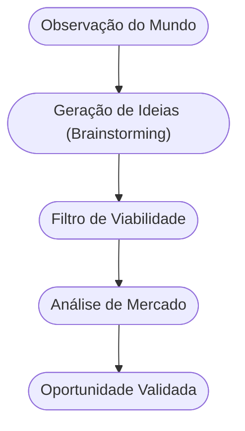

# Aula 02 - Identificação de Oportunidades de Negócio 🏗️

!!! tip "Objetivo"
    **Objetivo**: Aprender a distinguir uma ideia de uma oportunidade real, utilizar ferramentas para mapear o mercado e identificar lacunas que podem ser transformadas em negócios sustentáveis.

---

## 1. Ideia vs. Oportunidade 💡

Ter uma ideia brilhante não garante um negócio de sucesso. A diferença entre elas é fundamental:

=== "Conceito de Ideia"
    *   **Definição**: Uma concepção abstrata, algo que "seria legal fazer".
    *   **Foco**: Na criatividade pura e na imaginação do autor.
    *   **Risco**: Baixo (enquanto estiver no papel).

=== "Conceito de Oportunidade"
    *   **Definição**: Uma ideia que encontra um **mercado**, resolve uma **dor real**.
    *   **Foco**: Na viabilidade econômica e na demanda do cliente.
    *   **Risco**: Calculado e testado através de ferramentas de validação.

!!! info "Conceito"
    Uma **Oportunidade de Negócio** é uma ideia que se mostra viável para ser implementada, gerando valor tanto para o empreendedor quanto para o cliente.

---

## 2. Onde nascem as oportunidades? 🔍

As melhores oportunidades surgem da observação atenta do ambiente:

1.  **Problemas não resolvidos**: Reclamações de clientes sobre produtos existentes. (1)
2.  **Mudanças Sociais**: Novos hábitos de consumo (ex: aumento do home office). (2)
3.  **Avanços Tecnológicos**: Surgimento de novas ferramentas.
4.  **Mudanças Legais**: Novas leis que geram necessidade de adaptação.
5.  **Lacunas de Mercado**: Públicos não atendidos.

(1) "A dor do cliente é o lucro do empreendedor."
(2) Aqui entra a probabilidade de sucesso: $S \approx \frac{D + N}{C}$ onde D é Desejo, N é Necessidade e C é Custo.

---

## 3. O Funil de Oportunidades (Mermaid) 🌪️


```mermaid
graph TD
    A(["Observação do Mundo"]) --> B(["Geração de Ideias (Brainstorming)"])
    B --> C(["Filtro de Viabilidade"])
    C --> D(["Análise de Mercado"])
    D --> E(["Oportunidade Validada"])
```

---

## 4. Ferramentas de Mapeamento 🛠️

Para identificar se sua ideia é uma oportunidade, use o comando da "realidade":

<!-- termynal -->
```console
$ oportunidade --scan-market
> Analisando demanda... [OK]
> Verificando concorrência... [ALTA]
> Calculando diferenciação... [NECESSÁRIA]
> Alerta: Foque em um nicho específico para vencer a concorrência!
```

---

## 5. Análise de Nicho 🎯

Tentar vender para todo mundo é o caminho mais rápido para não vender para ninguém.
*   **Segmentação**: Dividir o mercado em grupos menores.
*   **Diferenciação**: O que faz você ser a escolha óbvia em comparação aos outros?

!!! warning "Atenção"
    Não se apaixone pela sua solução, se apaixone pelo **problema** do seu cliente. A solução pode mudar, o problema é o que sustenta o negócio.

---

## 6. Aprofundamento: Matriz CSD e Oceano Azul 🌊

Para avançarmos, é vital não apenas identificar oportunidades, mas mapear **Certezas, Suposições e Dúvidas (Matriz CSD)**. Além disso, a estratégia do **Oceano Azul** sugere que, em vez de competir em mercados saturados (oceanos vermelhos), o empreendedor intermediário deve buscar espaços inexplorados, criando nova demanda e tornando a concorrência irrelevante através de inovação de valor.

---

## 7. Mini-Projeto: Observação de Campo 🚀

1.  Escolha um trajeto que você faz diariamente (ou uma rede social que usa muito).
2.  Anote 3 situações que geram frustração (problemas).
3.  Para cada problema, pense em uma solução simples que poderia ser um negócio.
4.  Escolha a melhor das três e verifique: "As pessoas pagariam por isso?".

---

## 8. Exercício de Fixação 🧠

1.  Defina, com suas palavras, a diferença entre ideia e oportunidade.
2.  Cite dois exemplos de mudanças tecnológicas recentes que criaram novas oportunidades de negócio.
3.  Por que a segmentação é importante na fase de identificação de oportunidades?

---

---

## 🔗 Materiais da Aula

<div class="grid cards" markdown>
- :material-presentation: **Slides**

    ---

    Material visual com diagramas e conceitos-chave.

    [:octicons-arrow-right-24: Slide 02](../slides/slide-02.md)

- :material-help-circle: **Quiz**

    ---

    Teste seu conhecimento com 10 questões interativas.

    [:octicons-arrow-right-24: Quiz 02](../quizzes/quiz-02.md)

- :fontawesome-solid-pencil: **Exercícios**

    ---

    5 exercícios progressivos (básico → desafio).

    [:octicons-arrow-right-24: Exercício 02](../exercicios/exercicio-02.md)

- :material-briefcase-outline: **Projeto**

    ---

    Aplicação prática dos conceitos da aula.

    [:octicons-arrow-right-24: Projeto 02](../projetos/projeto-02.md)

</div>

---

[:octicons-arrow-right-24: Avançar para Aula 03](./aula-03.md){ .md-button .md-button--primary }

*[CSD]: Matriz de Certezas, Suposições e Dúvidas
*[Oceano Azul]: Estratégia de busca por mercados inexplorados e sem concorrência direta.
