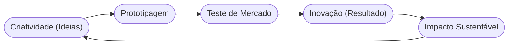

# Aula 03 - Análise de Valor: Inovação e Sustentabilidade 📡

!!! tip "Objetivo"
    **Objetivo**: Compreender como agregar valor real a um produto ou serviço por meio da inovação, criatividade e práticas sustentáveis, garantindo que o negócio seja relevante e ético.

---

## 1. O que é Valor? 💎

Para o empreendedor, **valor** não é o preço que se cobra, mas o benefício que o cliente percebe. 

!!! info "Conceito"
    **Proposta de Valor** é o conjunto de vantagens que uma empresa oferece aos seus clientes para satisfazer suas necessidades ou resolver seus problemas.

### Dimensões do Valor:
1.  **Funcional**: Resolve um problema prático (ex: um aplicativo de transporte).
2.  **Emocional**: Proporciona uma sensação positiva (ex: uma marca de roupas de luxo).
3.  **Social**: Ajuda o cliente a se conectar com outros (ex: redes sociais).
4.  **Sustentável**: Gera impacto positivo no mundo (ex: produtos eco-friendly).

---

## 2. Inovação vs. Criatividade 🎨

Muitas pessoas confundem os dois termos, mas eles são os dois lados da mesma moeda:

*   **Criatividade**: É o ato de pensar coisas novas. É a matéria-prima (ideias).
*   **Inovação**: É o ato de **fazer** coisas novas que gerem valor. É a criatividade aplicada com resultado.

!!! warning "Atenção"
    Não existe inovação sem execução. Uma ideia criativa que fica no papel nunca se torna uma inovação.

---

## 3. Sustentabilidade e Diversidade 🌍

Os negócios modernos não podem ignorar o impacto que causam. O valor de uma empresa hoje também é medido por:

*   **Sustentabilidade**: Uso consciente de recursos para não comprometer as gerações futuras.
*   **Diversidade Cultural**: Incluir diferentes visões de mundo na criação do produto, tornando-o mais universal e inclusivo.
*   **Inclusão Social**: Como o seu negócio ajuda a diminuir as desigualdades?

---

## 4. O Ciclo da Inovação (Mermaid) 🔄



---

## 5. Simulando Valor (Termynal) 📊

Como saber se sua proposta tem valor? Vamos rodar um "diagnóstico de valor":

<!-- termynal -->
```console
$ check-value --target "Meu Negócio"
> Analisando diferenciação... [ALTA]
> Verificando sustentabilidade... [75%]
> Checando inclusão... [EM PROGRESSO]
> Diagnóstico: Seu modelo possui ALTO POTENCIAL de mercado!
```

---

## 6. Aprofundamento: A Equação de Valor e o CAC/LTV 📐

A percepção de valor não é estática. Empreendedores avançados calculam o Custo de Aquisição de Clientes (CAC) e o Lifetime Value (LTV). A regra de ouro intermediária é garantir que LTV > 3 * CAC. O valor verdadeiro é entregue quando a solução não apenas resolve a dor, mas também gera uma economia (de tempo ou dinheiro) quantificável que supera o esforço de adoção.

---

## 7. Mini-Projeto: Valor e Impacto 🚀

1.  Pense em um produto comum (ex: uma garrafa de água).
2.  Como você poderia inovar nesse produto usando a **sustentabilidade**?
3.  Como você adicionaria **diversidade cultural** no marketing desse produto?
4.  Escreva uma frase de "Proposta de Valor" para o seu novo produto inovador.

---

## 8. Exercício de Fixação 🧠

1.  Diferencie Valor Funcional de Valor Emocional com exemplos.
2.  Por que a Diversidade é considerada um ativo estratégico para a inovação?
3.  Explique o conceito de "Triple Bottom Line" (Pessoas, Planeta, Lucro) no contexto da sustentabilidade.

---

---

## 🔗 Materiais da Aula

<div class="grid cards" markdown>
- :material-presentation: **Slides**

    ---

    Material visual com diagramas e conceitos-chave.

    [:octicons-arrow-right-24: Slide 03](../slides/slide-03.html)

- :material-help-circle: **Quiz**

    ---

    Teste seu conhecimento com 10 questões interativas.

    [:octicons-arrow-right-24: Quiz 03](../quizzes/quiz-03.md)

- :fontawesome-solid-pencil: **Exercícios**

    ---

    5 exercícios progressivos (básico → desafio).

    [:octicons-arrow-right-24: Exercício 03](../exercicios/exercicio-03.md)

- :material-briefcase-outline: **Projeto**

    ---

    Aplicação prática dos conceitos da aula.

    [:octicons-arrow-right-24: Projeto 03](../projetos/projeto-03.md)

</div>

---

[:octicons-arrow-right-24: Avançar para Aula 04](./aula-04.md){ .md-button .md-button--primary }
