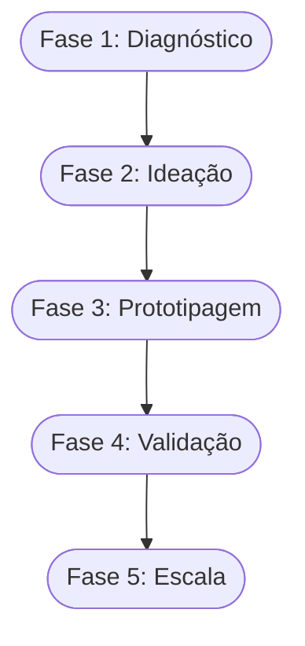

# Aula 04 - Etapas de Processo de Valor e Inovação 📄

!!! tip "Objetivo"
    **Objetivo**: Entender as fases práticas de criação de valor, identificar as diferentes tipologias de inovação e aprender como estruturar um ambiente propício para a criatividade e o planejamento estratégico.

---

## 1. O que é o Processo de Valor? 🛠️

O valor não aparece por mágica; ele é **construído** através de etapas lógicas que transformam uma percepção em um resultado concreto.

### As 4 Etapas do Processo:
1.  **Criação**: Identificação da oportunidade e desenvolvimento da ideia.
2.  **Configuração**: Estruturação dos recursos (pessoas, tecnologia, dinheiro).
3.  **Entrega**: Como o valor chega até o cliente (canais, marketing).
4.  **Captura**: Como o negócio recebe o retorno (financeiro ou social).

---

## 2. Tipologias de Inovação 🏗️

A inovação pode acontecer de diferentes formas e em diferentes níveis de intensidade:

*   **Inovação Incremental**: Pequenas melhorias em algo que já existe (ex: nova versão de um celular).
*   **Inovação Radical**: Cria um novo mercado ou desbanca um existente (ex: a transição das câmeras de filme para digitais).
*   **Inovação de Processo**: Mudar o "como" as coisas são feitas para ganhar eficiência.
*   **Inovação de Modelo de Negócio**: Mudar a forma como se ganha dinheiro (ex: streaming vs venda de CDs).

---

## 3. Ambiente Inovador 🚀

Para que a inovação floresça, o ambiente deve permitir:
*   **Segurança Psicológica**: Liberdade para errar e aprender.
*   **Colaboração**: Troca de ideias entre diferentes áreas.
*   **Flexibilidade**: Capacidade de mudar a rota rapidamente.

---

## 4. Estruturação do Processo (Mermaid) 📊



---

## 5. Simulando o Processo (Termynal) 💻

Vamos validar a fase atual do seu processo de inovação:

<!-- termynal -->
```console
$ inovacao --check-stage
> Verificando fase do projeto...
  - [x] Problema identificado
  - [x] Solução proposta
  - [/] Protótipo em construção
> Status: Fase de EXPERIMENTAÇÃO.
> Dica: Não demore para testar com clientes reais!
```

---

## 6. Aprofundamento: Curva de Adoção de Inovação e TRL 📉

A inovação não atinge a todos simultaneamente. Compreender a **Curva de Difusão da Inovação** (Innovators, Early Adopters, Early Majority...) é crucial para saber como comunicar o lançamento. Além disso, a escala TRL (Technology Readiness Level) auxilia a mensurar a maturidade de uma tecnologia, indo de uma pesquisa básica (TRL 1) até um sistema provado em ambiente real (TRL 9).

---

## 7. Mini-Projeto: Planejando a Inovação 🚀

1.  Identifique uma empresa que você conhece que tenha passado por uma **Inovação Incremental** recentemente.
2.  Agora, descreva um exemplo de **Inovação de Modelo de Negócio**.
3.  Desenhe um pequeno cronograma de 3 passos para validar uma ideia inovadora em uma semana.

---

## 8. Exercício de Fixação 🧠

1.  Explique a diferença entre Inovação Radical e Incremental.
2.  Quais são as 4 etapas básicas do processo de valor?
3.  Por que a "Captura de Valor" é essencial para a sustentabilidade de uma empresa?

---

!!! info "Dica"
    O planejamento não deve ser rígido. No processo de inovação, o planejamento serve para dar direção, mas a execução exige adaptabilidade.

---

---

## 🔗 Materiais da Aula

<div class="grid cards" markdown>
- :material-presentation: **Slides**

    ---

    Material visual com diagramas e conceitos-chave.

    [:octicons-arrow-right-24: Slide 04](../slides/slide-04.html)

- :material-help-circle: **Quiz**

    ---

    Teste seu conhecimento com 10 questões interativas.

    [:octicons-arrow-right-24: Quiz 04](../quizzes/quiz-04.md)

- :fontawesome-solid-pencil: **Exercícios**

    ---

    5 exercícios progressivos (básico → desafio).

    [:octicons-arrow-right-24: Exercício 04](../exercicios/exercicio-04.md)

- :material-briefcase-outline: **Projeto**

    ---

    Aplicação prática dos conceitos da aula.

    [:octicons-arrow-right-24: Projeto 04](../projetos/projeto-04.md)

</div>

---

[:octicons-arrow-right-24: Avançar para Aula 05](./aula-05.md){ .md-button .md-button--primary }
