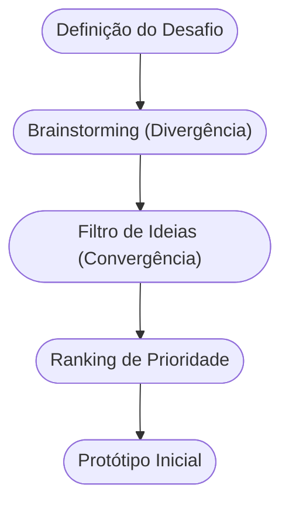

# Aula 05 - Gestão de Negócios e Ideação ⚙️

!!! tip "Objetivo"
    **Objetivo**: Compreender os fundamentos da gestão competitiva e aprender métodos estruturados para a geração de ideias inovadoras, transformando conceitos abstratos em soluções de mercado.

---

## 1. Gestão de Negócios 🏢

A gestão é o conjunto de decisões e ações que garantem a sobrevivência e o crescimento de uma empresa. No mundo empreendedor, gerir significa equilibrar recursos limitados com metas ambiciosas.

### Estratégias Competitivas (Michael Porter):
Para se destacar, uma empresa deve escolher um caminho:
1.  **Liderança em Custo**: Ser o mais barato do mercado. (1)
2.  **Diferenciação**: Oferecer algo único pelo qual o cliente aceite pagar mais. (2)
3.  **Foco (Nicho)**: Atender perfeitamente um grupo específico de pessoas. (3)

(1) Ex: Marcas próprias de supermercado.
(2) Ex: Apple e Tesla.
(3) Ex: Loja especializada em sapatos para maratonistas.

---

## 2. Fontes de Novas Ideias 💡

As ideias não surgem do nada. Elas vêm de:
*   **Feedback de Clientes**: Ouvir o que as pessoas detestam nos produtos atuais.
*   **Análise da Concorrência**: Observar o que os outros fazem bem (ou mal).
*   **Tendências Globais**: Novas tecnologias ou comportamentos sociais.

---

## 3. Métodos de Geração de Ideias (Ideação) 🧠

Existem ferramentas para "forçar" o cérebro a ser criativo:

=== "Divergência (Criar)"
    *   **Brainstorming**: Foco na quantidade, sem julgamentos.
    *   **SCAMPER**: Técnica de substituição e combinação.
    *   **Mapa Mental**: Conectar ideias de forma radial.

=== "Convergência (Filtrar)"
    *   **Ranking**: Pontuar ideias por viabilidade.
    *   **Matriz de Prioridade**: Esforço vs. Impacto.
    *   **Votação**: Escolha democrática da melhor solução.

!!! info "Matemática da Ideação"
    O sucesso da ideação segue a lógica: $S \approx \sum(Ideias) \times Filtro_{crítico}$.

---

## 4. O Fluxo de Ideação (Mermaid) 🌊



---

## 5. Ferramentas de Gestão (Termynal) 💻

Como um gestor moderno analisa uma ideia?

<!-- termynal -->
```console
$ gestao --analisar-ideia
> Verificando viabilidade técnica... [OK]
> Analisando mercado potencial... [GRANDE]
> Checando diferencial competitivo... [PENDENTE]
> Dica: Sua ideia é boa, mas como você vai impedir os outros de copiarem?
```

---

## 6. Aprofundamento: Design Thinking e Duplo Diamante 💎

No estágio intermediário da ideação, não dependemos da "inspiração divina". Utilizamos o modelo estruturado do **Duplo Diamante**: Descobrir e Definir (espaço do problema), Desenvolver e Entregar (espaço da solução). Esse pensamento divergente e convergente garante que estamos tendo as ideias certas para os problemas reais, alinhando empatia, prototipação e viabilidade técnica.

---

## 7. Mini-Projeto: Maratona de Ideias 🚀

1.  Escolha um problema comum (ex: "As pessoas perdem muito tempo filas de banco").
2.  Faça um **Brainstorming** individual e escreva 10 soluções malucas.
3.  Aplique um filtro de **Diferenciação**: Qual dessas soluções é a mais única?
4.  Crie um pequeno **Questionário** de 3 perguntas que você faria para potenciais clientes.

---

## 8. Exercício de Fixação 🧠

1.  Quais são as três estratégias competitivas de Porter?
2.  Por que no Brainstorming não se deve criticar as ideias na fase inicial?
3.  Qual a importância de ouvir a concorrência para gerar novas ideias?

---

!!! info "Conceito"
    **Ideação** é o processo sistemático de gerar, desenvolver e comunicar novas ideias. É a ponte entre o problema identificado e a solução projetada.

---

---

## 🔗 Materiais da Aula

<div class="grid cards" markdown>
- :material-presentation: **Slides**

    ---

    Material visual com diagramas e conceitos-chave.

    [:octicons-arrow-right-24: Slide 05](../slides/slide-05.html)

- :material-help-circle: **Quiz**

    ---

    Teste seu conhecimento com 10 questões interativas.

    [:octicons-arrow-right-24: Quiz 05](../quizzes/quiz-05.md)

- :fontawesome-solid-pencil: **Exercícios**

    ---

    5 exercícios progressivos (básico → desafio).

    [:octicons-arrow-right-24: Exercício 05](../exercicios/exercicio-05.md)

- :material-briefcase-outline: **Projeto**

    ---

    Aplicação prática dos conceitos da aula.

    [:octicons-arrow-right-24: Projeto 05](../projetos/projeto-05.md)

</div>

---

[:octicons-arrow-right-24: Avançar para Aula 06](./aula-06.md){ .md-button .md-button--primary }

*[Brainstorming]: Técnica de geração de ideias em grupo sem julgamentos prévios.
*[SCAMPER]: Acrônimo para Substituir, Combinar, Adaptar, Modificar, Propor, Eliminar e Reorganizar.
