# Aula 05 - Gestão de Negócios e Ideação ⚙️

!!! tip "Objetivo"
    **Objetivo**: Compreender os fundamentos da gestão competitiva e aprender métodos estruturados para a geração de ideias inovadoras, transformando conceitos abstratos em soluções de mercado.

---

## 1. Gestão de Negócios 🏢

A gestão é o conjunto de decisões e ações que garantem a sobrevivência e o crescimento de uma empresa. No mundo empreendedor, gerir significa equilibrar recursos limitados com metas ambiciosas.

### Estratégias Competitivas (Michael Porter):
Para se destacar, uma empresa deve escolher um caminho:
1.  **Liderança em Custo**: Ser o mais barato do mercado (ex: marcas próprias de supermercado).
2.  **Diferenciação**: Oferecer algo único pelo qual o cliente aceite pagar mais (ex: Apple).
3.  **Foco (Nicho)**: Atender perfeitamente um grupo específico de pessoas.

---

## 2. Fontes de Novas Ideias 💡

As ideias não surgem do nada. Elas vêm de:
*   **Feedback de Clientes**: Ouvir o que as pessoas detestam nos produtos atuais.
*   **Análise da Concorrência**: Observar o que os outros fazem bem (ou mal).
*   **Tendências Globais**: Novas tecnologias ou comportamentos sociais.

---

## 3. Métodos de Geração de Ideias (Ideação) 🧠

Existem ferramentas para "forçar" o cérebro a ser criativo:

1.  **Brainstorming**: Tempestade de ideias. O foco é a quantidade, sem julgamentos iniciais.
2.  **Grupos de Discussão (Focus Groups)**: Conversar com potenciais usuários para validar percepções.
3.  **Questionários**: Coletar dados quantitativos sobre dores e necessidades.

---

## 4. O Fluxo de Ideação (Mermaid) 🌊

```mermaid
graph TD
    A(["Definição do Desafio"]) --> B(["Brainstorming (Divergência)"])
    B --> C(["Filtro de Ideias (Convergência)"])
    C --> D(["Ranking de Prioridade"])
    D --> E(["Protótipo Inicial"])
```



---

## 5. Ferramentas de Gestão (Termynal) 💻

Como um gestor moderno analisa uma ideia?

```termynal
$ gestao --analisar-ideia
> Verificando viabilidade técnica... [OK]
> Analisando mercado potencial... [GRANDE]
> Checando diferencial competitivo... [PENDENTE]
> Dica: Sua ideia é boa, mas como você vai impedir os outros de copiarem?
```

---

## 6. Mini-Projeto: Maratona de Ideias 🚀

1.  Escolha um problema comum (ex: "As pessoas perdem muito tempo filas de banco").
2.  Faça um **Brainstorming** individual e escreva 10 soluções malucas.
3.  Aplique um filtro de **Diferenciação**: Qual dessas soluções é a mais única?
4.  Crie um pequeno **Questionário** de 3 perguntas que você faria para potenciais clientes.

---

## 7. Exercício de Fixação 🧠

1.  Quais são as três estratégias competitivas de Porter?
2.  Por que no Brainstorming não se deve criticar as ideias na fase inicial?
3.  Qual a importância de ouvir a concorrência para gerar novas ideias?

---

!!! info "Conceito"
    **Ideação** é o processo sistemático de gerar, desenvolver e comunicar novas ideias. É a ponte entre o problema identificado e a solução projetada.

---

**Próxima Aula**: Vamos aprender a formalizar essas ideias no [Plano de Negócios](./aula-06.md) 🧠
