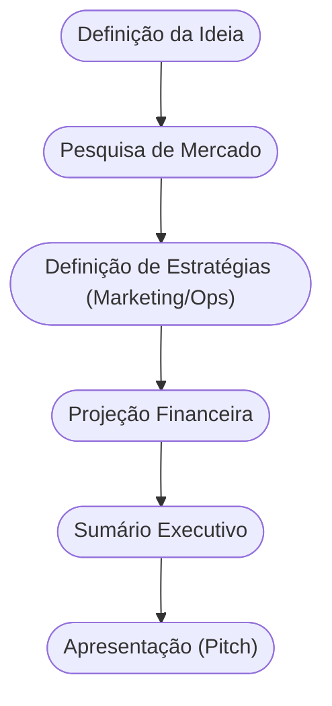

# Aula 06 - O Plano de Negócios 💾

!!! tip "Objetivo"
    **Objetivo**: Compreender o conceito, a finalidade e a estrutura de um Plano de Negócios, aprendendo a transformar uma ideia em um documento estratégico para captação de recursos e orientação da gestão.

---

## 1. O que é um Plano de Negócios (PN)? 🏗️

O **Plano de Negócios** é o "mapa" do seu empreendimento. É um documento que descreve os objetivos de um negócio e quais passos devem ser dados para alcançá-los, diminuindo os riscos e as incertezas.

### Finalidade do PN:
1.  **Orientação Interna**: Ajuda o empreendedor a manter o foco e planejar o crescimento.
2.  **Captação de Recursos**: Essencial para apresentar a investidores ou bancos.
3.  **Teste de Viabilidade**: Ajuda a descobrir se o negócio é sustentável antes de investir tempo e dinheiro real.

---

## 2. Estrutura Básica de um Plano Profissional 📋

Um PN completo geralmente contém:
*   **Sumário Executivo**: Resumo dos pontos principais. (1)
*   **Análise de Mercado**: Estudo de clientes e concorrentes. (2)
*   **Plano de Marketing**: Divulgação e vendas.
*   **Plano Operacional**: O dia a dia do negócio.
*   **Plano Financeiro**: Custos e Ponto de Equilíbrio.

(1) Deve ser a última parte a ser escrita.
(2) Use a matriz SWOT para esta análise.

---

## 3. O Fluxo de Elaboração (Mermaid) 🌊



---

## 4. O PN no Mundo Moderno 🚀

Antigamente, planos de negócios eram livros de 100 páginas. Hoje, eles são mais ágeis:

=== "Plano Tradicional"
    *   **Foco**: Detalhamento extremo e previsibilidade.
    *   **Uso**: Financiamentos bancários e grandes licitações.
    *   **Tempo**: Meses para ser elaborado.

=== "Plano Ágil (Lean)"
    *   **Foco**: Velocidade e validação de hipóteses.
    *   **Uso**: Startups e novos experimentos de mercado.
    *   **Tempo**: Dias ou semanas, focado no aprendizado.

!!! info "Fórmula do Sucesso"
    O Ponto de Equilíbrio é calculado como: $PE = \frac{Custos Fixos}{Preço Venda - Custos Variáveis}$.

---

## 5. Simulando a Viabilidade (Termynal) 📦

Vamos verificar se seu Plano de Negócios está pronto para ser apresentado:

<!-- termynal -->
```console
$ plano-negocio --validar
> Analisando mercado... [CHECK]
> Verificando plano financeiro... [OK]
> Checando análise de riscos... [PENDENTE]
> Status: QUASE PRONTO.
> Dica: Inclua um cenário de "pior caso" financeiro para dar mais credibilidade.
```

---

## 6. Aprofundamento: Modelagem Financeira e Break-even 📈

Um Plano de Negócios maduro exige projeções tangíveis. O conceito de **Break-even Point (Ponto de Equilíbrio)** é vital: o exato momento em que as receitas se igualam aos custos (fixos e variáveis). Além disso, a elaboração de cenários (Otimista, Realista e Pessimista) capacita o negócio a se proteger de variações drásticas do fluxo de caixa nos primeiros anos de operação.

---

## 7. Mini-Projeto: Esboço do Sumário Executivo 🛠️

Imagine que você quer abrir uma **Cafeteria Sustentável**.
1.  Escreva 3 lines descrevendo o que torna seu café único.
2.  Quem é seu público principal?
3.  Qual o investimento inicial estimado (chute um valor)?
4.  Em quanto tempo você espera ter o dinheiro de volta?

---

## 8. Exercício de Fixação 🧠

1.  Qual a principal diferença entre um Plano de Negócios e uma ideia solta?
2.  Por que o Sumário Executivo deve ser a última parte a ser escrita?
3.  Em que situação um empreendedor deve preferir um Plano de Negócios detalhado a um simples Canvas?

---

!!! warning "Atenção"
    O Plano de Negócios não é algo "escrito em pedra". Ele deve ser revisado constantemente à medida que o mercado muda e novos dados aparecem.

---

---

## 🔗 Materiais da Aula

<div class="grid cards" markdown>
- :material-presentation: **Slides**

    ---

    Material visual com diagramas e conceitos-chave.

    [:octicons-arrow-right-24: Slide 06](../slides/slide-06.html)

- :material-help-circle: **Quiz**

    ---

    Teste seu conhecimento com 10 questões interativas.

    [:octicons-arrow-right-24: Quiz 06](../quizzes/quiz-06.md)

- :fontawesome-solid-pencil: **Exercícios**

    ---

    5 exercícios progressivos (básico → desafio).

    [:octicons-arrow-right-24: Exercício 06](../exercicios/exercicio-06.md)

- :material-briefcase-outline: **Projeto**

    ---

    Aplicação prática dos conceitos da aula.

    [:octicons-arrow-right-24: Projeto 06](../projetos/projeto-06.md)

</div>

---

[:octicons-arrow-right-24: Avançar para Aula 07](./aula-07.md){ .md-button .md-button--primary }

*[SWOT]: Forças, Fraquezas, Oportunidades e Ameaças (Strengths, Weaknesses, Opportunities, Threats).
*[Sumário Executivo]: Visão geral concisa que destaca os pontos principais do plano de negócios.
