# Aula 06 - O Plano de Negócios 💾

!!! tip "Objetivo"
    **Objetivo**: Compreender o conceito, a finalidade e a estrutura de um Plano de Negócios, aprendendo a transformar uma ideia em um documento estratégico para captação de recursos e orientação da gestão.

---

## 1. O que é um Plano de Negócios (PN)? 🏗️

O **Plano de Negócios** é o "mapa" do seu empreendimento. É um documento que descreve os objetivos de um negócio e quais passos devem ser dados para alcançá-los, diminuindo os riscos e as incertezas.

### Finalidade do PN:
1.  **Orientação Interna**: Ajuda o empreendedor a manter o foco e planejar o crescimento.
2.  **Captação de Recursos**: Essencial para apresentar a investidores ou bancos.
3.  **Teste de Viabilidade**: Ajuda a descobrir se o negócio é sustentável antes de investir tempo e dinheiro real.

---

## 2. Estrutura Básica de um Plano Profissional 📋

Um PN completo geralmente contém:
*   **Sumário Executivo**: Resumo dos pontos principais (feito por último!).
*   **Análise de Mercado**: Estudo dos clientes, concorrentes e fornecedores.
*   **Plano de Marketing**: Como o produto será vendido e divulgado.
*   **Plano Operacional**: Como o negócio vai funcionar no dia a dia.
*   **Plano Financeiro**: Projeção de custos, receitas e ponto de equilíbrio.

---

## 3. O Fluxo de Elaboração (Mermaid) 🌊

```mermaid
graph TD
    A(["Definição da Ideia"]) --> B(["Pesquisa de Mercado"])
    B --> C(["Definição de Estratégias (Marketing/Ops)"])
    C --> D(["Projeção Financeira"])
    D --> E(["Sumário Executivo"])
    E --> F(["Apresentação (Pitch)"])
```



---

## 4. O PN no Mundo Moderno 🚀

Antigamente, planos de negócios eram livros de 100 páginas. Hoje, eles são mais ágeis e focados.
*   **PN Tradicional**: Detalhado, focado em estabilidade e financiamento bancário.
*   **PN Ágil (Lean)**: Focado em testes rápidos e aprendizado constante.

---

## 5. Simulando a Viabilidade (Termynal) 📦

Vamos verificar se seu Plano de Negócios está pronto para ser apresentado:

```termynal
$ plano-negocio --validar
> Analisando mercado... [CHECK]
> Verificando plano financeiro... [OK]
> Checando análise de riscos... [PENDENTE]
> Status: QUASE PRONTO.
> Dica: Inclua um cenário de "pior caso" financeiro para dar mais credibilidade.
```

---

## 6. Mini-Projeto: Esboço do Sumário Executivo 🛠️

Imagine que você quer abrir uma **Cafeteria Sustentável**.
1.  Escreva 3 lines descrevendo o que torna seu café único.
2.  Quem é seu público principal?
3.  Qual o investimento inicial estimado (chute um valor)?
4.  Em quanto tempo você espera ter o dinheiro de volta?

---

## 7. Exercício de Fixação 🧠

1.  Qual a principal diferença entre um Plano de Negócios e uma ideia solta?
2.  Por que o Sumário Executivo deve ser a última parte a ser escrita?
3.  Em que situação um empreendedor deve preferir um Plano de Negócios detalhado a um simples Canvas?

---

!!! warning "Atenção"
    O Plano de Negócios não é algo "escrito em pedra". Ele deve ser revisado constantemente à medida que o mercado muda e novos dados aparecem.

---

**Próxima Aula**: Vamos simplificar tudo com o [Modelagem de Negócios: O Canvas](./aula-07.md) 🗄️
