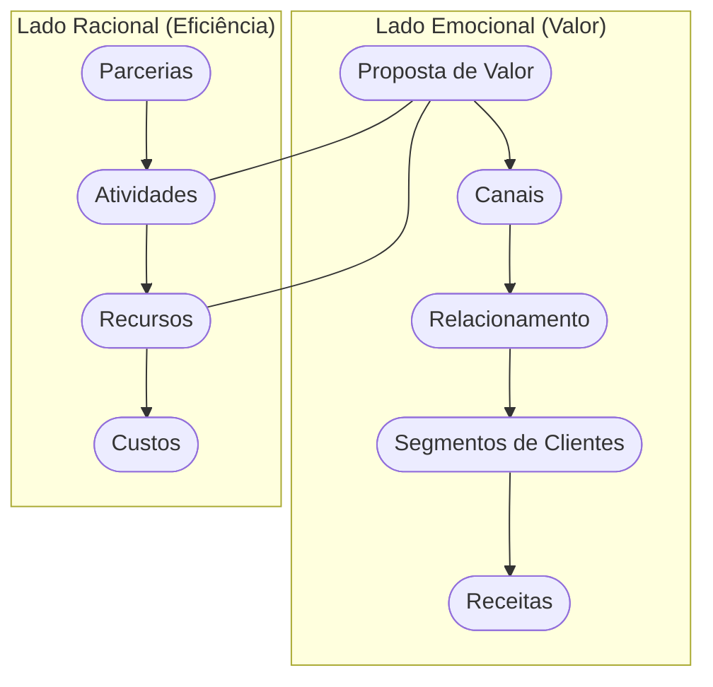

# Aula 07 - Modelagem de Negócios: O Canvas 🧪

!!! tip "Objetivo"
    **Objetivo**: Dominar o Business Model Canvas (BMC), a ferramenta visual mais poderosa para projetar e analisar modelos de negócios, permitindo uma visão holística e ágil da estrutura da empresa.

---

## 1. O que é o Canvas? 🎨

O **Business Model Canvas** é um mapa visual que resume o modelo de negócio em 9 blocos fundamentais. Ele permite que você entenda como a empresa cria, entrega e captura valor em uma única página.

---

## 2. Os 9 Blocos do Canvas 🧱

Para modelar seu negócio, você deve preencher:

1.  **Segmento de Clientes**: Quem atendemos? (1)
2.  **Proposta de Valor**: Que dor resolvemos? (2)
3.  **Canais**: Como entregamos o valor?
4.  **Relacionamento**: Como retemos o cliente?
5.  **Fontes de Receita**: Como monetizamos?
6.  **Recursos Principais**: Ativos vitais.
7.  **Atividades Principais**: Ações indispensáveis.
8.  **Parcerias**: Quem nos complementa?
9.  **Estrutura de Custos**: Gastos fixos e variáveis.

(1) Foco total no nicho.
(2) Aqui reside a Equação de Valor: $Valor = Benefícios - (Custo + Esforço)$.

---

## 3. A Lógica do Canvas (Mermaid) 🔗

O Canvas é dividido em dois lados: o lado **Direito** (valor e cliente) e o lado **Esquerdo** (eficiência e infraestrutura).



---

## 4. Canvas vs. Plano de Negócios 📊

A escolha da ferramenta depende da maturidade da ideia:

=== "Lado Direito (Valor)"
    *   **Foco**: O que entregamos para o mundo.
    *   **Meta**: Criar desejo e resolver dores.
    *   **Drivers**: Marketing e Vendas.

=== "Lado Esquerdo (Eficiência)"
    *   **Foco**: Como fazemos a mágica acontecer.
    *   **Meta**: Reduzir desperdícios e otimizar processos.
    *   **Drivers**: Logística e Operações.

> **Dica**: Use o Canvas para encontrar o modelo certo e o Plano de Negócios para detalhar como você vai executá-lo.

---

## 5. Simulando um Modelo (Termynal) 📥

Vamos rodar uma verificação no seu Canvas:

<!-- termynal -->
```console
$ canvas --check-balance
> Verificando equilíbrio entre lados... [OK]
> Checando Proposta de Valor vs Cliente... [CONECTADO]
> Analisando Receitas vs Custos... [ALERTA: Margem Pequena]
> Diagnóstico: Seu modelo é viável, mas os custos operacionais estão altos!
```

---

## 6. Aprofundamento: Padrões de Modelos de Negócios (Business Model Patterns) 🧩

O Canvas não é apenas para preenchimento; ele serve para detectar padrões. Modelos **Long Tail** (venda de muitos itens de nicho em pequena quantidade), **Plataformas Multilaterais** (unir dois grupos de clientes distintos, como o Uber faz com motoristas e passageiros) e **Freemium** (base gratuita para converter uma minoria em premium) são estratégias intermediárias que mudam radicalmente o preenchimento de cada bloco do Canvas.

---

## 7. Mini-Projeto: Modelando uma Startup 🏗️

Imagine que você está criando o **Uber das Bicicletas**.
1.  Qual a sua principal **Proposta de Valor**?
2.  Quem são seus **Segmentos de Clientes**?
3.  Quais seriam seus dois principais **Recursos**?
4.  De onde viria sua **Fonte de Receita**?

---

## 8. Exercício de Fixação 🧠

1.  Quais são los 9 blocos do Business Model Canvas?
2.  O que o "lado direito" do Canvas representa?
3.  Por que o Canvas é considerado uma ferramenta de "metodologia ágil"?

---

---

## 🔗 Materiais da Aula

<div class="grid cards" markdown>
- :material-presentation: **Slides**

    ---

    Material visual com diagramas e conceitos-chave.

    [:octicons-arrow-right-24: Slide 07](../slides/slide-07.html)

- :material-help-circle: **Quiz**

    ---

    Teste seu conhecimento com 10 questões interativas.

    [:octicons-arrow-right-24: Quiz 07](../quizzes/quiz-07.md)

- :fontawesome-solid-pencil: **Exercícios**

    ---

    5 exercícios progressivos (básico → desafio).

    [:octicons-arrow-right-24: Exercício 07](../exercicios/exercicio-07.md)

- :material-briefcase-outline: **Projeto**

    ---

    Aplicação prática dos conceitos da aula.

    [:octicons-arrow-right-24: Projeto 07](../projetos/projeto-07.md)

</div>

---

[:octicons-arrow-right-24: Avançar para Aula 08](./aula-08.md){ .md-button .md-button--primary }

*[BMC]: Business Model Canvas (Quadro de Modelo de Negócios).
*[Freemium]: Modelo de negócio onde o produto básico é gratuito e recursos avançados são pagos.
