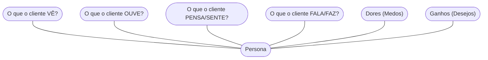

# Aula 08 - Segmentação de Clientes e Público-Alvo 🚢

!!! tip "Objetivo"
    **Objetivo**: Aprender a identificar, dividir e analisar o público-alvo de um negócio, compreendendo as características e necessidades de cada grupo para criar estratégias personalizadas.

---

## 1. Por que Segmentar? 🎯

Tentar vender para "todo mundo" é o erro número 1 de novos empreendedores. Se você não sabe para quem vende, não sabe como falar, onde anunciar ou que preço cobrar.

!!! info "Conceito"
    **Segmentação de Mercado** é o processo de dividir um mercado de clientes potenciais em grupos (segmentos) baseados em características compartilhadas.

---

## 2. Formas de Segmentação 🧼

Podemos dividir os clientes por diferentes critérios:

*   **Geográfica**: Onde eles moram ou trabalham (ex: bairro, cidade, clima).
*   **Demográfica**: Idade, gênero, renda, profissão, nível escolar.
*   **Psicográfica**: Estilo de vida, valores, personalidade, interesses.
*   **Comportamental**: Como eles usam o produto, frequência de compra, lealdade à marca.

---

## 3. Público-Alvo vs. Persona 👤

*   **Público-Alvo**: Uma definição ampla (ex: Mulheres, 25-40 anos, moradoras de SP, classe B).
*   **Persona**: Um personagem fictício que representa seu cliente ideal (ex: "Clara, 32 anos, arquiteta, gosta de café gourmet e busca praticidade no dia a dia").

---

## 4. O Checklist da Segmentação (Termynal) ✅

Vamos validar se seu público está bem definido:

<!-- termynal -->
```console
$ publico --analisar
> Verificando tamanho do grupo... [OK]
> Analisando poder de compra... [MÉDIO]
> Checando facilidade de acesso... [ALTA]
> Resultado: Seu público é ACESSÍVEL e LUCRATIVO.
> Dica: Foque na persona para humanizar sua comunicação!
```

---

## 5. Mapa de Empatia (Mermaid) 🧠

Uma ferramenta para mergulhar no mundo do cliente:



---

## 6. Aprofundamento: Personas e Job To Be Done (JTBD) 🎯

Segmentação demográfica (idade, renda) é insuficiente. O conceito intermediário exige focar em **Personas** (arquétipos semi-fictícios, com dores e desejos comportamentais e psicográficos) e no modelo **Job To Be Done** (o trabalho a ser feito). Segundo o JTBD, o cliente "contrata" um produto para resolver um problema em uma circunstância específica. Entender a jornada do usuário é mais importante que o Censo.

---

## 7. Mini-Projeto: Criando sua Persona 🚀

Escolha um negócio (ex: Loja de Jogos Digitais).
1.  Defina o **Público-Alvo** em 3 linhas.
2.  Crie uma **Persona** detalhada (Nome, idade, um problema que ela tem).
3.  Qual a principal "dor" dessa persona que seu negócio resolve?

---

## 8. Exercício de Fixação 🧠

1.  Qual a diferença entre segmentação demográfica e psicográfica?
2.  Por que criar uma Persona ajuda mais no marketing do que apenas ter um Público-Alvo?
3.  O que acontece se uma empresa tentar ignorar a segmentação e vender para todos?

---

!!! info "Dica"
    Um segmento ideal deve ser: Mensurável, Acessível, Substancial (grande o suficiente) e Acionável.

---


---

## 📚 Material Complementar

*   **[📝 Exercícios da Aula 08](../exercicios/exercicio-08.md)**: Pratique os conceitos com questões focadas.
*   **[🚀 Projeto da Aula 08](../projetos/projeto-08.md)**: Aplique o conhecimento em um desafio prático de nível intermediário.

**Próxima Aula**: Entrando no Bloco 3! [Definição da Proposta de Valor ao Cliente](./aula-09.md) ✅
