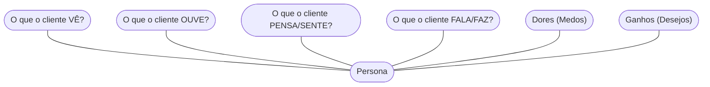

# Aula 08 - Segmentação de Clientes e Público-Alvo 🚢

!!! tip "Objetivo"
    **Objetivo**: Aprender a identificar, dividir e analisar o público-alvo de um negócio, compreendendo as características e necessidades de cada grupo para criar estratégias personalizadas.

---

## 1. Por que Segmentar? 🎯

Tentar vender para "todo mundo" é o erro número 1 de novos empreendedores. Se você não sabe para quem vende, não sabe como falar, onde anunciar ou que preço cobrar.

!!! info "Conceito"
    **Segmentação de Mercado** é o processo de dividir um mercado de clientes potenciais em grupos (segmentos) baseados em características compartilhadas.

---

## 2. Formas de Segmentação 🧼

Podemos dividir os clientes por diferentes critérios:

*   **Geográfica**: Onde eles moram. (1)
*   **Demográfica**: Idade, gênero, renda. (2)
*   **Psicográfica**: Estilo de vida e valores.
*   **Comportamental**: Hábitos de compra.

(1) Essencial para negócios locais.
(2) Use a fórmula de tamanho de mercado: $TAM = N \times P$ (Onde N é o número de pessoas e P o gasto médio).

---

## 3. Público-Alvo vs. Persona 👤

Identificar o cliente exige dois níveis de detalhamento:

=== "Público-Alvo (Nível 1)"
    *   **Visão**: Macro (grupo grande).
    *   **Dados**: Demográficos e Geográficos.
    *   **Ex**: Mulheres de 20 a 30 anos, interesadas em moda.

=== "Persona (Nível 2)"
    *   **Visão**: Micro (indivíduo fictício).
    *   **Dados**: Psicográficos e Comportamentais.
    *   **Ex**: Mariana, arquiteta, busca roupas sustentáveis para o trabalho.

---

## 4. O Checklist da Segmentação (Termynal) ✅

Vamos validar se seu público está bem definido:

<!-- termynal -->
```console
$ publico --analisar
> Verificando tamanho do grupo... [OK]
> Analisando poder de compra... [MÉDIO]
> Checando facilidade de acesso... [ALTA]
> Resultado: Seu público é ACESSÍVEL e LUCRATIVO.
> Dica: Foque na persona para humanizar sua comunicação!
```

---

## 5. Mapa de Empatia (Mermaid) 🧠

Uma ferramenta para mergulhar no mundo do cliente:


```mermaid
graph TD
    A(["O que o cliente VÊ?"]) --- B(["Persona"])
    C(["O que o cliente OUVE?"]) --- B
    D(["O que o cliente PENSA/SENTE?"]) --- B
    E(["O que o cliente FALA/FAZ?"]) --- B
    F(["Dores (Medos)"]) --- B
    G(["Ganhos (Desejos)"]) --- B
```

---

## 6. Aprofundamento: Personas e Job To Be Done (JTBD) 🎯

Segmentação demográfica (idade, renda) é insuficiente. O conceito intermediário exige focar em **Personas** (arquétipos semi-fictícios, com dores e desejos comportamentais e psicográficos) e no modelo **Job To Be Done** (o trabalho a ser feito). Segundo o JTBD, o cliente "contrata" um produto para resolver um problema em uma circunstância específica. Entender a jornada do usuário é mais importante que o Censo.

---

## 7. Mini-Projeto: Criando sua Persona 🚀

Escolha um negócio (ex: Loja de Jogos Digitais).
1.  Defina o **Público-Alvo** em 3 linhas.
2.  Crie uma **Persona** detalhada (Nome, idade, um problema que ela tem).
3.  Qual a principal "dor" dessa persona que seu negócio resolve?

---

## 8. Exercício de Fixação 🧠

1.  Qual a diferença entre segmentação demográfica e psicográfica?
2.  Por que criar uma Persona ajuda mais no marketing do que apenas ter um Público-Alvo?
3.  O que acontece se uma empresa tentar ignorar a segmentação e vender para todos?

---

!!! info "Dica"
    Um segmento ideal deve ser: Mensurável, Acessível, Substancial (grande o suficiente) e Acionável.

---

---

## 🔗 Materiais da Aula

<div class="grid cards" markdown>
- :material-presentation: **Slides**

    ---

    Material visual com diagramas e conceitos-chave.

    [:octicons-arrow-right-24: Slide 08](../slides/slide-08.html)

- :material-help-circle: **Quiz**

    ---

    Teste seu conhecimento com 10 questões interativas.

    [:octicons-arrow-right-24: Quiz 08](../quizzes/quiz-08.md)

- :fontawesome-solid-pencil: **Exercícios**

    ---

    5 exercícios progressivos (básico → desafio).

    [:octicons-arrow-right-24: Exercício 08](../exercicios/exercicio-08.md)

- :material-briefcase-outline: **Projeto**

    ---

    Aplicação prática dos conceitos da aula.

    [:octicons-arrow-right-24: Projeto 08](../projetos/projeto-08.md)

</div>

---

[:octicons-arrow-right-24: Avançar para Aula 09](./aula-09.md){ .md-button .md-button--primary }

*[Persona]: Representação fictícia do cliente ideal fundamentada em dados reais.
*[JTBD]: Job To Be Done (Trabalho a ser feito) - Teoria sobre a motivação da compra.
