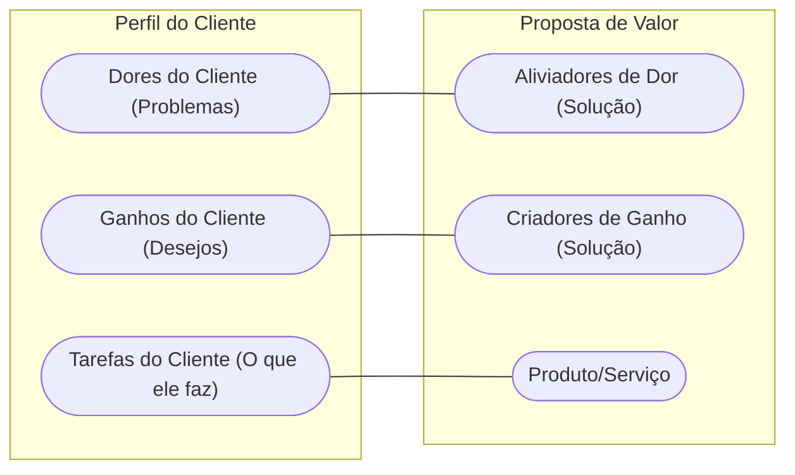

# Aula 09 - Definição de Proposta de Valor ao Cliente 💎

!!! tip "Objetivo"
    **Objetivo**: Dominar a arte de criar propostas de valor irresistíveis, entendendo o que o cliente realmente "compra" e como se diferenciar da concorrência por meio da inovação e da utilidade.

---

## 1. O que é Proposta de Valor? 🎯

Muitos confundem produto com proposta de valor. O produto é o objeto; a proposta de valor é a **solução** que ele entrega.

=== "Exemplo de Produto"
    *   **O Que É**: Uma furadeira elétrica de 500W.
    *   **Foco**: Nos componentes e potência técnica.
    *   **Valor**: Intrínseco ao objeto.

=== "Exemplo de Proposta de Valor"
    *   **O Que É**: Um furo na parede para pendurar um quadro.
    *   **Foco**: Na necessidade final e no benefício do cliente.
    *   **Valor**: Percebido pelo resultado alcançado.

!!! info "Conceito"
    A **Proposta de Valor** é o motivo pelo qual os clientes escolhem uma empresa em vez de outra. Ela resolve um problema do cliente ou satisfaz uma necessidade específica.

---

## 2. Tipos de Proposta de Valor 📊

Existem diversas formas de agregar valor a um segmento de cliente:

1.  **Novidade**: Atender necessidades ocultas. (1)
2.  **Performance**: Melhorar o desempenho.
3.  **Personalização**: Adaptar às necessidades. (2)
4.  **Design**: Valor estético e usabilidade.
5.  **Preço**: Similar por valor menor.
6.  **Redução de Risco**: Garantias e seguros. (3)

(1) Ex: Primeiro iPhone ou Uber.
(2) Ex: Tênis customizados com seu nome.
(3) Aqui entra a evolução do valor: $Evolução = \frac{\Delta Valor}{\Delta Esforço}$.

---

## 3. O Encaixe: Problema-Solução (Mermaid) 🔗

O valor só existe se houver um encaixe perfeito entre o que você oferece e o que o cliente precisa.



---

## 4. Validando sua Proposta (Termynal) 💻

Como saber se sua proposta de valor é realmente forte?

<!-- termynal -->
```console
$ valor --analisar-proposta
> Verificando clareza da mensagem... [OK]
> Analisando diferencial competitivo... [MÉDIO]
> Checando alinhamento com a dor do cliente... [ALTO]
> Resultado: Sua proposta é BOA, mas precisa ser mais única.
> Dica: Tente focar em uma dor que ninguém mais resolve hoje!
```

---

## 5. Proposta de Valor vs. Slogan 📢

*   **Slogan**: Uma frase curta de marketing (ex: "Just Do It").
*   **Proposta de Valor**: Uma declaração clara de benefícios (ex: "Oferecemos equipamentos de alta performance para atletas que buscam superar seus limites").

---

## 6. Aprofundamento: Canvas da Proposta de Valor (VPC) 🎁

Para alinhar perfeitamente o produto ao mercado, o **Value Proposition Canvas** cruza o Perfil do Cliente (Tarefas, Dores e Ganhos) com o Mapa de Valor do Produto (Criadores de Ganhos, Aliviadores de Dores e Produtos/Serviços). O "Fit" ocorre apenas quando os aliviadores de fato resolvem as dores mais extremas mapeadas no perfil, garantindo que o produto tenha tração inicial (Product-Market Fit).

---

## 7. Mini-Projeto: O Canvas da Proposta de Valor 🚀

1.  Escolha um negócio (ex: Um app de delivery de comida saudável).
2.  Liste 2 **Dores** do cliente (ex: falta de tempo, comida ruim no trabalho).
3.  Liste 2 **Aliviadores** da sua proposta (ex: entrega em 15 min, cardápio assinado por nutricionista).
4.  Escreva sua Proposta de Valor em um parágrafo.

---

## 8. Exercício de Fixação 🧠

1.  Dê um exemplo de proposta de valor baseada em "Redução de Custo".
2.  Qual a diferença entre um benefício funcional e um benefício emocional?
3.  Por que é perigoso focar apenas no preço como sua única proposta de valor?

---

!!! warning "Atenção"
    Sua proposta de valor deve ser **clara**, **objetiva** e **fácil de entender**. Se o cliente demorar mais de 5 segundos para entender o que você faz, ele irá embora.

---

---

## 🔗 Materiais da Aula

<div class="grid cards" markdown>
- :material-presentation: **Slides**

    ---

    Material visual com diagramas e conceitos-chave.

    [:octicons-arrow-right-24: Slide 09](../slides/slide-09.html)

- :material-help-circle: **Quiz**

    ---

    Teste seu conhecimento com 10 questões interativas.

    [:octicons-arrow-right-24: Quiz 09](../quizzes/quiz-09.md)

- :fontawesome-solid-pencil: **Exercícios**

    ---

    5 exercícios progressivos (básico → desafio).

    [:octicons-arrow-right-24: Exercício 09](../exercicios/exercicio-09.md)

- :material-briefcase-outline: **Projeto**

    ---

    Aplicação prática dos conceitos da aula.

    [:octicons-arrow-right-24: Projeto 09](../projetos/projeto-09.md)

</div>

---

[:octicons-arrow-right-24: Avançar para Aula 10](./aula-10.md){ .md-button .md-button--primary }

*[Product-Market Fit]: Grau em que um produto satisfaz uma forte demanda de mercado.
*[VPC]: Value Proposition Canvas (Quadro de Proposta de Valor).
