# Aula 09 - Definição de Proposta de Valor ao Cliente 💎

!!! tip "Objetivo"
    **Objetivo**: Dominar a arte de criar propostas de valor irresistíveis, entendendo o que o cliente realmente "compra" e como se diferenciar da concorrência por meio da inovação e da utilidade.

---

## 1. O que é Proposta de Valor? 🎯

Muitos confundem produto com proposta de valor. O produto é o objeto; a proposta de valor é a **solução** que ele entrega.

*   **Produto**: Uma furadeira.
*   **Proposta de Valor**: Um furo na parede para pendurar um quadro de memórias.

!!! info "Conceito"
    A **Proposta de Valor** é o motivo pelo qual os clientes escolhem uma empresa em vez de outra. Ela resolve um problema do cliente ou satisfaz uma necessidade específica.

---

## 2. Tipos de Proposta de Valor 📊

Existem diversas formas de agregar valor a um segmento de cliente:

1.  **Novidade**: Atender necessidades que os clientes nem sabiam que tinham (ex: o primeiro iPhone).
2.  **Performance**: Melhorar o desempenho de algo (ex: um computador mais rápido).
3.  **Personalização**: Adaptar produtos às necessidades específicas (ex: tênis customizados).
4.  **Design**: Valor pela estética e usabilidade (ex: móveis de design assinado).
5.  **Preço**: Oferecer valor similar por um preço menor (ex: companhias aéreas low-cost).
6.  **Redução de Risco**: Garantias estendidas ou seguros.

---

## 3. O Encaixe: Problema-Solução (Mermaid) 🔗

O valor só existe se houver um encaixe perfeito entre o que você oferece e o que o cliente precisa.

```mermaid
graph LR
    A(["Dores do Cliente (Problemas)"]) --- B(["Aliviadores de Dor (Solução)"])
    C(["Ganhos do Cliente (Desejos)"]) --- D(["Criadores de Ganho (Solução)"])
    E(["Tarefas do Cliente (O que ele faz)"]) --- F(["Produto/Serviço"])
    subgraph "Proposta de Valor"
        B
        D
        F
    end
    subgraph "Perfil do Cliente"
        A
        C
        E
    end
```



---

## 4. Validando sua Proposta (Termynal) 💻

Como saber se sua proposta de valor é realmente forte?

```termynal
$ valor --analisar-proposta
> Verificando clareza da mensagem... [OK]
> Analisando diferencial competitivo... [MÉDIO]
> Checando alinhamento com a dor do cliente... [ALTO]
> Resultado: Sua proposta é BOA, mas precisa ser mais única.
> Dica: Tente focar em uma dor que ninguém mais resolve hoje!
```

---

## 5. Proposta de Valor vs. Slogan 📢

*   **Slogan**: Uma frase curta de marketing (ex: "Just Do It").
*   **Proposta de Valor**: Uma declaração clara de benefícios (ex: "Oferecemos equipamentos de alta performance para atletas que buscam superar seus limites").

---

## 6. Aprofundamento: Canvas da Proposta de Valor (VPC) 🎁

Para alinhar perfeitamente o produto ao mercado, o **Value Proposition Canvas** cruza o Perfil do Cliente (Tarefas, Dores e Ganhos) com o Mapa de Valor do Produto (Criadores de Ganhos, Aliviadores de Dores e Produtos/Serviços). O "Fit" ocorre apenas quando os aliviadores de fato resolvem as dores mais extremas mapeadas no perfil, garantindo que o produto tenha tração inicial (Product-Market Fit).

---

## 7. Mini-Projeto: O Canvas da Proposta de Valor 🚀

1.  Escolha um negócio (ex: Um app de delivery de comida saudável).
2.  Liste 2 **Dores** do cliente (ex: falta de tempo, comida ruim no trabalho).
3.  Liste 2 **Aliviadores** da sua proposta (ex: entrega em 15 min, cardápio assinado por nutricionista).
4.  Escreva sua Proposta de Valor em um parágrafo.

---

## 8. Exercício de Fixação 🧠

1.  Dê um exemplo de proposta de valor baseada em "Redução de Custo".
2.  Qual a diferença entre um benefício funcional e um benefício emocional?
3.  Por que é perigoso focar apenas no preço como sua única proposta de valor?

---

!!! warning "Atenção"
    Sua proposta de valor deve ser **clara**, **objetiva** e **fácil de entender**. Se o cliente demorar mais de 5 segundos para entender o que você faz, ele irá embora.

---


---

## 📚 Material Complementar

*   **[📝 Exercícios da Aula 09](../exercicios/exercicio-09.md)**: Pratique os conceitos com questões focadas.
*   **[🚀 Projeto da Aula 09](../projetos/projeto-09.md)**: Aplique o conhecimento em um desafio prático de nível intermediário.

**Próxima Aula**: Como essa proposta chega até o cliente? [Canais de Comunicação e Distribuição](./aula-10.md) 🚢
