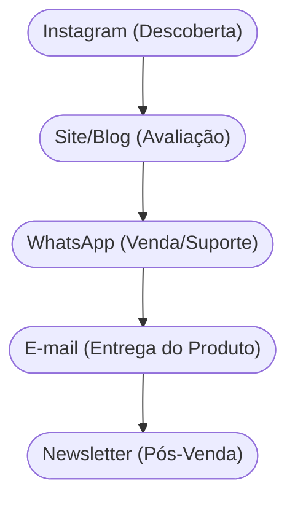

# Aula 10 - Canais de Comunicação e Distribuição 🚢

!!! tip "Objetivo"
    **Objetivo**: Compreender como a proposta de valor chega até o cliente, integrando canais de comunicação, vendas e logística para criar uma experiência de compra fluida e eficiente.

---

## 1. O que são Canais? 🗺️

Os canais são os pontos de contato entre a empresa e o cliente. Eles servem como os "braços" do negócio para entregar valor e capturar feedback.

### Funções dos Canais:
1.  **Descoberta**: Como o cliente fica sabendo que existimos?
2.  **Avaliação**: Como ajudamos o cliente a escolher nossa proposta?
3.  **Compra**: Por onde ele paga e fecha o pedido?
4.  **Entrega**: Como o produto/serviço chega até ele?
5.  **Pós-venda**: Como oferecemos suporte após a compra?

---

## 2. Tipos de Canais 📦

Os canais podem ser divididos entre diretos e indiretos:

| Tipo | Exemplos | Prós | Contras |
| :--- | :--- | :--- | :--- |
| **Direto** | Site oficial, Loja Própria, Venda Direta. | Margem maior, controle total. | Custo de aquisição alto. |
| **Indireto** | Marketplace (Amazon, App Store), Atacado. | Grande alcance, confiança. | Margem menor, zero controle. |

---

## 3. O Funil de Multicanais (Mermaid) 🌪️

A jornada do cliente muitas vezes passa por vários canais antes da compra final.



---

## 4. Estratégia Omnichannel 🔄

Ser **Omnichannel** significa oferecer uma experiência integrada em todos os canais. O cliente pode começar a compra no site e retirar na loja física sem frustração.

---

## 5. Validando seus Canais (Termynal) 💻

Como saber se você está usando os canais certos?

```termynal
$ canais --scan-efficiency
> Verificando Canal: Instagram... [ALTO ALCANCE]
> Verificando Canal: E-mail... [ALTA CONVERSÃO]
> Verificando Logística... [LENTA]
> Alerta: Seu gargalo está na ENTREGA! Melhore seus parceiros de logística.
```

---

## 6. Aprofundamento: Estratégias Omnichannel e CAC vs. Canal 📱

A maturidade em canais requer transitar do modelo Multicanal para o **Omnichannel**, onde a experiência do usuário é contínua e integrada em todos os pontos de contato físicos e digitais. Além disso, a gestão intermediária acompanha minuciosamente a eficiência de cada funil, descartando canais cujo CAC seja insustentável e escalando os canais que trazem os Early Adopters com maior retenção.

---

## 7. Mini-Projeto: Desenhando a Jornada 🚀

1.  Pense em um serviço (ex: Curso de Inglês Online).
2.  Defina 1 canal para **Descoberta**.
3.  Defina 1 canal para **Venda**.
4.  Como você faria o **Pós-venda** para garantir que o aluno continue satisfeito?

---

## 8. Exercício de Fixação 🧠

1.  Diferencie canal direto de canal indireto.
2.  Quais são as 5 fases de um canal segundo o Business Model Canvas?
3.  O que significa uma estratégia **Omnichannel** na prática?

---

!!! info "Dica"
    O melhor canal é aquele onde o seu cliente já está. Não tente forçar o cliente a usar um canal que ele não gosta.

---


---

## 📚 Material Complementar

*   **[📝 Exercícios da Aula 10](../exercicios/exercicio-10.md)**: Pratique os conceitos com questões focadas.
*   **[🚀 Projeto da Aula 10](../projetos/projeto-10.md)**: Aplique o conhecimento em um desafio prático de nível intermediário.

**Próxima Aula**: Como manter esse cliente perto de você? [Relacionamento com o Cliente](./aula-11.md) 🤝
