# Aula 10 - Canais de Comunicação e Distribuição 🚢

!!! tip "Objetivo"
    **Objetivo**: Compreender como a proposta de valor chega até o cliente, integrando canais de comunicação, vendas e logística para criar uma experiência de compra fluida e eficiente.

---

## 1. O que são Canais? 🗺️

Os canais são os pontos de contato entre a empresa e o cliente. Eles servem como os "braços" do negócio para entregar valor e capturar feedback.

### Funções dos Canais:
As 5 fases essenciais de um canal são:
1.  **Descoberta**: Como ficamos conhecidos? (1)
2.  **Avaliação**: Como ajudamos na escolha?
3.  **Compra**: Onde ocorre o pagamento? (2)
4.  **Entrega**: Como o valor chega ao cliente?
5.  **Pós-venda**: Qual o suporte oferecido?

(1) Marketing e publicidade consciente.
(2) Aqui calculamos a eficiência: $Eficiência \approx \frac{Vendas}{Custo\_do\_Canal}$.

---

## 2. Tipos de Canais 📦

A escolha entre direto e indireto impacta a margem e o alcance:

=== "Canal Direto"
    *   **Vantagens**: Controle total da experiência e margem maior (sem intermediários).
    *   **Desafios**: Exige investimento em infraestrutura e marketing próprio.
    *   **Ex**: Site oficial, Loja de Fábrica.

=== "Canal Indireto"
    *   **Vantagens**: Grande alcance rápido e confiança imediata do mercado parceiro.
    *   **Desafios**: Dependência de terceiros e margens reduzidas por comissões.
    *   **Ex**: Marketplaces (Amazon), Distribuidores.

---

## 3. O Funil de Multicanais (Mermaid) 🌪️

A jornada do cliente muitas vezes passa por vários canais antes da compra final.

```mermaid
graph TD
    A(["Instagram (Descoberta)"]) --> B(["Site/Blog (Avaliação)"])
    B --> C(["WhatsApp (Venda/Suporte)"])
    C --> D(["E-mail (Entrega do Produto)"])
    D --> E(["Newsletter (Pós-Venda)"])
```



---

## 4. Estratégia Omnichannel 🔄

Ser **Omnichannel** significa oferecer uma experiência integrada em todos os canais. O cliente pode começar a compra no site e retirar na loja física sem frustração.

---

## 5. Validando seus Canais (Termynal) 💻

Como saber se você está usando os canais certos?

<!-- termynal -->
```console
$ canais --scan-efficiency
> Verificando Canal: Instagram... [ALTO ALCANCE]
> Verificando Canal: E-mail... [ALTA CONVERSÃO]
> Verificando Logística... [LENTA]
> Alerta: Seu gargalo está na ENTREGA! Melhore seus parceiros de logística.
```

---

## 6. Aprofundamento: Estratégias Omnichannel e CAC vs. Canal 📱

A maturidade em canais requer transitar do modelo Multicanal para o **Omnichannel**, onde a experiência do usuário é contínua e integrada em todos os pontos de contato físicos e digitais. Além disso, a gestão intermediária acompanha minuciosamente a eficiência de cada funil, descartando canais cujo CAC seja insustentável e escalando os canais que trazem os Early Adopters com maior retenção.

---

## 7. Mini-Projeto: Desenhando a Jornada 🚀

1.  Pense em um serviço (ex: Curso de Inglês Online).
2.  Defina 1 canal para **Descoberta**.
3.  Defina 1 canal para **Venda**.
4.  Como você faria o **Pós-venda** para garantir que o aluno continue satisfeito?

---

## 8. Exercício de Fixação 🧠

1.  Diferencie canal direto de canal indireto.
2.  Quais são as 5 fases de um canal segundo o Business Model Canvas?
3.  O que significa uma estratégia **Omnichannel** na prática?

---

!!! info "Dica"
    O melhor canal é aquele onde o seu cliente já está. Não tente forçar o cliente a usar um canal que ele não gosta.

---

---

## 🔗 Materiais da Aula

<div class="grid cards" markdown>
- :material-presentation: **Slides**

    ---

    Material visual com diagramas e conceitos-chave.

    [:octicons-arrow-right-24: Slide 10](../slides/slide-10.html)

- :material-help-circle: **Quiz**

    ---

    Teste seu conhecimento com 10 questões interativas.

    [:octicons-arrow-right-24: Quiz 10](../quizzes/quiz-10.md)

- :fontawesome-solid-pencil: **Exercícios**

    ---

    5 exercícios progressivos (básico → desafio).

    [:octicons-arrow-right-24: Exercício 10](../exercicios/exercicio-10.md)

- :material-briefcase-outline: **Projeto**

    ---

    Aplicação prática dos conceitos da aula.

    [:octicons-arrow-right-24: Projeto 10](../projetos/projeto-10.md)

</div>

---

[:octicons-arrow-right-24: Avançar para Aula 11](./aula-11.md){ .md-button .md-button--primary }

*[Marketplace]: Plataforma de comércio eletrônico que conecta diversos vendedores a diversos compradores.
*[Omnichannel]: Estratégia de vendas multicanal que oferece ao cliente uma experiência de compra integrada.
