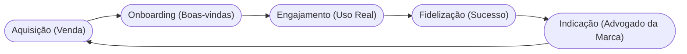

# Aula 11 - Relacionamento com o Cliente 🤝

!!! tip "Objetivo"
    **Objetivo**: Aprender a definir e gerenciar o tipo de relação que a empresa estabelece com seus clientes, visando a conquista de novos usuários, a retenção dos atuais e o aumento das vendas.

---

## 1. O que é Relacionamento? 💞

No Business Model Canvas, o relacionamento descreve o "tom" e a intensidade da interação entre a empresa e cada segmento de cliente. 

### Objetivos do Relacionamento:
1.  **Conquista**: Trazer novos clientes para o negócio.
2.  **Retenção**: Evitar que o cliente vá para a concorrência.
3.  **Vendas Adicionais**: Vender mais para quem já é cliente (Upsells).

---

## 2. Categorias de Relacionamento 📑

As empresas podem escolher diferentes níveis de proximidade:

*   **Assistência Pessoal**: Interação humana real (ex: call center, vendedor na loja).
*   **Assistência Personalizada**: Um gerente exclusivo para o cliente (ex: Private Banking).
*   **Self-Service**: A empresa fornece os meios, o cliente faz tudo sozinho (ex: Caixas eletrônicos).
*   **Serviços Automatizados**: Self-service com inteligência (ex: recomendação da Netflix).
*   **Comunidades**: Clientes interagem entre si para resolver problemas (ex: Fóruns de jogos).
*   **Co-criação**: O cliente ajuda a criar o valor (ex: Reviews da Amazon, vídeos do YouTube).

---

## 3. O Ciclo do Cliente (Mermaid) 🔄

Manter um cliente é muito mais barato do que conquistar um novo.



---

## 4. CRM: A Ferramenta do Gestor 🛠️

O **CRM (Customer Relationship Management)** é o software que guarda todo o histórico do cliente para que o relacionamento seja sempre contextualizado.

```termynal
$ crm --check-health
> Analisando base de clientes...
  - [x] Taxa de Resposta: 95%
  - [x] Churn (Cancelamento): 2%
  - [/] Satisfação (NPS): 8.5
> Status: RELACIONAMENTO SAUDÁVEL.
> Dica: Seus clientes estão felizes, mas peça mais indicações!
```

---

## 5. Churn Rate: O Perigo do Cancelamento 📉

O **Churn** é a taxa de clientes que param de comprar de você.
*   **Low Churn**: Indica que o relacionamento está forte.
*   **High Churn**: Indica que algo na proposta de valor ou no atendimento está falhando.

---

## 6. Mini-Projeto: Estratégia de Retenção 🚀

Imagine um **App de Academia**.
1.  Qual seria o tipo de relacionamento principal (ex: Manual ou Automatizado)?
2.  Como você usaria uma **Comunidade** para evitar que os alunos desistam?
3.  Crie uma mensagem de "Boas-vindas" automatizada para um novo aluno.

---

## 7. Exercício de Fixação 🧠

1.  Explique a diferença entre assistência pessoal e personalizada.
2.  O que é Co-criação e como ela gera valor para a empresa?
3.  Por que medir o **NPS (Net Promoter Score)** é vital para o relacionamento?

---

!!! info "Dica"
    Um bom relacionamento transforma clientes em **fãs**. Fãs perdoam erros pequenos e defendem sua marca de graça.

---

**Próxima Aula**: O que você faz todo dia? [Atividades-chave do Negócio](./aula-12.md) ⚙️
