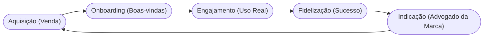

# Aula 11 - Relacionamento com o Cliente 🤝

!!! tip "Objetivo"
    **Objetivo**: Aprender a definir e gerenciar o tipo de relação que a empresa estabelece com seus clientes, visando a conquista de novos usuários, a retenção dos atuais e o aumento das vendas.

---

## 1. O que é Relacionamento? 💞

No Business Model Canvas, o relacionamento descreve o "tom" e a intensidade da interação entre a empresa e cada segmento de cliente. 

### Objetivos do Relacionamento:
1.  **Conquista**: Trazer novos clientes para o negócio.
2.  **Retenção**: Evitar que o cliente vá para a concorrência.
3.  **Vendas Adicionais**: Vender mais para quem já é cliente (Upsells).

---

## 2. Categorias de Relacionamento 📑

As empresas podem escolher diferentes níveis de proximidade:

*   **Assistência Pessoal**: Interação humana (Call Center). (1)
*   **Assistência Personalizada**: Gerente exclusivo.
*   **Self-Service**: Cliente faz tudo sozinho. (2)
*   **Serviços Automatizados**: Self-service inteligente.
*   **Comunidades**: Clientes interagem entre si.
*   **Co-criação**: O cliente ajuda a criar valor. (3)

(1) Alto custo, mas alta confiança.
(2) Baixo custo, exige interface intuitiva.
(3) Ex: Reviews e vídeos de usuários.

---

## 3. Público-Alvo vs. Persona 👤

Identificar o cliente exige dois níveis de detalhamento:

=== "Relacionamento Manual"
    *   **Foco**: Humanização e empatia profunda.
    *   **Indicado para**: Produtos complexos ou de alto ticket.
    *   **Custo**: Elevado por cliente.

=== "Relacionamento Automatizado"
    *   **Foco**: Escalabilidade e eficiência técnica.
    *   **Indicado para**: Produtos de massa ou SaaS.
    *   **Custo**: Baixo por cliente, depende de software.

!!! info "Net Promoter Score"
    O $NPS$ é a métrica definitiva de satisfação: $NPS = \%Promotores - \%Detratores$.

---

## 3. O Ciclo do Cliente (Mermaid) 🔄

Manter um cliente é muito mais barato do que conquistar um novo:


```mermaid
graph LR
    A(["Aquisição (Venda)"]) --> B(["Onboarding (Boas-vindas)"])
    B --> C(["Engajamento (Uso Real)"])
    C --> D(["Fidelização (Sucesso)"])
    D --> E(["Indicação (Advogado da Marca)"])
    E --> A
```

---

## 4. CRM: A Ferramenta do Gestor 🛠️

O **CRM (Customer Relationship Management)** é o software que guarda todo o histórico do cliente para que o relacionamento seja sempre contextualizado.

<!-- termynal -->
```console
$ crm --check-health
> Analisando base de clientes...
  - [x] Taxa de Resposta: 95%
  - [x] Churn (Cancelamento): 2%
  - [/] Satisfação (NPS): 8.5
> Status: RELACIONAMENTO SAUDÁVEL.
> Dica: Seus clientes estão felizes, mas peça mais indicações!
```

---

## 5. Churn Rate: O Perigo do Cancelamento 📉

O **Churn** é a taxa de clientes que param de comprar de você.
*   **Low Churn**: Indica que o relacionamento está forte.
*   **High Churn**: Indica que algo na proposta de valor ou no atendimento está falhando.

---

## 6. Aprofundamento: Cohort Analysis e Churn Rate 💔

Relacionar-se inclui metrificar retenção. O **Churn Rate** mede a taxa de cancelamento ou evasão de clientes. O aprofundamento analítico utiliza a análise de **Cohorts** (grupos de usuários que iniciaram juntos) para detectar em qual semana exata os usuários desistem da plataforma, permitindo intervir com automação de marketing pontual (ex: réguas de relacionamento, onboarding contínuo e Customer Success proativo).

---

## 7. Mini-Projeto: Estratégia de Retenção 🚀

Imagine um **App de Academia**.
1.  Qual seria o tipo de relacionamento principal (ex: Manual ou Automatizado)?
2.  Como você usaria uma **Comunidade** para evitar que os alunos desistam?
3.  Crie uma mensagem de "Boas-vindas" automatizada para um novo aluno.

---

## 8. Exercício de Fixação 🧠

1.  Explique a diferença entre assistência pessoal e personalizada.
2.  O que é Co-criação e como ela gera valor para a empresa?
3.  Por que medir o **NPS (Net Promoter Score)** é vital para o relacionamento?

---

!!! info "Dica"
    Um bom relacionamento transforma clientes em **fãs**. Fãs perdoam erros pequenos e defendem sua marca de graça.

---

---

## 🔗 Materiais da Aula

<div class="grid cards" markdown>
- :material-presentation: **Slides**

    ---

    Material visual com diagramas e conceitos-chave.

    [:octicons-arrow-right-24: Slide 11](../slides/slide-11.md)

- :material-help-circle: **Quiz**

    ---

    Teste seu conhecimento com 10 questões interativas.

    [:octicons-arrow-right-24: Quiz 11](../quizzes/quiz-11.md)

- :fontawesome-solid-pencil: **Exercícios**

    ---

    5 exercícios progressivos (básico → desafio).

    [:octicons-arrow-right-24: Exercício 11](../exercicios/exercicio-11.md)

- :material-briefcase-outline: **Projeto**

    ---

    Aplicação prática dos conceitos da aula.

    [:octicons-arrow-right-24: Projeto 11](../projetos/projeto-11.md)

</div>

---

[:octicons-arrow-right-24: Avançar para Aula 12](./aula-12.md){ .md-button .md-button--primary }

*[Churn]: Taxa de cancelamento ou abandono de um serviço por parte do cliente.
*[NPS]: Net Promoter Score - Métrica de lealdade e satisfação do cliente.
*[CRM]: Gestão de Relacionamento com o Cliente (Customer Relationship Management).
