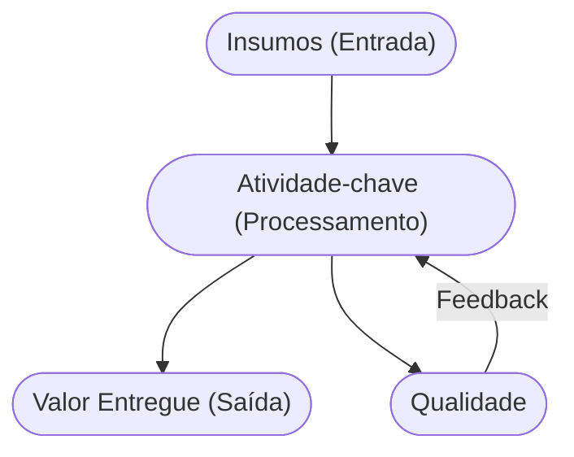

# Aula 12 - Atividades-chave do Negócio ⚙️

!!! tip "Objetivo"
    **Objetivo**: Identificar as ações mais importantes que uma empresa deve realizar para que seu modelo de negócio funcione, diferenciando o que é vital do que é secundário para a entrega de valor.

---

## 1. O que são Atividades-chave? 🔑

As atividades-chave são as ações essenciais que uma empresa deve executar para criar e oferecer uma Proposta de Valor, alcançar mercados, manter Relacionamentos com Clientes e obter Receitas.

!!! info "Conceito"
    Se você parar de realizar uma **Atividade-chave**, o seu modelo de negócio quebra. Elas são o "core" da sua operação.

---

## 2. Categorias de Atividades 📂

Geralmente, as atividades se encaixam em três grandes grupos:

1.  **Produção**: Atividades ligadas ao design, fabricação e entrega de um produto em larga escala (ex: fábricas de automóveis).
2.  **Resolução de Problemas**: Atividades que buscam soluções únicas para problemas de clientes individuais (ex: consultorias, hospitais).
3.  **Plataforma/Rede**: Atividades ligadas à gestão e promoção de uma plataforma ou rede (ex: Visa, eBay, Microsoft, Uber).

---

## 3. Atividade vs. Tarefa ⚖️

Nem tudo o que você faz no dia a dia é uma Atividade-chave.
*   **Tarefa**: Responder e-mails, limpar o escritório.
*   **Atividade-chave**: Desenvolvimento de Software (para uma empresa de tecnologia), Gestão da Cadeia de Suprimentos (para um e-commerce).

---

## 4. O Fluxo de Operação (Mermaid) 🌊



---

## 5. Auditoria de Atividades (Termynal) 💻

Seu negócio está focando no que importa?

```termynal
$ core-business --audit
> Analisando lista de tarefas...
  - [x] Desenvolvimento do Produto [CORE]
  - [x] Marketing Estratégico [CORE]
  - [!] Organização de Arquivos [SECUNDÁRIO]
> Alerta: Você está gastando muito tempo em tarefas secundárias.
> Dica: Delegue o que não for Atividade-chave!
```

---

## 6. Aprofundamento: Gargalos e Teoria das Restrições (TOC) 🏭

Gerir atividades-chave exige dominar a operacionalidade. A **Teoria das Restrições (TOC)** dita que todo sistema produtivo é limitado por pelo menos um gargalo (restrição). Empreendedores precisam mapear o macroprocesso, identificar esse gargalo e subordinar todo o resto a ele. Otimizar qualquer parte que não seja a restrição é considerado um desperdício de tempo que mascara ineficiências latentes.

---

## 7. Mini-Projeto: Priorizando o Core 🚀

Imagine que você é dono de um **Restaurante Gourmet**.
1.  Liste 3 Atividades que você faz no dia a dia.
2.  Identifique qual delas é a **Atividade-chave** (aquela que sem ela o restaurante fecha).
3.  Como você poderia terceirizar uma atividade que não é chave?

---

## 8. Exercício de Fixação 🧠

1.  Quais são as três categorias principais de Atividades-chave?
2.  Dê um exemplo de uma Atividade-chave para uma empresa que é uma **Plataforma**.
3.  Por que é importante focar nas Atividades-chave e delegar as secundárias?

---

!!! warning "Atenção"
    Não tente ser bom em tudo. Escolha as atividades que realmente geram diferencial competitivo e torne-se o melhor nelas.

---


---

## 📚 Material Complementar

*   **[📝 Exercícios da Aula 12](../exercicios/exercicio-12.md)**: Pratique os conceitos com questões focadas.
*   **[🚀 Projeto da Aula 12](../projetos/projeto-12.md)**: Aplique o conhecimento em um desafio prático de nível intermediário.

**Próxima Aula**: Entrando no Bloco 4! [Recursos Essenciais e Parcerias](./aula-13.md) 🧩
