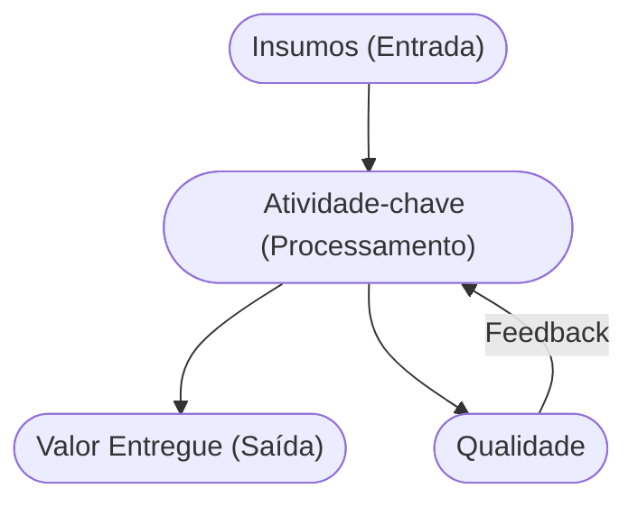

# Aula 12 - Atividades-chave do Negócio ⚙️

!!! tip "Objetivo"
    **Objetivo**: Identificar as ações mais importantes que uma empresa deve realizar para que seu modelo de negócio funcione, diferenciando o que é vital do que é secundário para a entrega de valor.

---

## 1. O que são Atividades-chave? 🔑

As atividades-chave são as ações essenciais que uma empresa deve executar para criar e oferecer uma Proposta de Valor, alcançar mercados, manter Relacionamentos com Clientes e obter Receitas.

!!! info "Conceito"
    Se você parar de realizar uma **Atividade-chave**, o seu modelo de negócio quebra. Elas são o "core" da sua operação.

---

## 2. Categorias de Atividades 📂

Geralmente, as atividades se encaixam em três grandes grupos:

1.  **Produção**: Design e fabricação em larga escala. (1)
2.  **Resolução de Problemas**: Soluções únicas para dores individuais. (2)
3.  **Plataforma/Rede**: Gestão e promoção de ecossistemas.

(1) Ex: Linhas de montagem automotiva.
(2) Ex: Hospitais e Consultorias.

---

## 3. Atividade vs. Tarefa ⚖️

Nem todo o trabalho agrega valor estratégico ao modelo de negócio:

=== "Atividade Operacional"
    *   **Foco**: Manutenção da rotina e execução local.
    *   **Impacto**: Médio (garante o funcionamento).
    *   **Ex**: Emissão de notas, limpeza, reuniões de status.

=== "Atividade Estratégica"
    *   **Foco**: Diferencial competitivo e entrega de valor.
    *   **Impacto**: Alto (se parar, o negócio morre).
    *   **Ex**: P&D, Gestão da Marca, Inovação de Processo.

!!! info "Cálculo de Capacidade"
    $Capacidade = \frac{Tempo\_Total\_Disponível}{Tempo\_por\_Tarefa} \times Eficiência$.

---

## 4. O Fluxo de Operação (Mermaid) 🌊


```mermaid
graph TD
    A(["Insumos (Entrada)"]) --> B(["Atividade-chave (Processamento)"])
    B --> C(["Valor Entregue (Saída)"])
    B --> D(["Qualidade"])
    D -- "Feedback" --> B
```

---

## 5. Auditoria de Atividades (Termynal) 💻

Seu negócio está focando no que importa?

<!-- termynal -->
```console
$ core-business --audit
> Analisando lista de tarefas...
  - [x] Desenvolvimento do Produto [CORE]
  - [x] Marketing Estratégico [CORE]
  - [!] Organização de Arquivos [SECUNDÁRIO]
> Alerta: Você está gastando muito tempo em tarefas secundárias.
> Dica: Delegue o que não for Atividade-chave!
```

---

## 6. Aprofundamento: Gargalos e Teoria das Restrições (TOC) 🏭

Gerir atividades-chave exige dominar a operacionalidade. A **Teoria das Restrições (TOC)** dita que todo sistema produtivo é limitado por pelo menos um gargalo (restrição). Empreendedores precisam mapear o macroprocesso, identificar esse gargalo e subordinar todo o resto a ele. Otimizar qualquer parte que não seja a restrição é considerado um desperdício de tempo que mascara ineficiências latentes.

---

## 7. Mini-Projeto: Priorizando o Core 🚀

Imagine que você é dono de um **Restaurante Gourmet**.
1.  Liste 3 Atividades que você faz no dia a dia.
2.  Identifique qual delas é a **Atividade-chave** (aquela que sem ela o restaurante fecha).
3.  Como você poderia terceirizar uma atividade que não é chave?

---

## 8. Exercício de Fixação 🧠

1.  Quais são as três categorias principais de Atividades-chave?
2.  Dê um exemplo de uma Atividade-chave para uma empresa que é uma **Plataforma**.
3.  Por que é importante focar nas Atividades-chave e delegar as secundárias?

---

!!! warning "Atenção"
    Não tente ser bom em tudo. Escolha as atividades que realmente geram diferencial competitivo e torne-se o melhor nelas.

---

---

## 🔗 Materiais da Aula

<div class="grid cards" markdown>
- :material-presentation: **Slides**

    ---

    Material visual com diagramas e conceitos-chave.

    [:octicons-arrow-right-24: Slide 12](../slides/slide-12.md)

- :material-help-circle: **Quiz**

    ---

    Teste seu conhecimento com 10 questões interativas.

    [:octicons-arrow-right-24: Quiz 12](../quizzes/quiz-12.md)

- :fontawesome-solid-pencil: **Exercícios**

    ---

    5 exercícios progressivos (básico → desafio).

    [:octicons-arrow-right-24: Exercício 12](../exercicios/exercicio-12.md)

- :material-briefcase-outline: **Projeto**

    ---

    Aplicação prática dos conceitos da aula.

    [:octicons-arrow-right-24: Projeto 12](../projetos/projeto-12.md)

</div>

---

[:octicons-arrow-right-24: Avançar para Aula 13](./aula-13.md){ .md-button .md-button--primary }

*[Core Business]: Atividade principal e central de uma empresa.
*[TOC]: Teoria das Restrições (Theory of Constraints) - Metodologia de gestão focada em gargalos.
