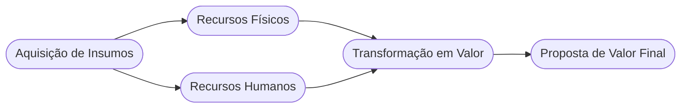

# Aula 13 - Recursos Essenciais e Infraestrutura 🧩

!!! tip "Objetivo"
    **Objetivo**: Identificar e gerenciar os recursos fundamentais necessários para que o modelo de negócio funcione, compreendendo as quatro categorias principais de ativos que sustentam a operação.

---

## 1. O que são Recursos Essenciais? 🏗️

Os recursos essenciais são os ativos mais importantes requeridos para fazer um modelo de negócio funcionar. Eles permitem que a empresa crie e ofereça uma Proposta de Valor, alcance mercados e mantenha relacionamentos.

---

## 2. As Quatro Categorias de Recursos 📂

Todo negócio precisa de uma combinação desses quatro tipos de recursos:

1.  **Físicos**: Ativos tangíveis, como instalações de fabricação, edifícios, veículos, sistemas de ponto de venda e redes de distribuição.
2.  **Intelectuais**: Ativos intangíveis, como marcas, conhecimento proprietário, patentes, direitos autorais e bancos de dados de clientes.
3.  **Humanos**: As pessoas são cruciais em todos os modelos de negócio, mas são particularmente importantes em indústrias criativas e de conhecimento intenso (ex: consultorias).
4.  **Financeiros**: Recursos financeiros e/ou garantias financeiras, como dinheiro, linhas de crédito ou opções de ações.

---

## 3. Posse vs. Acesso ⚖️

Um recurso essencial não precisa necessariamente ser de propriedade da empresa; ele pode ser alugado ou obtido por meio de parceiros.

*   **Próprio**: Maior controle, custo fixo inicial alto.
*   **Alugado/Terceirizado**: Menor controle, maior flexibilidade e custos variáveis.

---

## 4. O Fluxo de Recursos (Mermaid) 🌊



---

## 5. Inventário de Ativos (Termynal) 💻

Seu negócio tem o que precisa para rodar hoje?

<!-- termynal -->
```console
$ recursos --inventario
> Analisando infraestrutura... [OK]
> Verificando equipe técnica... [EM FALTA]
> Checando reserva financeira... [12 MESES]
> Diagnóstico: Seu maior risco hoje é a falta de RECURSO HUMANO especializado.
> Dica: Foque em contratação ou parcerias técnicas!
```

---

## 6. Aprofundamento: Gestão Ágil de Ativos e Capital Humano 🧠

Recursos não são apenas físicos. A alocação ótima do Capital Humano, protegendo as informações fundamentais e direitos de Propriedade Intelectual (PI), é vital a médio prazo. A abordagem *asset-light* (como ter servidores em nuvem, não comprar frotas – sublocar) reflete uma maturidade estratégica onde se prefere o OPE6 (Despesas Operacionais flexíveis) ao CAPE6 (Despesas de Capital pesadas) para facilitar o pivot das operações.

---

## 7. Mini-Projeto: Mapeando Ativos 🚀

Imagine que você está abrindo uma **Fábrica de Chocolate Artesanal**.
1.  Liste 2 **Recursos Físicos** essenciais.
2.  Qual seria o **Recurso Intelectual** mais importante (ex: uma receita secreta)?
3.  Quantas pessoas seriam o "mínimo viável" para começar (**Recursos Humanos**)?

---

## 8. Exercício de Fixação 🧠

1.  Explique a diferença entre recursos físicos e recursos intelectuais.
2.  Por que em uma empresa de software o recurso humano é frequentemente o mais valioso?
3.  Dê um exemplo de um negócio onde o recurso financeiro é o diferencial competitivo principal.

---

!!! info "Dica"
    Identifique o seu "Ponto Crítico": Qual recurso, se faltar hoje, faz seu negócio parar imediatamente? Esse é o seu recurso mais essencial.

---

---

## 🔗 Materiais da Aula

<div class="grid cards" markdown>
- :material-presentation: **Slides**

    ---

    Material visual com diagramas e conceitos-chave.

    [:octicons-arrow-right-24: Slide 13](../slides/slide-13.html)

- :material-help-circle: **Quiz**

    ---

    Teste seu conhecimento com 10 questões interativas.

    [:octicons-arrow-right-24: Quiz 13](../quizzes/quiz-13.md)

- :fontawesome-solid-pencil: **Exercícios**

    ---

    5 exercícios progressivos (básico → desafio).

    [:octicons-arrow-right-24: Exercício 13](../exercicios/exercicio-13.md)

- :material-briefcase-outline: **Projeto**

    ---

    Aplicação prática dos conceitos da aula.

    [:octicons-arrow-right-24: Projeto 13](../projetos/projeto-13.md)

</div>

---

[:octicons-arrow-right-24: Avançar para Aula 14](./aula-14.md){ .md-button .md-button--primary }
