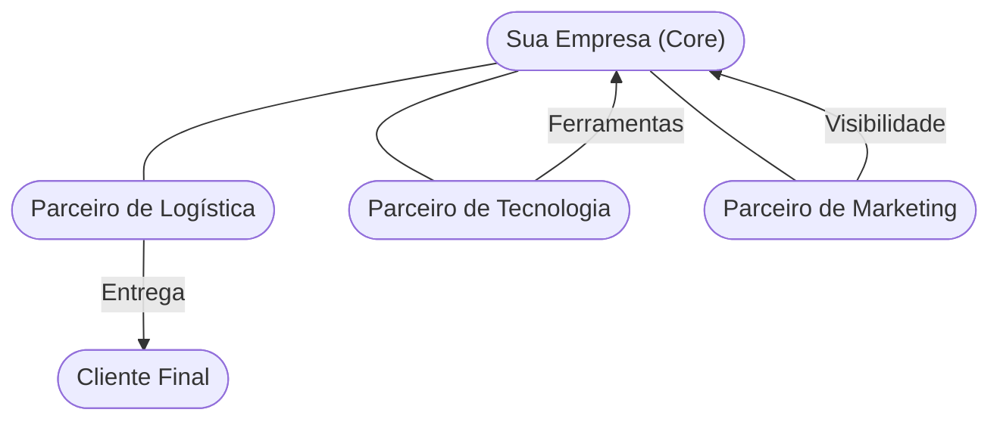

# Aula 14 - Parceiros-chave e Alianças Estratégicas 🤝

!!! tip "Objetivo"
    **Objetivo**: Compreender a importância da rede de fornecedores e parceiros que fazem o modelo de negócio funcionar, identificando os diferentes tipos de alianças e os motivos para estabelecê-las.

---

## 1. O que são Parceiros-chave? 🔗

Parceiros-chave são a rede de fornecedores e colaboradores que ajudam a otimizar o modelo de negócio, reduzir riscos ou adquirir recursos. Ninguém faz tudo sozinho no mercado moderno.

---

## 2. Tipos de Parcerias 📑

Existem quatro tipos diferentes de parcerias:

1.  **Alianças Estratégicas**: Entre empresas não concorrentes (ex: uma marca de café e uma livraria).
2.  **Competição (Coopetição)**: Parcerias estratégicas entre concorrentes para desenvolver o mercado (ex: montadoras que dividem pesquisa de motores).
3.  **Joint Ventures**: Duas empresas criam um novo negócio juntas (ex: Sony Ericson no passado).
4.  **Relação Comprador-Fornecedor**: Parcerias para garantir insumos confiáveis (ex: montadoras e seus fornecedores de pneus).

---

## 3. Por que fazer parcerias? ❓

Nenhuma empresa é uma ilha. Os motivos principais são:
*   **Otimização e Economia de Escala**: Reduzir custos por meio de infraestrutura compartilhada.
*   **Redução de Risco e Incerteza**: Dividir o risco de entrar em um novo mercado tecnológico.
*   **Aquisição de Recursos ou Atividades**: Onde a empresa foca no seu "core" e deixa o resto com especialistas.

---

## 4. O Sistema de Alianças (Mermaid) 🔄



---

## 5. Validação de Parcerias (Termynal) 💻

Seus parceiros estão alinhados com seus objetivos?

```termynal
$ parceiro --analisar "Logística Express"
> Verificando histórico de entregas... [98% OK]
> Analisando custos vs benefícios... [ALTO CUSTO]
> Checando exclusividade... [NÃO]
> Resultado: Parceiro CONFIÁVEL, mas caro.
> Dica: Procure um segundo fornecedor para aumentar seu poder de negociação!
```

---

## 6. Mini-Projeto: Mapa de Parceiros 🚀

Imagine que você está criando um **SaaS (Software como Serviço) para Advogados**.
1.  Quem seria seu **Parceiro de Infraestrutura** (ex: AWS, Azure)?
2.  Identifique uma possível **Aliança Estratégica** (ex: uma associação de advogados).
3.  Qual o maior risco de depender de um único parceiro tecnológico?

---

## 7. Exercício de Fixação 🧠

1.  Explique o conceito de "Coopetição" com um exemplo real.
2.  Quais são as três motivações principais para se estabelecer uma parceria?
3.  Como uma parceria pode ajudar na "Redução de Riscos" de uma startup?

---

!!! warning "Atenção"
    Escolher o parceiro errado pode ser tão fatal quanto não ter parceiro algum. Avalie sempre a reputação e o alinhamento de valores antes de assinar um contrato.

---

**Próxima Aula**: Quanto custa tudo isso? [Estrutura de Custos do Negócio](./aula-15.md) 💰
