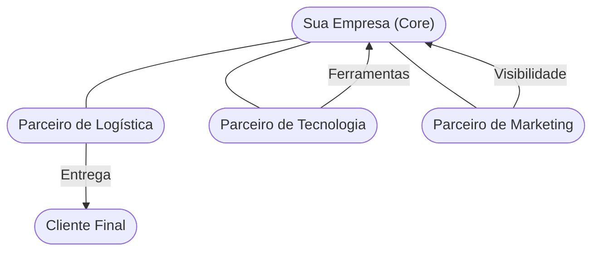

# Aula 14 - Parceiros-chave e Alianças Estratégicas 🤝

!!! tip "Objetivo"
    **Objetivo**: Compreender a importância da rede de fornecedores e parceiros que fazem o modelo de negócio funcionar, identificando os diferentes tipos de alianças e os motivos para estabelecê-las.

---

## 1. O que são Parceiros-chave? 🔗

Parceiros-chave são a rede de fornecedores e colaboradores que ajudam a otimizar o modelo de negócio, reduzir riscos ou adquirir recursos. Ninguém faz tudo sozinho no mercado moderno.

---

## 2. Tipos de Parcerias 📑

Existem quatro tipos diferentes de parcerias:

1.  **Alianças Estratégicas**: Não concorrentes colaborando. (1)
2.  **Competição (Coopetição)**: Concorrentes colaborando. (2)
3.  **Joint Ventures**: Novo negócio criado por dois parceiros.
4.  **Relação Comprador-Fornecedor**: Garantia de suprimentos.

(1) Ex: Cafeteria dentro de uma Livraria.
(2) Ex: Marcas de carros que dividem o custo de criar um novo motor. Aqui entra a conta da Sinergia: $S > 1 + 1$.

---

## 3. Por que fazer parcerias? ❓

As alianças devem ser estratégicas e não apenas operacionais:

=== "Otimização e Escala"
    *   **Foco**: Reduzir desperdícios unitários.
    *   **Meta**: Aproveitar a infraestrutura de terceiros.
    *   **Drivers**: Preço e Agilidade.

=== "Redução de Risco"
    *   **Foco**: Segurança em ambientes incertos.
    *   **Meta**: Não quebrar sozinho em novos mercados.
    *   **Drivers**: Estabilidade e Compartilhamento.

*   **Otimização e Economia de Escala**: Reduzir custos por meio de infraestrutura compartilhada.
*   **Redução de Risco e Incerteza**: Dividir o risco de entrar em um novo mercado tecnológico.
*   **Aquisição de Recursos ou Atividades**: Onde a empresa foca no seu "core" e deixa o resto com especialistas.

---

## 4. O Sistema de Alianças (Mermaid) 🔄


```mermaid
graph TD
    A(["Sua Empresa (Core)"]) --- B(["Parceiro de Logística"])
    A --- C(["Parceiro de Tecnologia"])
    A --- D(["Parceiro de Marketing"])
    B -- "Entrega" --> E(["Cliente Final"])
    C -- "Ferramentas" --> A
    D -- "Visibilidade" --> A
```

---

## 5. Validação de Parcerias (Termynal) 💻

Seus parceiros estão alinhados com seus objetivos?

<!-- termynal -->
```console
$ parceiro --analisar "Logística Express"
> Verificando histórico de entregas... [98% OK]
> Analisando custos vs benefícios... [ALTO CUSTO]
> Checando exclusividade... [NÃO]
> Resultado: Parceiro CONFIÁVEL, mas caro.
> Dica: Procure um segundo fornecedor para aumentar seu poder de negociação!
```

---

## 6. Aprofundamento: Joint Ventures e Alianças API/Economy 🤝

Parcerias vão além da simples relação cliente-fornecedor. Alianças estratégicas (coopetição = colaborar com competidores) e a submissão a ecossistemas interconectados são sinais de maturidade. No mundo digital, as APIs (interfaces de comunicação de software) são as novas 'parcerias': construir sobre a base de terceiros (ex: usar Google Maps API, Stripe para pagamentos), poupando meses de desenvolvimento proprietário e acelerando a entrada no mercado.

---

## 7. Mini-Projeto: Mapa de Parceiros 🚀

Imagine que você está criando um **SaaS (Software como Serviço) para Advogados**.
1.  Quem seria seu **Parceiro de Infraestrutura** (ex: AWS, Azure)?
2.  Identifique uma possível **Aliança Estratégica** (ex: uma associação de advogados).
3.  Qual o maior risco de depender de um único parceiro tecnológico?

---

## 8. Exercício de Fixação 🧠

1.  Explique o conceito de "Coopetição" com um exemplo real.
2.  Quais são as três motivações principais para se estabelecer uma parceria?
3.  Como uma parceria pode ajudar na "Redução de Riscos" de uma startup?

---

!!! warning "Atenção"
    Escolher o parceiro errado pode ser tão fatal quanto não ter parceiro algum. Avalie sempre a reputação e o alinhamento de valores antes de assinar um contrato.

---

---

## 🔗 Materiais da Aula

<div class="grid cards" markdown>
- :material-presentation: **Slides**

    ---

    Material visual com diagramas e conceitos-chave.

    [:octicons-arrow-right-24: Slide 14](../slides/slide-14.md)

- :material-help-circle: **Quiz**

    ---

    Teste seu conhecimento com 10 questões interativas.

    [:octicons-arrow-right-24: Quiz 14](../quizzes/quiz-14.md)

- :fontawesome-solid-pencil: **Exercícios**

    ---

    5 exercícios progressivos (básico → desafio).

    [:octicons-arrow-right-24: Exercício 14](../exercicios/exercicio-14.md)

- :material-briefcase-outline: **Projeto**

    ---

    Aplicação prática dos conceitos da aula.

    [:octicons-arrow-right-24: Projeto 14](../projetos/projeto-14.md)

</div>

---

[:octicons-arrow-right-24: Avançar para Aula 15](./aula-15.md){ .md-button .md-button--primary }

*[Outsourcing]: Terceirização de processos de negócio para parceiros externos.
*[Joint Venture]: Modelo de negócio onde duas ou mais empresas isoladas se unem para criar uma nova entidade.
