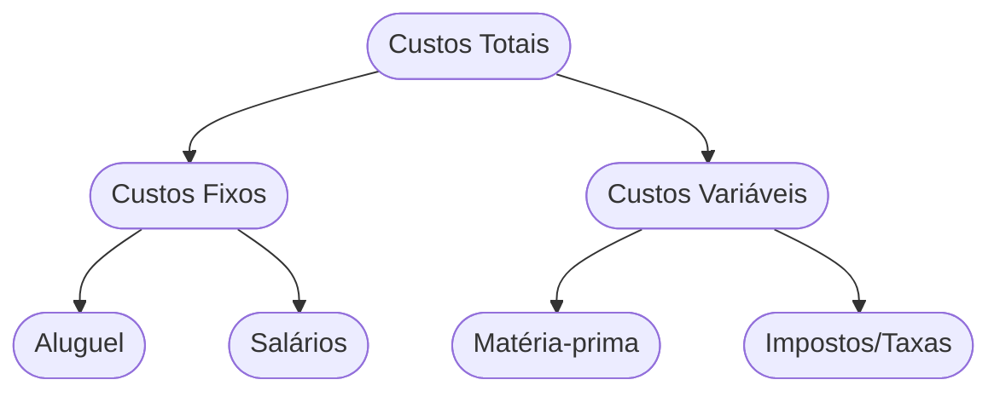

# Aula 15 - Estrutura de Custos do Negócio 💰

!!! tip "Objetivo"
    **Objetivo**: Compreender todos os custos envolvidos na operação de um modelo de negócio, aprendendo a diferenciar tipos de custos e a encontrar o ponto de equilíbrio financeiro do empreendimento.

---

## 1. O que é Estrutura de Custos? 🏗️

A estrutura de custos descreve todos os custos incorridos para operar um modelo de negócio. Criar e entregar valor, manter relacionamentos e gerar receita, tudo gera custo.

---

## 2. Tipos de Estruturas de Custo 📂

A decisão estratégica sobre custos define o DNA da empresa:

=== "Foco no Custo (Low Cost)"
    *   **Lógica**: Eficiência extrema e preço baixo.
    *   **Ex**: Companhias aéreas sem luxo.
    *   **Meta**: Volume massivo.

=== "Foco no Valor (Premium)"
    *   **Lógica**: Experiência única e exclusividade.
    *   **Ex**: Marcas de luxo e resorts.
    *   **Meta**: Alta margem por cliente.

1.  **Direcionado pelo Custo (Cost-driven)**: Focado em minimizar custos onde quer que seja possível (ex: companhias aéreas low-cost como a RyanAir).
2.  **Direcionado pelo Valor (Value-driven)**: Focado na criação de valor e personalização, com menos preocupação com o custo (ex: hotéis de luxo, marcas de grife).

---

## 3. Características dos Custos 📊

Para gerir seu financeiro, você deve entender estes quatro conceitos:

*   **Custos Fixos**: Independem da produção (Aluguel). (1)
*   **Custos Variáveis**: Proporcionais à produção (Insumos). (2)
*   **Economias de Escala**: Custo unitário cai com volume.
*   **Economias de Escopo**: Custo cai com variedade.

(1) Risco maior em períodos de crise.
(2) Aqui calculamos a Margem: $Margem = Preço - Custos\_Variáveis$.

---

## 4. O Mapa de Custos (Mermaid) 📉



---

## 5. Simulador de Gastos (Termynal) 💻

Como está a saúde financeira da sua operação?

<!-- termynal -->
```console
$ finance --audit-costs
> Analisando custos fixos... [ALTO]
> Verificando custos variáveis... [CONTROLADOS]
> Calculando Ponto de Equilíbrio... [1.500 unidades/mês]
> Resultado: Suas despesas fixas estão consumindo sua margem.
> Dica: Tente renegociar o aluguel ou otimizar a equipe administrativa!
```

---

## 6. Aprofundamento: Economia de Escala vs. Escopo e Burn Rate 🔥

Dominar custos implica entender que o crescimento pode trazer a **Economia de Escala** (redução do custo unitário pelo volume) ou **Economia de Escopo** (usar a mesma infraestrutura para vender múltiplos produtos). Para startups, o **Burn Rate** (taxa mensal que a empresa gasta do seu capital investido até virar lucrativa) e a projeção de "Runway" (quantos meses a empresa dura até quebrar) são os indicadores cruciais de sobrevivência e necessidade de novas captações.

---

## 7. Mini-Projeto: Calculando o Básico 🚀

Imagine que você vende **Camisetas Estampadas**.
1.  O aluguel da sua sala é de R$ 1.000,00 (**Custo Fixo**).
2.  Cada camiseta custa R$ 20,00 para ser produzida (**Custo Variável**).
3.  Se você vender a camiseta por R$ 50,00, quantas você precisa vender por mês apenas para pagar o aluguel?
4.  Identifique uma forma de gerar **Economia de Escala** nesse negócio.

---

## 8. Exercício de Fixação 🧠

1.  Qual a diferença entre um negócio *Cost-driven* e um *Value-driven*?
2.  Explique o conceito de "Custos Variáveis" com um exemplo de uma empresa de serviços.
3.  O que são "Economias de Escopo" e como elas ajudam a reduzir custos?

---

!!! info "Dica"
    O segredo de um negócio lucrativo é manter os custos fixos baixos e os variáveis sob controle, enquanto se escala a Proposta de Valor.

---

---

## 🔗 Materiais da Aula

<div class="grid cards" markdown>
- :material-presentation: **Slides**

    ---

    Material visual com diagramas e conceitos-chave.

    [:octicons-arrow-right-24: Slide 15](../slides/slide-15.html)

- :material-help-circle: **Quiz**

    ---

    Teste seu conhecimento com 10 questões interativas.

    [:octicons-arrow-right-24: Quiz 15](../quizzes/quiz-15.md)

- :fontawesome-solid-pencil: **Exercícios**

    ---

    5 exercícios progressivos (básico → desafio).

    [:octicons-arrow-right-24: Exercício 15](../exercicios/exercicio-15.md)

- :material-briefcase-outline: **Projeto**

    ---

    Aplicação prática dos conceitos da aula.

    [:octicons-arrow-right-24: Projeto 15](../projetos/projeto-15.md)

</div>

---

[:octicons-arrow-right-24: Avançar para Aula 16](./aula-16.md){ .md-button .md-button--primary }

*[Custos Fixos]: Gastos que não variam com o volume de produção (ex: aluguel).
*[Economias de Escala]: Vantagem de custo obtida com o aumento da produção unitária.
*[Burn Rate]: Taxa com que uma nova empresa consome o seu capital antes de gerar lucro.
