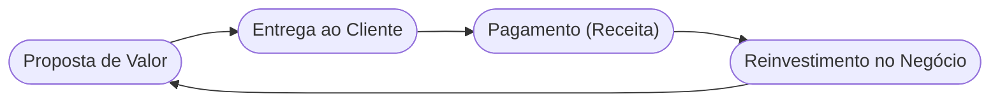

# Aula 16 - Fontes de Receita e Modelos de Ganho 🏆

!!! tip "Objetivo"
    **Objetivo**: Identificar as diferentes formas de gerar dinheiro em um modelo de negócio, explorando mecanismos de precificação e tipos de fluxos de receita para garantir a lucratividade e o crescimento.

---

## 1. O que são Fontes de Receita? 💰

As fontes de receita representam o dinheiro que uma empresa gera a partir de cada Segmento de Clientes. Se os clientes são o coração do negócio, as receitas são as **artérias**.

---

## 2. Tipos de Fluxos de Receita 💹

Um modelo de negócio pode envolver dois tipos diferentes de receitas:

1.  **Receitas Transacionais**: Pagamentos únicos (Venda). (1)
2.  **Receitas Recorrentes**: Pagamentos constantes (Assinatura). (2)

(1) Ex: Comprar um livro físico.
(2) Ex: Mensalidade da Netflix. Aqui entra o cálculo de $ARR_{Anual} = MRR \times 12$.

---

## 3. Formas de Gerar Receita 🛠️

O mercado oferece diversos mecanismos de monetização:

=== "Venda de Direitos"
    *   **Venda de Ativos**: Direito de propriedade total.
    *   **Licenciamento**: Direito de uso de PI.
    *   **Leasing/Aluguel**: Direito temporário de posse.

=== "Venda de Serviços"
    *   **Taxa de Uso**: Pagamento pelo consumo (ex: KW/h).
    *   **Taxa de Assinatura**: Acesso por tempo (ex: Academia).
    *   **Taxa de Corretagem**: Intermediação (ex: Imobiliária).

*   **Anúncios**: Taxas por visibilidade publicitária.

---

## 4. O Ciclo Financeiro (Mermaid) 🔄



---

## 5. Mecanisms de Precificação (Termynal) 📊

Como você define quanto cobrar?

<!-- termynal -->
```console
$ precificacao --check-strategy
> Analisando lista de preços...
  - [x] Fixas (Preço de Tabela)
  - [ ] Dinâmicas (Leilão/Negociação)
> Diagnóstico: Seu modelo é rígido.
> Dica: Considere taxas variadas por volume para atrair clientes maiores!
```

---

## 6. Aprofundamento: O Efeito de Rede e MRR/ARR 🕸️

A maestria em fontes de receita muitas vezes se apoia no **Efeito de Rede**: o produto se torna mais valioso à medida que mais pessoas o usam (ex: WhatsApp, MercadoLivre). Na medição financeira moderna, especialmente em negócios digitais ou serviços SaaS, foca-se brutalmente no MRR (Monthly Recurring Revenue - Receita Recorrente Mensal) e o ARR (Anual), métricas fiéis para atrair investidores em rodadas de Series A/B.

---

## 7. Mini-Projeto: Projetando Ganhos 🚀

Imagine que você criou um **App de Meditação**.
1.  Defina uma **Fonte de Receita Recorrente** (ex: R$ 29,90/mês).
2.  Defina uma **Fonte de Receita Transacional** (ex: compra de um fone de ouvido da marca).
3.  Qual seria o seu principal desafio para manter as receitas recorrentes crescendo?

---

## 8. Exercício de Fixação 🧠

1.  Qual a diferença entre receita transacional e recorrente?
2.  Dê um exemplo de um negócio que vive de "Taxa de Corretagem".
3.  O que é "Licenciamento" e como ele gera receita sem precisar fabricar produtos?

---

---

## 🔗 Materiais da Aula

<div class="grid cards" markdown>
- :material-presentation: **Slides**

    ---

    Material visual com diagramas e conceitos-chave.

    [:octicons-arrow-right-24: Slide 16](../slides/slide-16.html)

- :material-help-circle: **Quiz**

    ---

    Teste seu conhecimento com 10 questões interativas.

    [:octicons-arrow-right-24: Quiz 16](../quizzes/quiz-16.md)

- :fontawesome-solid-pencil: **Exercícios**

    ---

    5 exercícios progressivos (básico → desafio).

    [:octicons-arrow-right-24: Exercício 16](../exercicios/exercicio-16.md)

- :material-briefcase-outline: **Projeto**

    ---

    Aplicação prática dos conceitos da aula.

    [:octicons-arrow-right-24: Projeto 16](../projetos/projeto-16.md)

</div>

---

!!! success "Parabéns!"
    Você completou as **16 aulas** do curso! Agora você tem todas as ferramentas
    para construir modelos de negócios sólidos, lucrativos e inovadores. 🚀

[:octicons-arrow-left-24: Voltar à Trilha de Aulas](./index.md){ .md-button .md-button--primary }

*[Subscription]: Modelo de assinatura onde o cliente paga recorrentemente pelo acesso.
*[Monetization]: Monetização - Processo de transformar algo em fonte de lucro.
