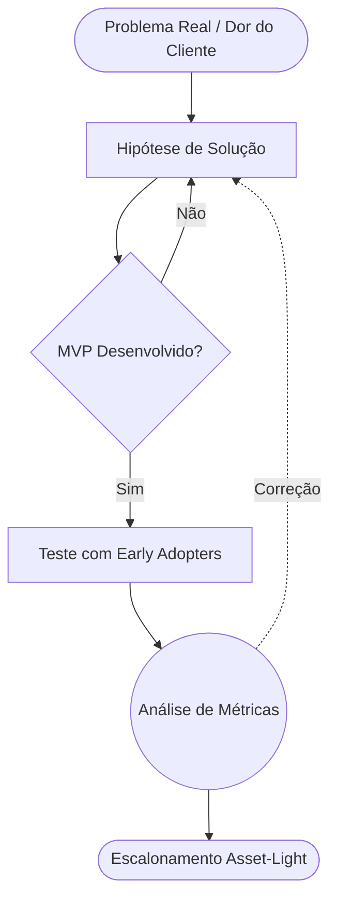

# O Projeto de Referência 🏆

!!! success "O Modelo de Ouro"
    Este projeto serve como **guia definitivo** e referencial para todas as entregas e simulações do curso. Ao construir o seu canvas ou validar sua hipótese, compare a profundidade da sua pesquisa com este documento de referência.

---

## 🏛️ Estrutura do Projeto Ideal

Um projeto de alta qualidade no contexto do *Desenvolvimento de Modelos de Negócios* deve sempre englobar os 3 pilares da tração real:

1. **Ideação Fundamentada:** Baseada em pesquisa demográfica tangível (JTBD).
2. **Matrizes Atestáveis (Canvas):** Desenho visual iterativo e fácil de transmutar.
3. **Métricas de Sucesso:** KPIs claros focando em Retenção (LTV) e Custo de Aquisição (CAC).

### Exemplo de Aplicação Prática

```termynal
$ projeto-init --referencia
> Carregando "O Projeto Ideal"...
> Estruturando bases de dados e viabilidade...
> [EXECUTADO] Verifique a consistência com o seu material!
```

---

## 📈 O Diagrama de Operação Padrão

O fluxo abaixo desenha puramente como uma operação sustentável deveria agir no mercado:



---

> Lembre-se: O propósito deste repositório não é limitar a criatividade, mas sim evitar que a **Ação Cega** ou **Suposição sem Validação** consumam os recursos da sua operação inicial. Compare constantemente os resultados da sua modelagem com esta âncora!
