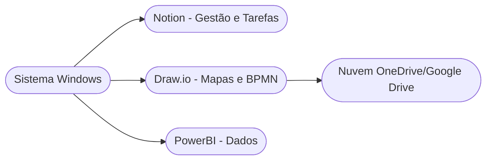

# Setup de Produtividade: Ambiente Windows 🪟

!!! tip "Objetivo"
    **Objetivo**: Preparar seu ambiente de sistema operacional Windows com as ferramentas certas de mapeamento, produtividade e cloud necessárias para atuar profissionalmente na gestão de modelos de negócios e Canvas.

---

## 1. O Ecossistema de Ferramentas 🛠️

Para o empreendedor digital no Windows, focar no ecossistema de fácil uso com forte interoperabilidade é crucial:



---

## 2. Instalação Ágil (Chocolatey) 💻

Em vez de baixar executáveis manualmente, usuários avançados no Windows utilizam o **Chocolatey** para instalar todas as ferramentas do ambiente de negócios de uma vez com um Terminal seguro.

Execute como Administrador:

```termynal
$ choco install notion drawio powerbi slack googlechrome -y
> [Processando] Download do Notion... OK
> [Processando] Download do Draw.io... OK
> [Processando] Download do PowerBI Desktop... OK
> Instalação Concluída. Seu setup de negócios está pronto!
```

---

!!! warning "Atenção ao Windows Update"
    Ocasionalmente atualizações forçadas reiniciam seu computador. Configure o "Horário Ativo" no Windows Update para o período que você está acordado e sempre mantenha backups contínuos de seus fluxos de caixa e matrizes no OneDrive ou Google Drive.

---

## 3. Próximo Passo
Se você usa outro sistema ou trabalha com Devs, recomendamos ler também como estruturar o ambiente de gestão para [Linux](./setup-02.md) e [macOS](./setup-03.md).