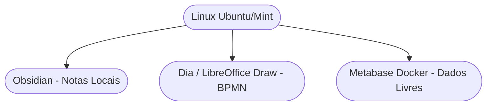

# Setup de Produtividade: Ambiente Linux 🐧

!!! tip "Objetivo"
    **Objetivo**: Parametrizar o ambiente Linux (distribuições Debian/Ubuntu) para estabilidade extrema na gestão de operações diárias, design de negócios (BPMN) e análise sem custo de licenciamento.

---

## 1. Segurança e Fluidez no Open Source 🌐

Ter o Linux no core da sua operação enxuta garante custo zero com licenciamento e foca seus recursos num ambiente ultra blindado (Zero-Trust):



---

## 2. Instalação Profissional Diária (APT / Snap) 💻

Instale todo o aparato e pacotes logísticos para suas matrizes através do seu console:

```termynal
$ sudo apt update && sudo apt install libreoffice dia -y
> Atualizando repositórios...
> LibreOffice instalado.
> Dia (Mapas Mentais) instalados.
$ sudo snap install obsidian --classic
> Obsidian (Gestão de Conhecimento Rápido) instalado! Seu Vault está pronto!
```

---

!!! info "Segurança em Nuvem"
    O Linux é fenomenal, mas evite salvar seus Canvas localmente se você for um viajante. Instale o Rclone ou Nextcloud para manter a sincronia ininterrupta de seus manifestos e planos de negócio com o resto de sua diretoria.

---

## 3. Ferramentas Extras
Consulte os guias de ambientação para [Windows](./setup-01.md) ou [macOS](./setup-03.md) caso algum funcionário de suas futuras integrações use essas plataformas.