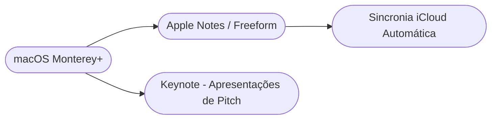

# Setup de Produtividade: Ambiente macOS 🍏

!!! tip "Objetivo"
    **Objetivo**: Harmonizar seu Mac para garantir excelência de design e processos criativos integrados ao ecossistema Apple com foco de gestão de negócios, ideal para processos de ideação profunda.

---

## 1. O Padrão Ouro de Engajamento 🖌️

O iOS foca no aspecto nativo. O profissional de ideação se beneficia de interfaces livres de fricção com a unificação Handoff entre o MacBook, o iPad e o iPhone em campo:



---

## 2. Instalação do Brew (Homebrew) 💻

Um Mac gerido profissionalmente foca as aquisições base pelo Terminal do MacOS usando o HomeBrew, instalando pacotes rapidamente:

```termynal
$ /bin/bash -c "$(curl -fsSL https://raw.githubusercontent.com/Homebrew/install/HEAD/install.sh)"
$ brew install --cask slack notion microsoft-excel
> Buscando dependências Apple e instalando Casks...
> Notion: Instalado!
> Slack HQ: Instalado!
> MS Excel (Mac Version): Instalado em Applications!
```

---

!!! success "O Fator Minimalista"
    A grande sacada no macOS para o Gestor de Negócios é focar na ausência de distrações. Use o Focus Mode atrelado ao seu calendário (ex. "Bloqueio de Foco" ativa automaticamente restrição de notificações indesejadas).

---

## 3. Navegação
Para equipes multiplataformas, revise também os padrões exigidos no ecossistema [Windows](./setup-01.md) e no ecossistema de open source [Linux](./setup-02.md).