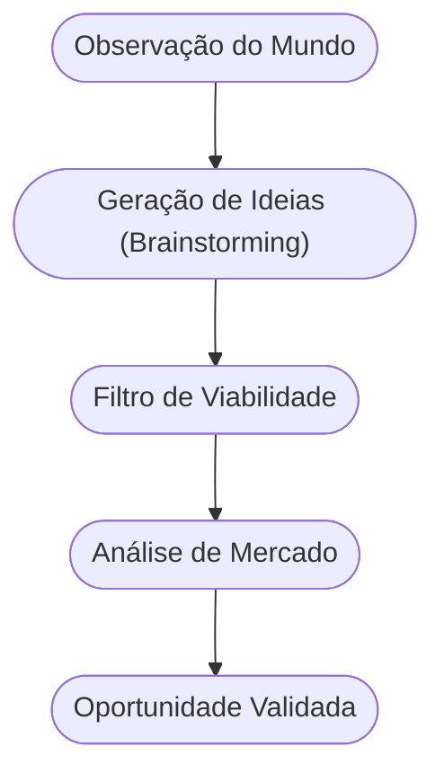

<!-- .slide: class="center" -->

# Aula 02 - Identificação de Oportunidades de Negócio 🏗️

### Desenvolvimento de Modelos de Negócios

[Pressione ESPAÇO para avançar]

---

## Avisos da Aula

- Desliguem os celulares <!-- .element: class="fragment" -->
- Foco na lógica <!-- .element: class="fragment" -->
- Participação ativa <!-- .element: class="fragment" -->

---

## 1. Ideia vs. Oportunidade 💡

Ter uma ideia brilhante não garante um negócio de sucesso. A diferença entre elas é fundamental:

- <!-- .element: class="fragment" --> **Ideia**: Uma concepção abstrata, algo que "seria legal fazer".
- <!-- .element: class="fragment" --> **Oportunidade**: É uma ideia que encontra um **mercado**, resolve uma **dor real** e possui **viabilidade econômica**.

---

## 1. Ideia vs. Oportunidade 💡

!!! info "Conceito"
    Uma **Oportunidade de Negócio** é uma ideia que se mostra viável para ser implementada, gerando valor tanto para o empreendedor quanto para o cliente.

---

---

## 2. Onde nascem as oportunidades? 🔍

As melhores oportunidades surgem da observação atenta do ambiente:

1.  **Problemas não resolvidos**: Reclamações de clientes sobre produtos existentes.
2.  **Mudanças Sociais**: Novos hábitos de consumo (ex: aumento do home office).
3.  **Avanços Tecnológicos**: Surgimento de novas ferramentas que permitem fazer algo de forma mais barata ou rápida.
4.  **Mudanças Legais**: Novas leis que geram necessidade de adaptação das empresas.
5.  **Lacunas de Mercado**: Regiões ou públicos que não são atendidos por grandes marcas.

---

## 2. Onde nascem as oportunidades? 🔍

---

---

## 3. O Funil de Oportunidades (Mermaid) 🌪️



---

## 3. O Funil de Oportunidades (Mermaid) 🌪️

---

---

## 4. Ferramentas de Mapeamento 🛠️

Para identificar se sua ideia é uma oportunidade, use o comando da "realidade":

---

## 4. Ferramentas de Mapeamento 🛠️

```termynal
$ oportunidade --scan-market
> Analisando demanda... [OK]
> Verificando concorrência... [ALTA]
> Calculando diferenciação... [NECESSÁRIA]
> Alerta: Foque em um nicho específico para vencer a concorrência!
```

---

## 4. Ferramentas de Mapeamento 🛠️

---

---

## 5. Análise de Nicho 🎯

Tentar vender para todo mundo é o caminho mais rápido para não vender para ninguém.
- <!-- .element: class="fragment" --> **Segmentação**: Dividir o mercado em grupos menores.
- <!-- .element: class="fragment" --> **Diferenciação**: O que faz você ser a escolha óbvia em comparação aos outros?

!!! warning "Atenção"
    Não se apaixone pela sua solução, se apaixone pelo **problema** do seu cliente. A solução pode mudar, o problema é o que sustenta o negócio.

---

## 5. Análise de Nicho 🎯

---

---

## 6. Aprofundamento: Matriz CSD e Oceano Azul 🌊

Para avançarmos, é vital não apenas identificar oportunidades, mas mapear **Certezas, Suposições e Dúvidas (Matriz CSD)**. Além disso, a estratégia do **Oceano Azul** sugere que, em vez de competir em mercados saturados (oceanos vermelhos), o empreendedor intermediário deve buscar espaços inexplorados, criando nova demanda e tornando a concorrência irrelevante através de inovação de valor.

---

---

## 7. Mini-Projeto: Observação de Campo 🚀

1.  Escolha um trajeto que você faz diariamente (ou uma rede social que usa muito).
2.  Anote 3 situações que geram frustração (problemas).
3.  Para cada problema, pense em uma solução simples que poderia ser um negócio.
4.  Escolha a melhor das três e verifique: "As pessoas pagariam por isso?".

---

---

## 8. Exercício de Fixação 🧠

1.  Defina, com suas palavras, a diferença entre ideia e oportunidade.
2.  Cite dois exemplos de mudanças tecnológicas recentes que criaram novas oportunidades de negócio.
3.  Por que a segmentação é importante na fase de identificação de oportunidades?

---

---

## 8. Exercício de Fixação 🧠


---

---

## 📚 Material Complementar

- <!-- .element: class="fragment" --> **[📝 Exercícios da Aula 02](../exercicios/exercicio-02.md)**: Pratique os conceitos com questões focadas.
- <!-- .element: class="fragment" --> **[🚀 Projeto da Aula 02](../projetos/projeto-02.md)**: Aplique o conhecimento em um desafio prático de nível intermediário.

**Próxima Aula**: Vamos mergulhar na [Análise de Valor: Inovação e Sustentabilidade](../aulas/aula-03.md)! 📡

---

## Discussão Aberta 1

- Como os conceitos vistos afetam nosso ambiente? <!-- .element: class="fragment" -->
- Quem tem um exemplo prático? <!-- .element: class="fragment" -->
- Pontos de ruptura? <!-- .element: class="fragment" -->

---

## Discussão Aberta 2

- Como os conceitos vistos afetam nosso ambiente? <!-- .element: class="fragment" -->
- Quem tem um exemplo prático? <!-- .element: class="fragment" -->
- Pontos de ruptura? <!-- .element: class="fragment" -->

---

<!-- .slide: class="center" -->

# FIM DA AULA 02

### Obrigado!