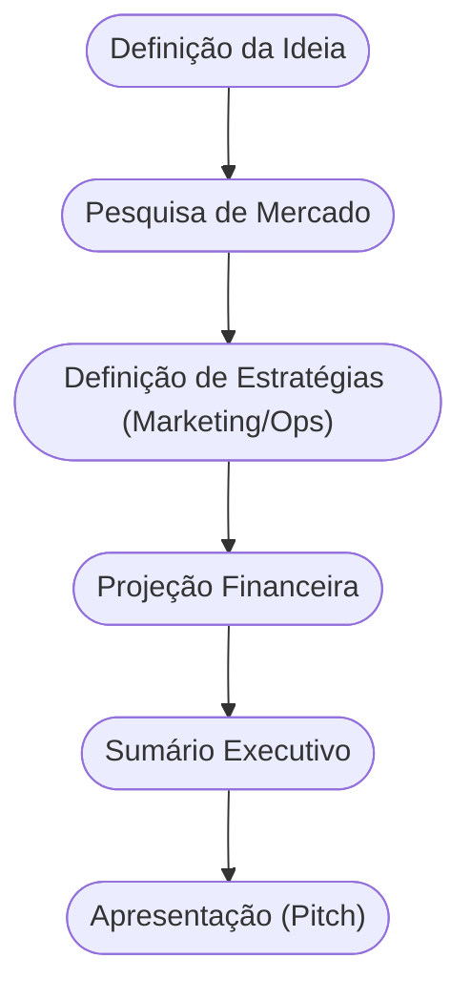

<!-- .slide: class="center" -->

# Aula 06 - O Plano de Negócios 💾

### Desenvolvimento de Modelos de Negócios

[Pressione ESPAÇO para avançar]

---

## Avisos da Aula

- Desliguem os celulares <!-- .element: class="fragment" -->
- Foco na lógica <!-- .element: class="fragment" -->
- Participação ativa <!-- .element: class="fragment" -->

---

## 1. O que é um Plano de Negócios (PN)? 🏗️

O **Plano de Negócios** é o "mapa" do seu empreendimento. É um documento que descreve os objetivos de um negócio e quais passos devem ser dados para alcançá-los, diminuindo os riscos e as incertezas.

### Finalidade do PN:
1.  **Orientação Interna**: Ajuda o empreendedor a manter o foco e planejar o crescimento.
2.  **Captação de Recursos**: Essencial para apresentar a investidores ou bancos.
3.  **Teste de Viabilidade**: Ajuda a descobrir se o negócio é sustentável antes de investir tempo e dinheiro real.

---

## 1. O que é um Plano de Negócios (PN)? 🏗️

---

---

## 2. Estrutura Básica de um Plano Profissional 📋

Um PN completo geralmente contém:
- <!-- .element: class="fragment" --> **Sumário Executivo**: Resumo dos pontos principais (feito por último!).
- <!-- .element: class="fragment" --> **Análise de Mercado**: Estudo dos clientes, concorrentes e fornecedores.
- <!-- .element: class="fragment" --> **Plano de Marketing**: Como o produto será vendido e divulgado.
- <!-- .element: class="fragment" --> **Plano Operacional**: Como o negócio vai funcionar no dia a dia.
- <!-- .element: class="fragment" --> **Plano Financeiro**: Projeção de custos, receitas e ponto de equilíbrio.

---

---

## 3. O Fluxo de Elaboração (Mermaid) 🌊



---

## 3. O Fluxo de Elaboração (Mermaid) 🌊

---

---

## 4. O PN no Mundo Moderno 🚀

Antigamente, planos de negócios eram livros de 100 páginas. Hoje, eles são mais ágeis e focados.
- <!-- .element: class="fragment" --> **PN Tradicional**: Detalhado, focado em estabilidade e financiamento bancário.
- <!-- .element: class="fragment" --> **PN Ágil (Lean)**: Focado em testes rápidos e aprendizado constante.

---

---

## 5. Simulando a Viabilidade (Termynal) 📦

Vamos verificar se seu Plano de Negócios está pronto para ser apresentado:

---

## 5. Simulando a Viabilidade (Termynal) 📦

```termynal
$ plano-negocio --validar
> Analisando mercado... [CHECK]
> Verificando plano financeiro... [OK]
> Checando análise de riscos... [PENDENTE]
> Status: QUASE PRONTO.
> Dica: Inclua um cenário de "pior caso" financeiro para dar mais credibilidade.
```

---

## 5. Simulando a Viabilidade (Termynal) 📦

---

---

## 6. Aprofundamento: Modelagem Financeira e Break-even 📈

Um Plano de Negócios maduro exige projeções tangíveis. O conceito de **Break-even Point (Ponto de Equilíbrio)** é vital: o exato momento em que as receitas se igualam aos custos (fixos e variáveis). Além disso, a elaboração de cenários (Otimista, Realista e Pessimista) capacita o negócio a se proteger de variações drásticas do fluxo de caixa nos primeiros anos de operação.

---

---

## 7. Mini-Projeto: Esboço do Sumário Executivo 🛠️

Imagine que você quer abrir uma **Cafeteria Sustentável**.
1.  Escreva 3 lines descrevendo o que torna seu café único.
2.  Quem é seu público principal?
3.  Qual o investimento inicial estimado (chute um valor)?
4.  Em quanto tempo você espera ter o dinheiro de volta?

---

---

## 8. Exercício de Fixação 🧠

1.  Qual a principal diferença entre um Plano de Negócios e uma ideia solta?
2.  Por que o Sumário Executivo deve ser a última parte a ser escrita?
3.  Em que situação um empreendedor deve preferir um Plano de Negócios detalhado a um simples Canvas?

---

---

## 8. Exercício de Fixação 🧠

!!! warning "Atenção"
    O Plano de Negócios não é algo "escrito em pedra". Ele deve ser revisado constantemente à medida que o mercado muda e novos dados aparecem.

---

---

## 8. Exercício de Fixação 🧠


---

---

## 📚 Material Complementar

- <!-- .element: class="fragment" --> **[📝 Exercícios da Aula 06](../exercicios/exercicio-06.md)**: Pratique os conceitos com questões focadas.
- <!-- .element: class="fragment" --> **[🚀 Projeto da Aula 06](../projetos/projeto-06.md)**: Aplique o conhecimento em um desafio prático de nível intermediário.

**Próxima Aula**: Vamos simplificar tudo com o [Modelagem de Negócios: O Canvas](../aulas/aula-07.md) 🗄️

---

## Discussão Aberta 1

- Como os conceitos vistos afetam nosso ambiente? <!-- .element: class="fragment" -->
- Quem tem um exemplo prático? <!-- .element: class="fragment" -->
- Pontos de ruptura? <!-- .element: class="fragment" -->

---

## Discussão Aberta 2

- Como os conceitos vistos afetam nosso ambiente? <!-- .element: class="fragment" -->
- Quem tem um exemplo prático? <!-- .element: class="fragment" -->
- Pontos de ruptura? <!-- .element: class="fragment" -->

---

## Discussão Aberta 3

- Como os conceitos vistos afetam nosso ambiente? <!-- .element: class="fragment" -->
- Quem tem um exemplo prático? <!-- .element: class="fragment" -->
- Pontos de ruptura? <!-- .element: class="fragment" -->

---

<!-- .slide: class="center" -->

# FIM DA AULA 06

### Obrigado!