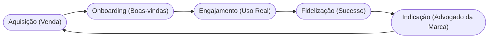

<!-- .slide: class="center" -->

# Aula 11 - Relacionamento com o Cliente 🤝

### Desenvolvimento de Modelos de Negócios

[Pressione ESPAÇO para avançar]

---

## Avisos da Aula

- Desliguem os celulares <!-- .element: class="fragment" -->
- Foco na lógica <!-- .element: class="fragment" -->
- Participação ativa <!-- .element: class="fragment" -->

---

## 1. O que é Relacionamento? 💞

No Business Model Canvas, o relacionamento descreve o "tom" e a intensidade da interação entre a empresa e cada segmento de cliente. 

### Objetivos do Relacionamento:
1.  **Conquista**: Trazer novos clientes para o negócio.
2.  **Retenção**: Evitar que o cliente vá para a concorrência.
3.  **Vendas Adicionais**: Vender mais para quem já é cliente (Upsells).

---

## 1. O que é Relacionamento? 💞

---

---

## 2. Categorias de Relacionamento 📑

As empresas podem escolher diferentes níveis de proximidade:

- <!-- .element: class="fragment" --> **Assistência Pessoal**: Interação humana real (ex: call center, vendedor na loja).
- <!-- .element: class="fragment" --> **Assistência Personalizada**: Um gerente exclusivo para o cliente (ex: Private Banking).
- <!-- .element: class="fragment" --> **Self-Service**: A empresa fornece os meios, o cliente faz tudo sozinho (ex: Caixas eletrônicos).
- <!-- .element: class="fragment" --> **Serviços Automatizados**: Self-service com inteligência (ex: recomendação da Netflix).
- <!-- .element: class="fragment" --> **Comunidades**: Clientes interagem entre si para resolver problemas (ex: Fóruns de jogos).
- <!-- .element: class="fragment" --> **Co-criação**: O cliente ajuda a criar o valor (ex: Reviews da Amazon, vídeos do YouTube).

---

## 2. Categorias de Relacionamento 📑

---

---

## 3. O Ciclo do Cliente (Mermaid) 🔄

Manter um cliente é muito mais barato do que conquistar um novo.

---

## 3. O Ciclo do Cliente (Mermaid) 🔄



---

## 3. O Ciclo do Cliente (Mermaid) 🔄

---

---

## 4. CRM: A Ferramenta do Gestor 🛠️

O **CRM (Customer Relationship Management)** é o software que guarda todo o histórico do cliente para que o relacionamento seja sempre contextualizado.

---

## 4. CRM: A Ferramenta do Gestor 🛠️

```termynal
$ crm --check-health
> Analisando base de clientes...
  - [x] Taxa de Resposta: 95%
  - [x] Churn (Cancelamento): 2%
  - [/] Satisfação (NPS): 8.5
> Status: RELACIONAMENTO SAUDÁVEL.
> Dica: Seus clientes estão felizes, mas peça mais indicações!
```

---

## 4. CRM: A Ferramenta do Gestor 🛠️

---

---

## 5. Churn Rate: O Perigo do Cancelamento 📉

O **Churn** é a taxa de clientes que param de comprar de você.
- <!-- .element: class="fragment" --> **Low Churn**: Indica que o relacionamento está forte.
- <!-- .element: class="fragment" --> **High Churn**: Indica que algo na proposta de valor ou no atendimento está falhando.

---

---

## 6. Aprofundamento: Cohort Analysis e Churn Rate 💔

Relacionar-se inclui metrificar retenção. O **Churn Rate** mede a taxa de cancelamento ou evasão de clientes. O aprofundamento analítico utiliza a análise de **Cohorts** (grupos de usuários que iniciaram juntos) para detectar em qual semana exata os usuários desistem da plataforma, permitindo intervir com automação de marketing pontual (ex: réguas de relacionamento, onboarding contínuo e Customer Success proativo).

---

---

## 7. Mini-Projeto: Estratégia de Retenção 🚀

Imagine um **App de Academia**.
1.  Qual seria o tipo de relacionamento principal (ex: Manual ou Automatizado)?
2.  Como você usaria uma **Comunidade** para evitar que os alunos desistam?
3.  Crie uma mensagem de "Boas-vindas" automatizada para um novo aluno.

---

---

## 8. Exercício de Fixação 🧠

1.  Explique a diferença entre assistência pessoal e personalizada.
2.  O que é Co-criação e como ela gera valor para a empresa?
3.  Por que medir o **NPS (Net Promoter Score)** é vital para o relacionamento?

---

---

## 8. Exercício de Fixação 🧠

!!! info "Dica"
    Um bom relacionamento transforma clientes em **fãs**. Fãs perdoam erros pequenos e defendem sua marca de graça.

---

---

## 8. Exercício de Fixação 🧠


---

---

## 📚 Material Complementar

- <!-- .element: class="fragment" --> **[📝 Exercícios da Aula 11](../exercicios/exercicio-11.md)**: Pratique os conceitos com questões focadas.
- <!-- .element: class="fragment" --> **[🚀 Projeto da Aula 11](../projetos/projeto-11.md)**: Aplique o conhecimento em um desafio prático de nível intermediário.

**Próxima Aula**: O que você faz todo dia? [Atividades-chave do Negócio](../aulas/aula-12.md) ⚙️

---

## Discussão Aberta 1

- Como os conceitos vistos afetam nosso ambiente? <!-- .element: class="fragment" -->
- Quem tem um exemplo prático? <!-- .element: class="fragment" -->
- Pontos de ruptura? <!-- .element: class="fragment" -->

---

<!-- .slide: class="center" -->

# FIM DA AULA 11

### Obrigado!