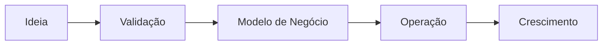
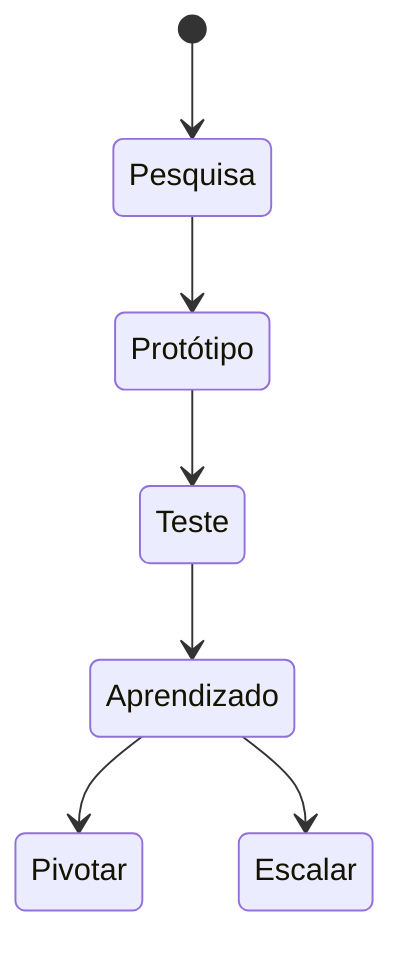

# Empreendedorismo e Visão 🚀
## Aula 01 - Desenvolvimento de Modelos de Negócios

---

## O que é Empreendedorismo? 💡

"Empreender é a arte de fazer acontecer com criatividade e coragem."

<!-- .element: class="fragment" -->
- Identificação de problemas
- Criação de valor
- Assunção de riscos calculados

---

## O Mito do Empreendedor 👤

Muitos acham que empreender é apenas "abrir um CNPJ".

<!-- .element: class="fragment" -->
**Realidade:**
- Resiliência
- Visão estratégica
- Execução implacável

---

## A Jornada do Empreendedor 🗺️

---

## Atitude Empreendedora 🧠

- **Proatividade:** Não espere a oportunidade, crie-a.
- **Curiosidade:** Questione o status quo.
- **Foco no Cliente:** Resolva dores reais.

---

## Tipos de Empreendedorismo 🏢

1. **Inovação:** Novos produtos/mercados.
2. **Social:** Impacto na comunidade.
3. **Intraempreendedorismo:** Inovação dentro de grandes empresas.

---

## Perfil do Empreendedor Moderno 👨‍💻

- **Adaptabilidade:** O mercado muda rápido.
- **Networking:** Ninguém cresce sozinho.
- **Aprendizado Contínuo:** Lifelong learning.

---

## Por que Modelar Negócios? 🏗️

Ideia ≠ Negócio

<!-- .element: class="fragment" -->
A modelagem é o rascunho do sucesso. Ela conecta a visão com a realidade financeira e operacional.

---

## Ideia vs. Oportunidade 💎

- **Ideia:** Abstrata, subjetiva.
- **Oportunidade:** Viável, lucrativa, resolve uma dor real e tem mercado.

---

## O Ciclo da Inovação 🔄

---

## O Mercado Brasileiro 🇧🇷

- Desafios burocráticos.
- Potencial criativo imenso.
- Oportunidade em nichos inexplorados.

---

## Soft Skills do Sucesso 🤝

- Liderança
- Comunicação
- Negociação
- Inteligência Emocional

---

## Hard Skills Necessárias 📊

- Gestão Financeira
- Marketing e Vendas
- Tecnologia e Processos
- Planejamento Estratégico

---

## Falha: O Melhor Professor ❌

"Eu não falhei. Apenas descobri 10 mil maneiras que não funcionam." (Thomas Edison)

<!-- .element: class="fragment" -->
O erro faz parte da inovação. Aprenda rápido e corrija o curso.

---

## Ecossistema Empreendedor 🌐

- Incubadoras
- Aceleradoras
- Investidores Anjo
- Mentoria

---

## O Papel da Tecnologia 💻

A tecnologia é um acelerador, não o fim. Ela deve servir para otimizar a entrega de valor.

---

## Sustentabilidade e ESG 🌱

Negócios modernos devem ser:
- Ambientalmente corretos
- Socialmente justos
- Governança transparente

---

## O Próximo Passo 👣

Nas próximas aulas, vamos transformar sua visão em um modelo real usando o Canvas.

---

## Resumo da Aula 📝

- Definição de empreendedorismo.
- Diferença entre ideia e oportunidade.
- Importância da visão e execução.
- O papel do empreendedor na sociedade.

---

## Desafio do Dia 🏆

Identifique um problema comum no seu dia a dia e pense em **3 formas diferentes** de resolvê-lo gerando valor.

---

## Dúvidas? 🤔

Obrigado pela atenção!
Até a próxima aula.
