```mermaid
graph LR
    A(["Identificação do Problema"]) --> B(["Geração da Ideia"])
    B --> C(["Validação do Modelo"])
    C --> D(["Execução/Lançamento"])
    D --> E(["Aprendizado e Ajuste"])
    E --> A
```

<!-- .slide: class="center" -->

# Aula 01 - Conceitos de Empreendedorismo e Visão Empreendedora 🚀

### Desenvolvimento de Modelos de Negócios

[Pressione ESPAÇO para avançar]

---

## Avisos da Aula

- Desliguem os celulares <!-- .element: class="fragment" -->
- Foco na lógica <!-- .element: class="fragment" -->
- Participação ativa <!-- .element: class="fragment" -->

---

## 1. O que é Empreendedorismo? 🧠

Empreendedorismo não é apenas o ato de abrir uma empresa. É um **comportamento**, uma postura diante da vida e do mercado que envolve a identificação de problemas e a criação de soluções que gerem valor.

!!! info "Conceito"
    **Empreender** é a capacidade de realizar, coordenar e executar projetos que introduzem inovações, assumindo riscos calculados para alcançar resultados transformadores.

---

## 1. O que é Empreendedorismo? 🧠

### 🌟 A Visão Empreendedora
Ter visão empreendedora é conseguir enxergar "além do óbvio". É a habilidade de perceber tendências antes que elas se tornem senso comum e transformar uma ideia abstrata em um negócio concreto.

---

---

## 2. Características do Empreendedor 👤

Nem todo mundo nasce empreendedor, mas as competências podem ser desenvolvidas. Pesquisas indicam que empreendedores de sucesso compartilham certas características:

1.  **Iniciativa**: Não esperar pelos outros; agir para que as coisas aconteçam.
2.  **Persistência**: Ver o erro como aprendizado, não como fim.
3.  **Correr Riscos Calculados**: Estudar as chances antes de apostar alto.
4.  **Liderança e Persuasão**: Capacidade de engajar pessoas em seu propósito.
5.  **Criatividade**: Buscar formas diferentes de resolver problemas antigos.

---

## 2. Características do Empreendedor 👤

---

---

## 3. Tipos de Empreendedores 📊

Existem diversas formas de empreender. Conhecer seu perfil ajuda a focar nas estratégias corretas:

| Perfil | Características | Foco Principal |
| :--- { .fragment } | :--- { .fragment } | :--- { .fragment } |
| **Por Oportunidade** | Enxerga uma lacuna no mercado. | Lucratividade e Crescimento |
| **Por Necessidade** | Empreende por falta de alternativa. | Sobrevivência e Renda Fixa |
| **Intraempreendedor** | Inova dentro da empresa onde trabalha. | Eficiência e Novos Processos |
| **Social** | Busca resolver problemas da comunidade. | Impacto Social e Sustentabilidade |
| **Serial** | Cria e vende empresas repetidamente. | Inovação e Escalabilidade |

---

## 3. Tipos de Empreendedores 📊

---

---

## 4. O Ciclo do Empreendedorismo (Mermaid) 🏗️



---

## 4. O Ciclo do Empreendedorismo (Mermaid) 🏗️

---

---

## 5. Ferramentas de Mentalidade (Termynal) 💻

O empreendedor moderno utiliza a tecnologia para validar suas ideias rapidamente.

---

## 5. Ferramentas de Mentalidade (Termynal) 💻

```termynal
$ empreendedor --check-vibe
> Verificando mentalidade atual...
  - [x] Paixão pelo problema
  - [x] Tolerância à incerteza
  - [x] Foco na execução
> Status: PRONTO PARA INICIAR!
```

---

## 5. Ferramentas de Mentalidade (Termynal) 💻

---

---

## 6. Aprofundamento: O Mindset Ágil e Lean Startup 🔄

No nível intermediário, o empreendedorismo deixa de ser apenas sobre 'ter ideias' e passa a ser sobre **validação contínua**. O modelo *Lean Startup* (Startup Enxuta) introduz o conceito de MVP (Produto Mínimo Viável) para testar hipóteses no mercado real com o menor custo possível. Empreendedores experientes não focam em planos perfeitos, mas em ciclos rápidos de construção, medição e aprendizado.

---

---

## 7. Mini-Projeto: Perfil Empreendedor 🚀

Sua primeira missão prática:
1.  Realize uma autoavaliação baseada nas 5 características citadas no item 2.
2.  Dê uma nota de 1 a 10 para si mesmo em cada uma.
3.  Identifique qual delas você precisa desenvolver mais e crie uma ação simples para esta semana (ex: "Vou liderar a organização de um grupo de estudos").

---

---

## 8. Exercícios de Fixação 🧠

1.  Diferencie o empreendedor "por oportunidade" do empreendedor "por necessidade".
2.  O que caracteriza o **Intraempreendedorismo** e qual sua importância para as grandes empresas?
3.  Explique por que "assumir riscos" em experimentos do empreendedorismo deve ser algo **calculado**.

---

---

## 8. Exercícios de Fixação 🧠

!!! warning "Atenção"
    Lembre-se: Ideias valem centavos, a **execução** vale milhões. Não se apegue apenas ao plano, foque em como realizar.

---

---

## 8. Exercícios de Fixação 🧠


---

---

## 📚 Material Complementar

- { .fragment } **[📝 Exercícios da Aula 01](../../exercicios/exercicio-01.md)**: Pratique os conceitos com questões focadas.
- { .fragment } **[🚀 Projeto da Aula 01](../../projetos/projeto-01.md)**: Aplique o conhecimento em um desafio prático de nível intermediário.

**Próxima Aula**: Vamos aprender a [Identificar Oportunidades de Negócio](../../aulas/aula-02.md)! 🏗️

---

## Discussão Aberta 1

- Como os conceitos vistos afetam nosso ambiente? { .fragment }
- Quem tem um exemplo prático? { .fragment }
- Pontos de ruptura? { .fragment }

---

<!-- .slide: class="center" -->

# FIM DA AULA 01

### Obrigado!