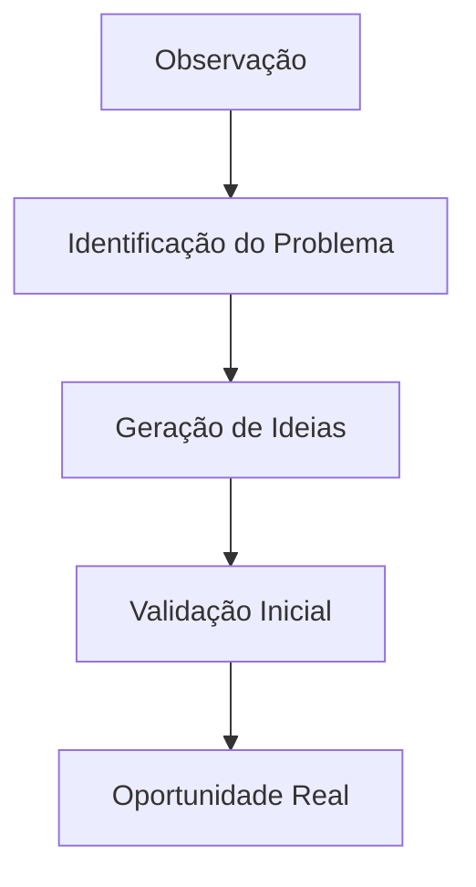
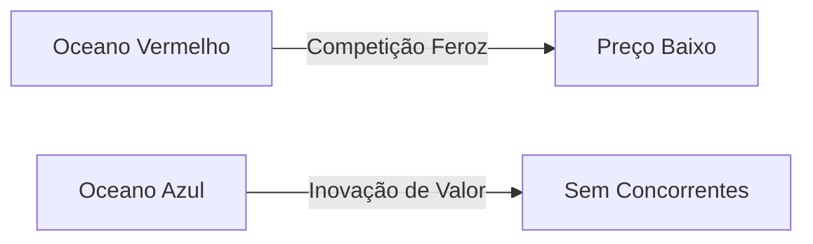
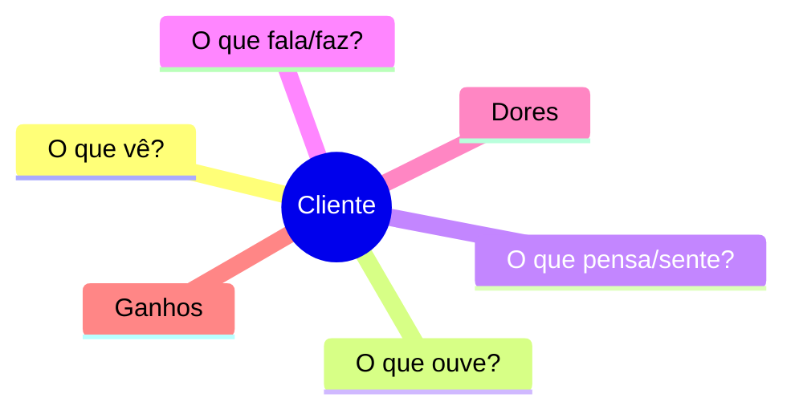
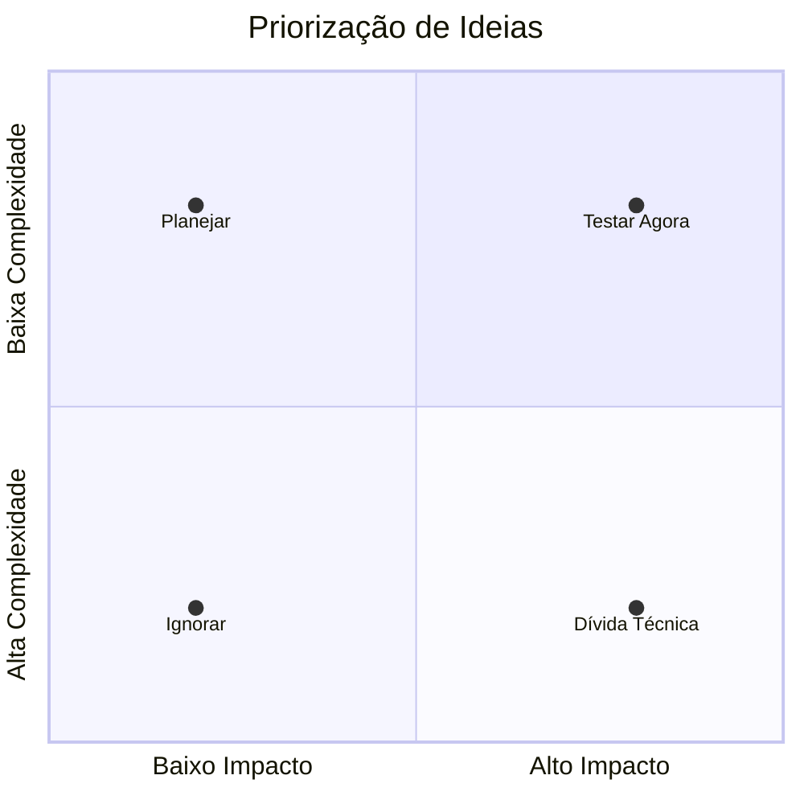

# Identificação de Oportunidades 🔍
## Aula 02 - Desenvolvimento de Modelos de Negócios

---

## Onde nascem as Ideias? 💡

As melhores ideias surgem da observação atenta de problemas reais.

<!-- .element: class="fragment" -->
- "Eu odeio quando..."
- "Por que ninguém fez isso ainda?"
- "Isso poderia ser muito mais fácil."

---

## Ideia vs. Oportunidade 💎

Nem toda ideia é uma oportunidade de negócio.

<!-- .element: class="fragment" -->
**Oportunidade é:**
- Desejável (Alguém quer?)
- Viável (Podemos fazer?)
- Lucrativa (Dá dinheiro?)

---

## O Ciclo da Oportunidade 🔄

---

## Pesquisa de Mercado 📊

Não se baseie apenas no "acho".

<!-- .element: class="fragment" -->
- Tamanho do mercado (TAM, SAM, SOM)
- Tendências de consumo
- Comportamento do cliente

---

## Analisando a Concorrência 🤺

Quem já está resolvendo esse problema?

<!-- .element: class="fragment" -->
- Quais são os pontos fracos deles?
- O que o cliente ainda reclama?
- Como você pode ser diferente? (Não apenas melhor)

---

## O Oceano Azul 🌊

---

## Diferenciação Estratégica ✨

- **Produto:** Recursos únicos.
- **Serviço:** Atendimento excepcional.
- **Preço:** Modelo de custo baixo.
- **Marca:** Conexão emocional.

---

## Entrevistas com Clientes 🗣️

"Fale com 10 pessoas que sofrem com o problema."

<!-- .element: class="fragment" -->
- Não venda sua ideia.
- Escute a dor deles.
- Pergunte quanto eles pagariam pela solução.

---

## O Mapa da Empatia 🧠

---

## Identificando Nichos 🎯

"Quem tenta vender para todo mundo, não vende para ninguém."

<!-- .element: class="fragment" -->
Foque em um grupo específico com uma necessidade específica.

---

## Exemplos de Nichos de Sucesso 🥇

- Padaria apenas para celíacos.
- Pet shop focado em gatos.
- Consultoria para pequenas clínicas médicas.

---

## Sinais de Alerta 🚩

- Ninguém quer pagar.
- O mercado é pequeno demais.
- A solução é muito complexa/cara.
- O problema não é tão doloroso assim.

---

## Criatividade e Brainstorming 🧠⚡

- Quantidade gera qualidade.
- Não julgue as ideias no início.
- Combine ideias diferentes (Mashup).

---

## Ferramenta: Matriz de Priorização 📋

---

## O Protótipo de Papel 📝

Antes de construir, rascunhe.
A validação visual ajuda a identificar falhas lógicas rapidamente.

---

## Tendências Tecnológicas 🤖

Como a IA, Blockchain ou IoT podem criar novas oportunidades no seu setor?

---

## Oportunidades em Crises 📉

"Enquanto uns choram, outros vendem lenços."
Mudanças no ambiente geram novas necessidades.

---

## Ética e Responsabilidade 🤝

Uma oportunidade real deve ser ética e sustentável a longo prazo.

---

## Resumo da Aula 📝

- Diferença entre ideia e oportunidade.
- Importância da pesquisa e escuta ativa.
- Identificação de nichos e diferenciação.

---

## Próximo Passo 👣

Na próxima aula, vamos falar sobre como criar uma **Proposta de Valor** irresistível.

---

## Desafio: O Caçador de Problemas 🕵️‍♂️

Liste **5 problemas** que você observou nesta última semana em estabelecimentos comerciais que você visitou.
