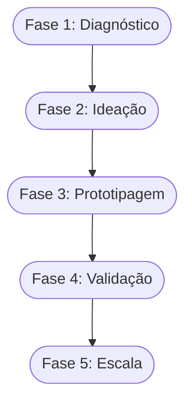

<!-- .slide: class="center" -->

# Aula 04 - Etapas de Processo de Valor e Inovação 📄

### Desenvolvimento de Modelos de Negócios

[Pressione ESPAÇO para avançar]

---

## Avisos da Aula

- Desliguem os celulares <!-- .element: class="fragment" -->
- Foco na lógica <!-- .element: class="fragment" -->
- Participação ativa <!-- .element: class="fragment" -->

---

## 1. O que é o Processo de Valor? 🛠️

O valor não aparece por mágica; ele é **construído** através de etapas lógicas que transformam uma percepção em um resultado concreto.

### As 4 Etapas do Processo:
1.  **Criação**: Identificação da oportunidade e desenvolvimento da ideia.
2.  **Configuração**: Estruturação dos recursos (pessoas, tecnologia, dinheiro).
3.  **Entrega**: Como o valor chega até o cliente (canais, marketing).
4.  **Captura**: Como o negócio recebe o retorno (financeiro ou social).

---

## 1. O que é o Processo de Valor? 🛠️

---

---

## 2. Tipologias de Inovação 🏗️

A inovação pode acontecer de diferentes formas e em diferentes níveis de intensidade:

- { .fragment } **Inovação Incremental**: Pequenas melhorias em algo que já existe (ex: nova versão de um celular).
- { .fragment } **Inovação Radical**: Cria um novo mercado ou desbanca um existente (ex: a transição das câmeras de filme para digitais).
- { .fragment } **Inovação de Processo**: Mudar o "como" as coisas são feitas para ganhar eficiência.
- { .fragment } **Inovação de Modelo de Negócio**: Mudar a forma como se ganha dinheiro (ex: streaming vs venda de CDs).

---

## 2. Tipologias de Inovação 🏗️

---

---

## 3. Ambiente Inovador 🚀

Para que a inovação floresça, o ambiente deve permitir:
- { .fragment } **Segurança Psicológica**: Liberdade para errar e aprender.
- { .fragment } **Colaboração**: Troca de ideias entre diferentes áreas.
- { .fragment } **Flexibilidade**: Capacidade de mudar a rota rapidamente.

---

---

## 4. Estruturação do Processo (Mermaid) 📊



---

## 4. Estruturação do Processo (Mermaid) 📊

---

---

## 5. Simulando o Processo (Termynal) 💻

Vamos validar a fase atual do seu processo de inovação:

---

## 5. Simulando o Processo (Termynal) 💻

```termynal
$ inovacao --check-stage
> Verificando fase do projeto...
  - [x] Problema identificado
  - [x] Solução proposta
  - [/] Protótipo em construção
> Status: Fase de EXPERIMENTAÇÃO.
> Dica: Não demore para testar com clientes reais!
```

---

## 5. Simulando o Processo (Termynal) 💻

---

---

## 6. Aprofundamento: Curva de Adoção de Inovação e TRL 📉

A inovação não atinge a todos simultaneamente. Compreender a **Curva de Difusão da Inovação** (Innovators, Early Adopters, Early Majority...) é crucial para saber como comunicar o lançamento. Além disso, a escala TRL (Technology Readiness Level) auxilia a mensurar a maturidade de uma tecnologia, indo de uma pesquisa básica (TRL 1) até um sistema provado em ambiente real (TRL 9).

---

---

## 7. Mini-Projeto: Planejando a Inovação 🚀

1.  Identifique uma empresa que você conhece que tenha passado por uma **Inovação Incremental** recentemente.
2.  Agora, descreva um exemplo de **Inovação de Modelo de Negócio**.
3.  Desenhe um pequeno cronograma de 3 passos para validar uma ideia inovadora em uma semana.

---

---

## 8. Exercício de Fixação 🧠

1.  Explique a diferença entre Inovação Radical e Incremental.
2.  Quais são as 4 etapas básicas do processo de valor?
3.  Por que a "Captura de Valor" é essencial para a sustentabilidade de uma empresa?

---

---

## 8. Exercício de Fixação 🧠

!!! info "Dica"
    O planejamento não deve ser rígido. No processo de inovação, o planejamento serve para dar direção, mas a execução exige adaptabilidade.

---

---

## 8. Exercício de Fixação 🧠


---

---

## 📚 Material Complementar

- { .fragment } **[📝 Exercícios da Aula 04](../../exercicios/exercicio-04.md)**: Pratique os conceitos com questões focadas.
- { .fragment } **[🚀 Projeto da Aula 04](../../projetos/projeto-04.md)**: Aplique o conhecimento em um desafio prático de nível intermediário.

**Próxima Aula**: Fim do Bloco 1! No Bloco 2, iniciaremos a [Gestão de Negócios e Ideação](../../aulas/aula-05.md)! 💻

---

## Discussão Aberta 1

- Como os conceitos vistos afetam nosso ambiente? { .fragment }
- Quem tem um exemplo prático? { .fragment }
- Pontos de ruptura? { .fragment }

---

## Discussão Aberta 2

- Como os conceitos vistos afetam nosso ambiente? { .fragment }
- Quem tem um exemplo prático? { .fragment }
- Pontos de ruptura? { .fragment }

---

<!-- .slide: class="center" -->

# FIM DA AULA 04

### Obrigado!