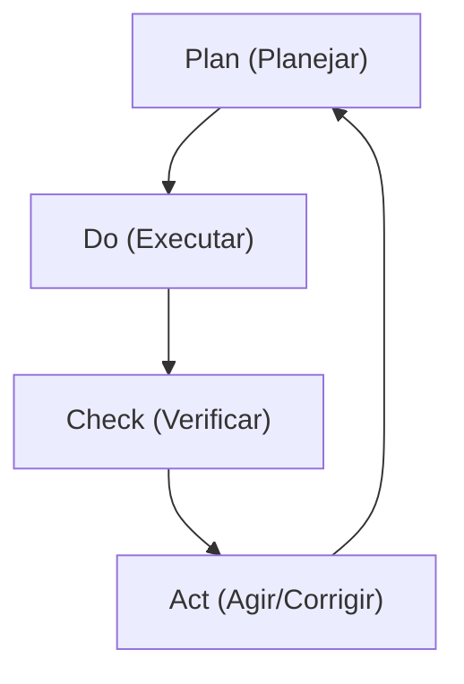
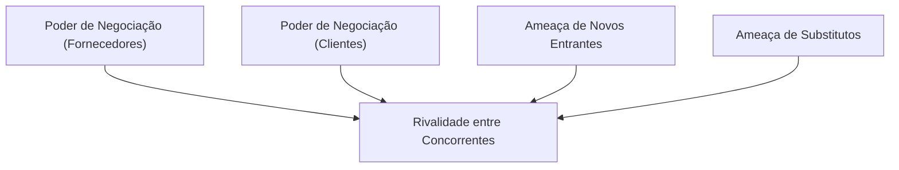
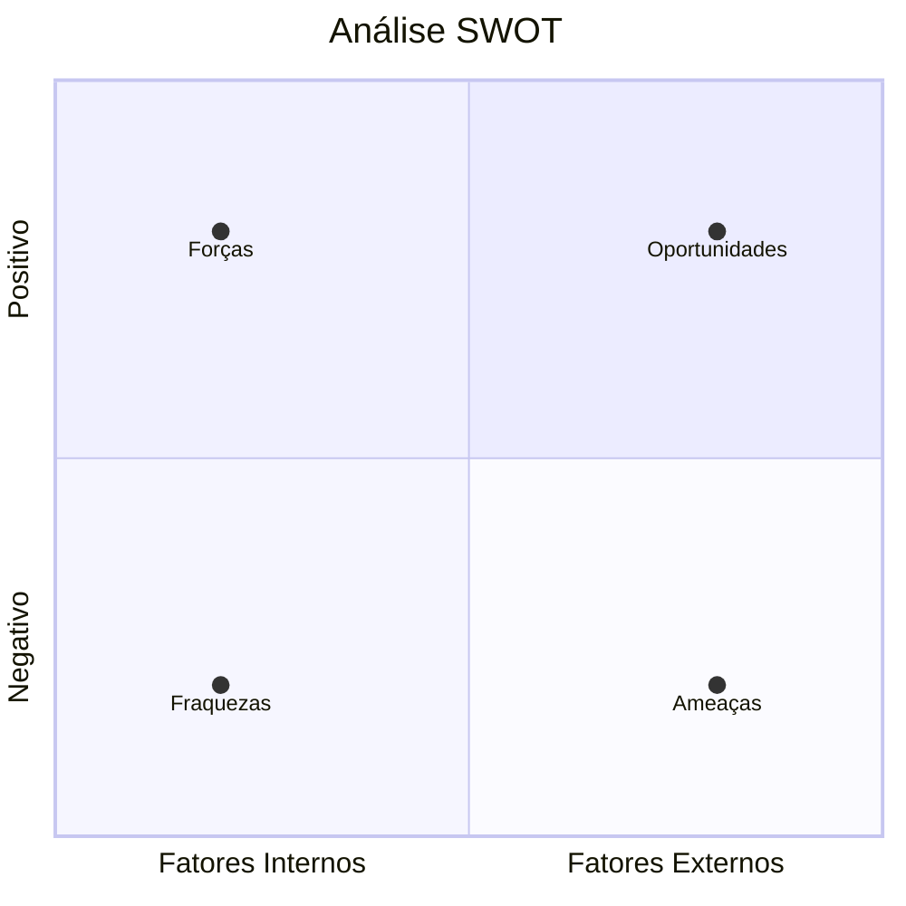

# Gestão de Negócios e Estratégias ⚙️
## Aula 05 - Desenvolvimento de Modelos de Negócios

---

## O que é Gestão? 🏛️

Gerir é a arte de coordenar recursos (humanos, financeiros, tecnológicos) para atingir um objetivo comum.

<!-- .element: class="fragment" -->
**Os 4 Pilares da Falência:**
1. Planejamento (P)
2. Organização (O)
3. Direção (D)
4. Controle (C)

---

## O Ciclo PDCA 🔄

A base da melhoria contínua.

---

## Estratégia: O Norte do Negócio 🧭

"Sem estratégia, qualquer caminho serve."

<!-- .element: class="fragment" -->
**Estratégia é:**
- Escolher o que fazer.
- Escolher o que **NÃO** fazer.
- Criar uma vantagem competitiva sustentável.

---

## As 5 Forças de Porter 🤺

---

## Matriz SWOT (FOFA) 📊

---

## Liderança vs. Chefia 👥

- **Chefe:** Manda, foca em tarefas, gera medo.
- **Líder:** Orienta, foca em pessoas, gera inspiração.

---

## Gestão de Processos ⚙️

Como o trabalho flui pela empresa?
Processos ineficientes destroem a margem de lucro.

---

## Cultura Organizacional 🏢

"A cultura come a estratégia no café da manhã." (Peter Drucker)
Os valores e comportamentos invisíveis que definem a empresa.

---

## Gestão Financeira Básica 💰

- **Fluxo de Caixa:** Dinheiro que entra e sai.
- **Margem de Contribuição:** O que sobra para pagar os custos fixos.
- **DRE:** Demonstrativo de Resultados (Lucro ou Prejuízo).

---

## Estratégias de Crescimento 📈

1. **Penetração de Mercado:** Vender mais do mesmo para os mesmos.
2. **Desenvolvimento de Produto:** Novas soluções para o mesmo público.
3. **Desenvolvimento de Mercado:** Mesmo produto em novas regiões.
4. **Diversificação:** Novo produto em novo mercado.

---

## Diferenciação vs. Liderança de Custo 🏆

- **Diferenciação:** Ser único e cobrar mais (Apple).
- **Liderança de Custo:** Ser o mais eficiente e cobrar menos (Walmart).

---

## Gestão por Indicadores (KPIs) 📏

"O que não é medido, não é gerenciado."
Ex: Custo de Aquisição de Cliente (CAC), Lifetime Value (LTV).

---

## Transformação Digital 💻

Não é apenas ter um site. É usar a tecnologia para mudar o modelo de entrega de valor e eficiência operacional.

---

## Agilidade Organizacional 🏃‍♂️

A capacidade de mudar de direção rapidamente conforme o mercado responde.

---

## Gestão de Mudanças 🌪️

Como preparar as pessoas para novos processos e tecnologias?
Ouvir, envolver e comunicar é a chave.

---

## Ética e Governança 🤝

Regras claras, transparência e conduta moral elevam a reputação da marca.

---

## O Papel do Gestor 🎩

Resolver conflitos, tomar decisões difites e garantir que todos estejam remando para o mesmo lado.

---

## Resumo da Aula 📝

- Definição de gestão e PDCA.
- Análise estratégica (Porter, SWOT).
- Liderança, cultura e KPIs.

---

## Próximo Passo 👣

Na próxima aula, vamos aprender a estruturar tudo isso no **Plano de Negócios**.

---

## Desafio: Análise SWOT Pessoal 🕵️‍♂️

Faça uma FOFA de você mesmo como futuro empreendedor: quais suas Forças, Oportunidades, Fraquezas e Ameaças hoje?
