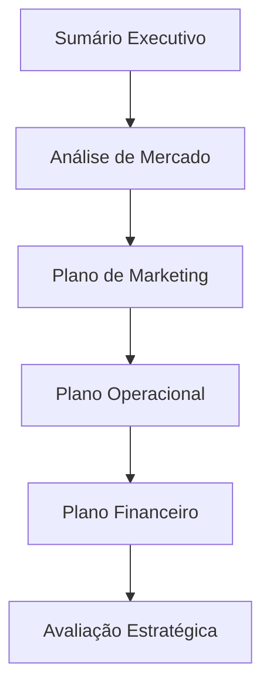

# O Plano de Negócios (PN) 📑
## Aula 06 - Desenvolvimento de Modelos de Negócios

---

## O que é um Plano de Negócios? 🤔

É o documento que descreve os objetivos de um negócio e quais passos devem ser dados para alcançá-los.

<!-- .element: class="fragment" -->
"Se você não sabe para onde vai, qualquer caminho serve."

---

## Por que fazer um PN? 🏗️

1. **Redução de Riscos:** Identificar falhas antes de gastar dinheiro.
2. **Captação de Recursos:** Bancos e investidores exigem o PN.
3. **Guia de Gestão:** Serve como bússola para o time.

---

## Estratégia de um PN Profissional 📂

---

## 1. Sumário Executivo ✨

A parte mais importante. Deve ser a última a ser escrita.
É o resumo atraente que convence alguém a ler o resto do documento.

---

## 2. Análise de Mercado 📊

- **Público-alvo:** Quem são eles?
- **Concorrentes:** O que eles fazem?
- **Fornecedores:** De quem vamos comprar?

---

## 3. Plano de Marketing 📣

- **Produto:** O que vendemos?
- **Preço:** Quanto vale?
- **Praça:** Onde vendemos?
- **Promoção:** Como nos encontram?

---

## 4. Plano Operacional ⚙️

Como o negócio funciona no dia a dia?
- Layout da loja/escritório.
- Capacidade produtiva.
- Processos de entrega.

---

## 5. Plano Financeiro 💰

Onde o empreendedor mais se perde.
- Investimento inicial.
- Fluxo de caixa projetado.
- Ponto de equilíbrio (Break-even).

---

## Plano de Negócios vs. Modelo de Negócio (Canvas) 🥊

- **Canvas:** Rápido, visual, focado em inovação e pivotagem. (O "Como")
- **Plano:** Detalhado, extenso, focado em execução e viabilidade financeira. (O "Quanto e Quando")

---

## O Público do seu PN 👥

- **Você mesmo:** Para se organizar.
- **Sócios:** Para alinhar a visão.
- **Investidores:** Para mostrar o lucro.
- **Bancos:** Para provar que pode pagar o empréstimo.

---

## Erros Comuns no PN ❌

- Estimativas de vendas otimistas demais.
- Ignorar a concorrência.
- Não detalhar o plano financeiro.
- Escrever demais e não dizer nada.

---

## Ferramenta: Sebrae 🛠️

O Sebrae oferece guias e softwares excelentes para montar seu PN de forma estruturada.

---

## Revisão Constante 🔄

O PN não é um monumento de pedra. Ele deve mudar conforme o mercado responde ao seu negócio.

---

## Planejamento Contingencial (Plano B) 🆘

E se as vendas forem 50% menores do que o esperado?
E se um fornecedor chave fechar?

---

## O Storytelling no PN 📖

Conte uma história convincente sobre o problema que você resolve e por que sua solução é a melhor do mundo.

---

## Conclusão: Tirando do Papel 🚀

Um bom plano sem execução é apenas uma alucinação.
O PN deve impulsionar a ação, não paralisar.

---

## Resumo da Aula 📝

- Definição e objetivos do Plano de Negócios.
- Diferença entre Modelo de Negócio e Plano.
- As 5 principais seções de um PN.

---

## Próximo Passo 👣

Na próxima aula, vamos ver a ferramenta mais amada pelos empreendedores: o **Business Model Canvas**.

---

## Desafio: O Sumário de 1 Minuto ⏱️

Tente escrever o Sumário Executivo da sua ideia de negócio em apenas **3 parágrafos**.
O primeiro sobre o problema, o segundo sobre a solução e o terceiro sobre o lucro.
