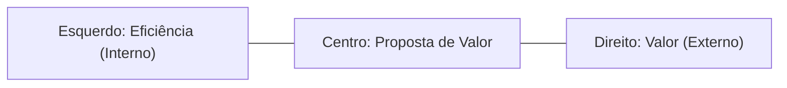
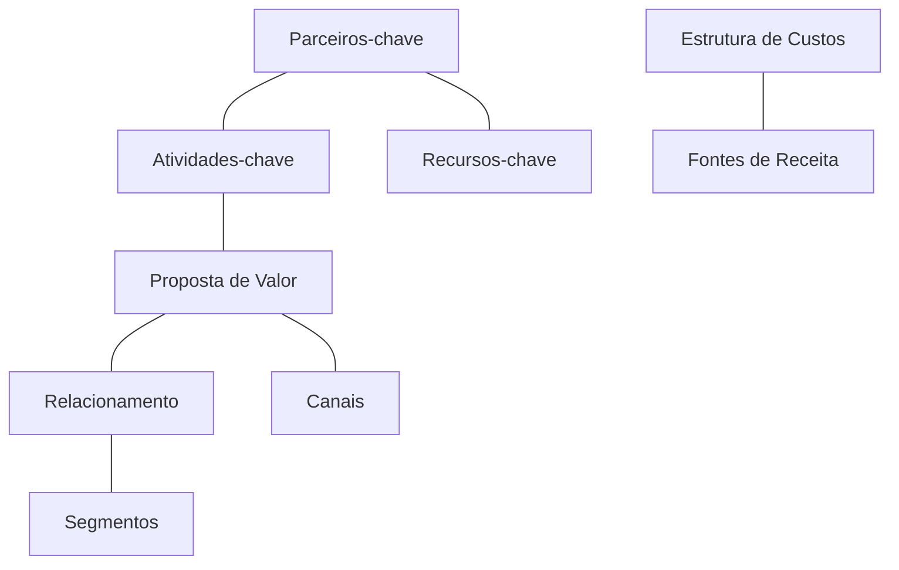

# Modelagem de Negócios: O Canvas 🧪
## Aula 07 - Desenvolvimento de Modelos de Negócios

---

## O que é o Business Model Canvas (BMC)? 🧩

Uma ferramenta visual de uma página que permite descrever, projetar e pivotar modelos de negócios de forma estratégica.

<!-- .element: class="fragment" -->
Criado por Alexander Osterwalder (Strategyzer).

---

## O Lado Direito vs. Lado Esquerdo 🧠

---

## Os 9 Blocos do Sucesso 🏗️

---

## 1. Segmentos de Clientes 👥

A quem o negócio serve?
- Mercado de massa
- Nicho
- Segmentado
- Plataforma multilateral

---

## 2. Proposta de Valor 💎

Que valor entregamos? Que problema resolvemos?
- Novidade
- Desempenho
- Design
- Marca/Status

---

## 3. Canais 📡

Como alcançamos o cliente?
- Venda direta (site, loja)
- Atacado
- Redes sociais

---

## 4. Relacionamento com Clientes 🤝

Que tipo de relação o cliente espera?
- Self-service
- Assistência pessoal
- Comunidades
- Co-criação

---

## 5. Fontes de Receita 💰

Como ganhamos dinheiro?
- Venda de ativos
- Assinatura
- Licenciamento
- Taxa de corretagem

---

## 6. Recursos Principais 🔋

O que é essencial para o negócio funcionar?
- Físicos (máquinas)
- Intelectuais (patentes)
- Humanos (conhecimento)
- Financeiros

---

## 7. Atividades-chave 🛠️

O que devemos fazer muito bem?
- Produção
- Resolução de problemas
- Plataforma/Rede

---

## 8. Parcerias Principais 🤝

Quem nos ajuda a crescer?
- Fornecedores
- Alianças estratégicas
- Joint ventures

---

## 9. Estrutura de Custos 💹

Quais os custos mais importantes?
- Focados no Custo (baixos preços)
- Focados no Valor (premium)

---

## Por que o Canvas é revolucionário? 🚀

1. **Agilidade:** Muda em minutos, não em semanas.
2. **Visual:** Todo o time enxerga o negócio da mesma forma.
3. **Foco:** Obriga a sintetizar o que é realmente importante.

---

## Como preencher corretamente? ✍️

- Comece pela **Proposta de Valor** ou **Segmentos de Clientes**.
- Use post-its.
- Seja breve (frases curtas).
- Teste cada hipótese.

---

## O Canvas é Dinâmico 🔄

O seu primeiro Canvas está errado!
Ele serve para ser testado e alterado conforme você recebe feedback do mercado.

---

## Canvas vs. Plano de Negócio 🥊

O Canvas é o rascunho. O Plano é o detalhamento.
Não comece o Plano sem ter um Canvas validado.

---

## Ferramentas Online 💻

- Strategyzer (Oficial)
- Canvanizer
- Miro
- Canva

---

## Resumo da Aula 📝

- Definição e origem do BMC.
- Os 9 blocos e suas conexões.
- Foco em agilidade e validação.

---

## Próximo Passo 👣

Na próxima aula, vamos mergulhar fundo no primeiro e mais importante bloco: **Segmentação e Público-Alvo**.

---

## Desafio: O Canvas do Uber 🚗

Tente preencher mentalmente os 9 blocos do Uber.
Quem são os parceiros? Quais as receitas? Qual a proposta de valor para o motorista?
