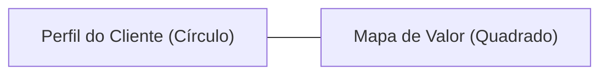
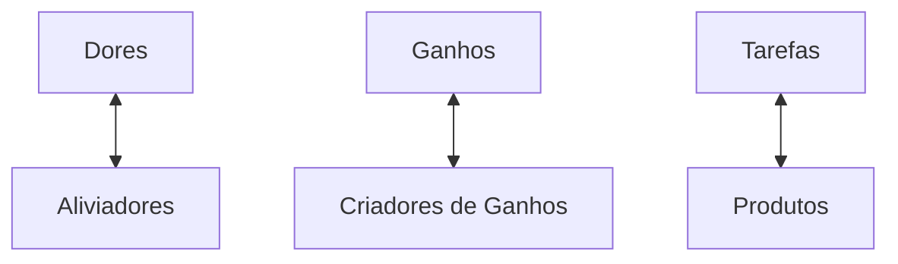

# O Canvas da Proposta de Valor (VPC) 💎
## Aula 09 - Desenvolvimento de Modelos de Negócios

---

## O Encaixe Perfeito (Problem-Solution Fit) 🧩

Não adianta ter uma solução incrível se ela não resolve a dor de alguém.
O VPC é um "zoom" nos blocos de **Segmento** e **Proposta de Valor** do Canvas.

---

## A Estrutura do VPC 📐

---

## 1. O Perfil do Cliente (Círculo) 👤

Onde olhamos o mundo pelos olhos do cliente.

- **Tarefas do Cliente:** O que eles tentam realizar?
- **Dores:** O que os impede ou os irrita?
- **Ganhos:** O que eles esperam ou desejam?

---

## Tarefas do Cliente (Customer Jobs) 🛠️

- **Funcionais:** Comer, limpar a casa, ir ao trabalho.
- **Sociais:** Parecer bem, ganhar status.
- **Emocionais:** Sentir-se seguro, em paz.

---

## Dores do Cliente (Pains) 😫

- Resultados indesejados (custo alto, demora).
- Obstáculos (falta de tempo).
- Riscos (perder dinheiro).

---

## Ganhos do Cliente (Gains) ✨

- Utilidade necessária.
- Ganhos esperados (qualidade).
- Ganhos desejados (recursos extras).

---

## 2. O Mapa de Valor (Quadrado) 📦

Onde desenhamos como nossa solução atende ao cliente.

- **Produtos e Serviços:** O que oferecemos.
- **Aliviadores de Dores:** Como matamos os problemas.
- **Criadores de Ganhos:** Como geramos felicidade.

---

## Aliviadores de Dores (Pain Relievers) 🩹

Como sua solução elimina frustrações específicas do cliente?
Reduz custos? Economiza tempo? Tira a dor de cabeça?

---

## Criadores de Ganhos (Gain Creators) 🚀

Como sua solução supera as expectativas e gera valor positivo real?
Torna a vida mais fácil? Dá status?

---

## O Encaixe (Fit) 🤝

O encaixe acontece quando o seu Mapa de Valor atende perfeitamente ao Perfil do Cliente.

---

## Validando as Hipóteses ✅

Tudo no VPC é uma suposição até você falar com o cliente.
"Eu acho que a dor dele é X, mas na verdade é Y."

---

## Exemplo: Uber 🚗

- **Tarefa:** Ir do ponto A ao B.
- **Dor:** Falta de táxis, preços imprevisíveis, mau atendimento.
- **Aliviador:** App fácil, preço fixo, avaliação do motorista.

---

## Exemplo: Nubank 💜

- **Tarefa:** Pagar contas e gerir dinheiro.
- **Dor:** Burocracia, filas em bancos, taxas abusivas.
- **Aliviador:** Tudo pelo app, sem taxas, atendimento humano.

---

## Inovando com o VPC 🚀

Ao olhar para dores ignoradas pela concorrência, você cria oportunidades de inovação radical.

---

## Design Thinking e VPC 🧠

Use a empatia para preencher o círculo antes de pensar em qualquer recurso do quadrado.

---

## MVP e VCP 🛠️

O seu MVP deve focar em resolver a dor MAIS profunda identificada no VPC.

---

## O Ciclo da Proposta de Valor 🔄

1. Crie o VCP.
2. Teste com o cliente.
3. Aprenda.
4. Ajuste.

---

## Resumo da Aula 📝

- Definição do VPC (Círculo e Quadrado).
- Tarefas, Dores e Ganhos.
- Aliviadores, Criadores e Produtos.
- O conceito de Encaixe (Fit).

---

## Próximo Passo 👣

Na próxima aula, vamos falar sobre como essas propostas chegam ao cliente: **Canais de Comunicação e Distribuição**.

---

## Desafio: O VPC da sua Ideia 🕵️‍♂️

Tente listar pelo menos 3 Dores e 3 Ganhos do seu cliente ideal e como seu produto os atende.
