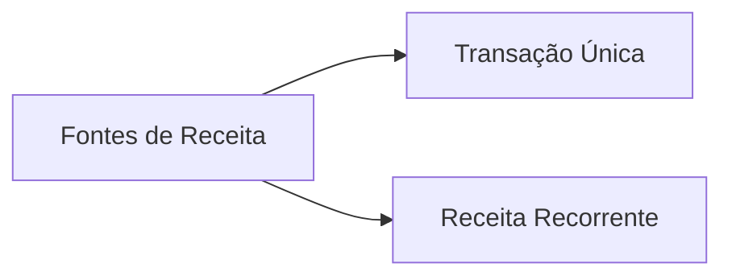

# Fontes de Receita 🏆
## Aula 16 - Desenvolvimento de Modelos de Negócios

---

## O que são as Fontes de Receita? 🤔

Representam o dinheiro que uma empresa gera de cada segmento de clientes.
Se os clientes são o coração do negócio, as receitas são as artérias.

---

## Tipos de Receita 📂

- **Transação:** Pagamento único por um produto/serviço.
- **Recorrente:** Pagamentos contínuos pelo valor entregue ou suporte.

---

## Formas de Gerar Receita 💰

1. Venda de Ativos
2. Taxa de Uso
3. Assinatura
4. Empréstimo/Aluguel/Leasing
5. Licenciamento
6. Taxas de Corretagem
7. Anúncios

---

## 1. Venda de Ativos 📦

O modelo mais comum. Vender direitos de propriedade de um produto físico.
Ex: Comprar um carro, um livro ou uma pizza.

---

## 2. Taxa de Uso ⏱️

Receita gerada pelo uso de um serviço particular. Quanto mais se usa, mais se paga.
Ex: Operadoras de celular (minutos), Hotéis (diárias).

---

## 3. Taxa de Assinatura (Subscription) 📺

Venda de acesso contínuo a um serviço.
Ex: Netflix, Academias, Spotify, Softwares SaaS.
Gera **previsibilidade de caixa**.

---

## 4. Empréstimo / Aluguel / Leasing 🏠

Concessão do direito temporário de usar um ativo por um período específico em troca de uma taxa.
Ex: Localiza (aluguel de carros), Imobiliárias.

---

## 5. Licenciamento 📜

Permissão para usar propriedade intelectual protegida em troca de taxas.
Ex: Softwares (Office), Personagens (Disney em brinquedos), Patentes.

---

## 6. Taxas de Corretagem (Brokerage) 🤝

Receita de serviços de intermediação realizados em nome de duas partes.
Ex: Corretoras de seguros, Imobiliárias, Uber, Airbnb.

---

## 7. Anúncios 📢

Receita proveniente de taxas para anunciar produtos, serviços ou marcas.
Ex: Google, Facebook, Jornais, Painéis de rua.

---

## Mecanismos de Precificação 🏷️

- **Fixos:** Preço de tabela, dependente de recursos, dependente do segmento.
- **Dinâmicos:** Negociação (Barganha), Leilão, Gestão de rendimento (Passagens aéreas).

---

## Freemium: O Grátis que dá Lucro 🎁

Atrair uma massa de usuários com serviço grátis e converter uma pequena porcentagem (ex: 5%) em assinantes pagos.
Ex: Spotify, LinkedIn, Dropbox.

---

## Receita em Plataformas Multilaterais 🤝

Cobrar de um lado para subsidiar o outro.
Ex: Grátis para o usuário (Google Search) e pago para o anunciante (Google Ads).

---

## Fluxo de Caixa vs. Receita 💸

Receita é o que você faturou. Fluxo de caixa é o dinheiro que realmente entrou no seu banco. Cuidado com prazos muito longos!

---

## Impostos e Receita Líquida 💹

A Receita Bruta ilude. Saiba calcular o que sobra após impostos, taxas de cartão e devoluções.

---

## Inovação na Receita 🚀

Mudar de "Venda de Produto" para "Serviço como Assinatura" mudou indústrias inteiras (como o software e música).

---

## Resumo da Aula 📝

- Definição de Fontes de Receita.
- Transações vs Recorrência.
- As 7 formas de gerar receita.
- Precificação Fixa vs Dinâmica.

---

## Conclusão do Curso 🎓

Parabéns! Você agora tem a visão completa de como modelar um negócio do zero, da visão estratégica à viabilidade financeira.

---

## O Próximo Passo é SEU 👣

Não deixe seu Canvas na gaveta. Vá para a rua, valide suas hipóteses e empreenda!

---

## Desafio Final 🏆

Mapeie as **Fontes de Receita** do seu próprio projeto de curso.
Como você vai cobrar? Será venda única ou assinatura? Existe algum parceiro que paga uma taxa?