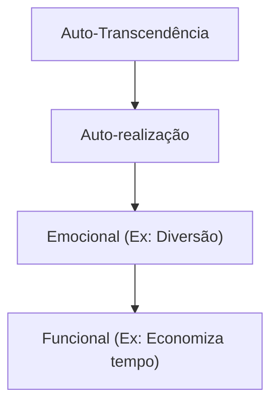

# Análise de Valor e Sustentabilidade 💎
## Aula 03 - Desenvolvimento de Modelos de Negócios

---

## O que é Valor? 🤔

Valor não é preço. Valor é a percepção de benefício dividida pelo custo.

<!-- .element: class="fragment" -->
"O cliente não compra uma furadeira, ele compra o furo na parede."

---

## A Proposta de Valor 🎁

É a promessa de valor a ser entregue ao cliente. É o motivo principal pelo qual um cliente compra de você e não do concorrente.

---

## Elementos de Valor ✨

- Novidade
- Desempenho
- Personalização
- "Fazer o que deve ser feito" (Design)
- Marca/Status
- Preço
- Redução de Custo
- Redução de Risco
- Acessibilidade
- Conveniência/Usabilidade

---

## Sustentabilidade no Negócio 🌱

Ser sustentável significa atender às necessidades do presente sem comprometer as gerações futuras.

<!-- .element: class="fragment" -->
**Os 3 Pilares (Tripé da Sustentabilidade):**
1. Social (Pessoas)
2. Ambiental (Planeta)
3. Econômico (Lucro)

---

## ESG: O Novo Padrão 🏛️

- **E (Environmental):** Meio ambiente.
- **S (Social):** Responsabilidade social.
- **G (Governance):** Governança ética.

Investidores buscam empresas que respeitam esses critérios.

---

## Negócios de Impacto Social 🤝

Empresas que têm como missão principal resolver um problema social, mas com um modelo de negócio lucrativo e autossuficiente.

---

## Economia Circular 🔄

Diferente do modelo "Extrair -> Produzir -> Descartar".
Foca em reutilizar, reciclar e regenerar recursos.

---

## A Pirâmide de Valor (B2C) 📊

---

## Gerando Valor para o Cliente B2B 🏢

No mercado corporativo, o valor costuma ser:
- Ganho de produtividade.
- Redução de custos operacionais.
- Conformidade (Compliance).
- Inovação no setor.

---

## Ética e Transparência ⚖️

A confiança é um ativo. Negócios sem ética podem lucrar rápido, mas não sobrevivem ao tempo.

---

## Consumo Consciente 🛒

O novo consumidor pesquisa a origem do produto e o comportamento da marca antes de comprar.

---

## Inovação Sustentável 🚀

Como criar produtos que usam menos plástico? Que gastam menos energia? Que duram mais?

---

## Certificações e Selos ✅

- Sistema B (Empresas B)
- ISO 14001
- Selo de Comércio Justo (Fair Trade)

---

## O Custo da Inação 📉

Empresas que ignoram a sustentabilidade enfrentam riscos regulatórios e boicotes de consumidores.

---

## Mindset de Abundância vs. Escassez 🧠

Empreendedores sustentáveis buscam soluções onde todos ganham (Win-Win).

---

## Design For Environment (DfE) 🎨

Projetar produtos pensando em todo o seu ciclo de vida, desde a extração até o descarte final.

---

## Resumo da Aula 📝

- Definição de Valor vs Preço.
- Elementos da Proposta de Valor.
- Pilares da Sustentabilidade e ESG.
- Negócios de impacto.

---

## Próximo Passo 👣

Na próxima aula, vamos falar sobre os **Processos de Valor e Inovação**.

---

## Desafio: Análise de Marca 🌱

Escolha uma marca que você admira e identifique quais elementos de valor ela entrega e se ela possui iniciativas de sustentabilidade claras.