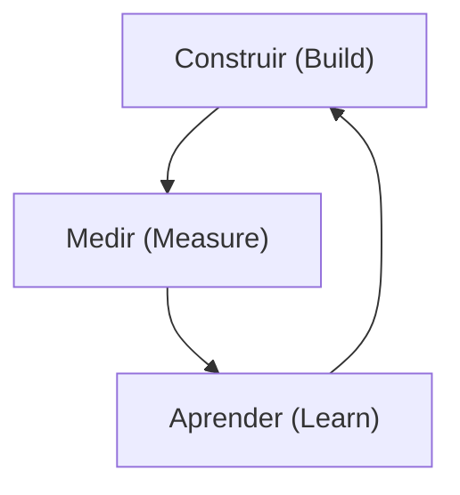

# Processos de Valor e Inovação ⚙️
## Aula 04 - Desenvolvimento de Modelos de Negócios

---

## O Ciclo da Inovação 💡

A inovação não é um evento isolado, é um processo contínuo de experimentação e aprendizado.

<!-- .element: class="fragment" -->
**Não é apenas sobre ideias, é sobre execução.**

---

## Tipos de Inovação 🏗️

1. **Incremental:** Melhorias em produtos existentes.
2. **Radial/Desruptiva:** Cria novos mercados e desbanca líderes.
3. **Arquitetural:** Aplica tecnologias existentes em novos contextos.

---

## Inovação de Valor (Oceano Azul) 🌊

Reduzir custos e aumentar o valor simultaneamente.
- **Eliminar** o que o mercado dá como certo, mas não agrega valor.
- **Reduzir** abaixo dos padrões da indústria.
- **Elevar** acima dos padrões.
- **Criar** o que ninguém nunca ofereceu.

---

## Lean Startup (Startup Enxuta) 🏃‍♂️

Foco em reduzir o tempo do ciclo e evitar desperdícios.

---

## MVP: Produto Mínimo Viável 📦

A versão mais simples de um produto que permite validar uma hipótese central de negócio com o menor esforço possível.

<!-- .element: class="fragment" -->
**Não é um produto "incompleto", é um produto focado.**

---

## Design Thinking 🧠

Metodologia focada no ser humano para resolver problemas complexos.
- Empatia
- Definição
- Ideação
- Prototipagem
- Teste

---

## Pivotar vs. Perseverar 🔄

- **Perseverar:** Manter a estratégia e ajustar a execução.
- **Pivotar:** Mudar drasticamente um componente chave do modelo de negócio após falha na validação.

---

## Inovação Aberta (Open Innovation) 🌐

Colaborar com parceiros externos, universidades e até concorrentes para acelerar o processo de inovação.

---

## Gestão de Processos de Negócio (BPM) 📊

Documentar, analisar e otimizar como o valor flui dentro da empresa.
Processos eficientes permitem escala.

---

## A Curva de Adoção de Inovação 📈

---

## Falha Rápida e Barata ❌📉

Se você vai errar, que seja logo e gastando o mínimo possível. O aprendizado da falha é o insumo da próxima versão.

---

## Cultura de Inovação 🏢

"A cultura come a estratégia no café da manhã." (Peter Drucker)
As pessoas devem ter segurança psicológica para sugerir ideias e testar hipóteses.

---

## Tecnologia como Facilitador 💻

A tecnologia (IA, Cloud, No-code) permite que os processos de inovação sejam muito mais rápidos hoje do que há 10 anos.

---

## Intraempreendedorismo reconsiderado 🧐

Como incentivar os funcionários a agirem como donos e inovarem dentro da estrutura corporativa?

---

## Resumo da Aula 📝

- Definição e tipos de inovação.
- Metodologias: Lean Startup e Design Thinking.
- Conceito de MVP e o ciclo Construir-Medir-Aprender.
- Importância da cultura organizacional.

---

## Próximo Passo 👣

Na próxima aula, vamos mergulhar na **Gestão de Negócios e Estratégias**.

---

## Desafio: O MVP da sua Ideia 🛠️

Se você tivesse apenas **R$ 500,00** e **1 semana**, como você validaria sua ideia de negócio principal? O que seria o seu MVP?
