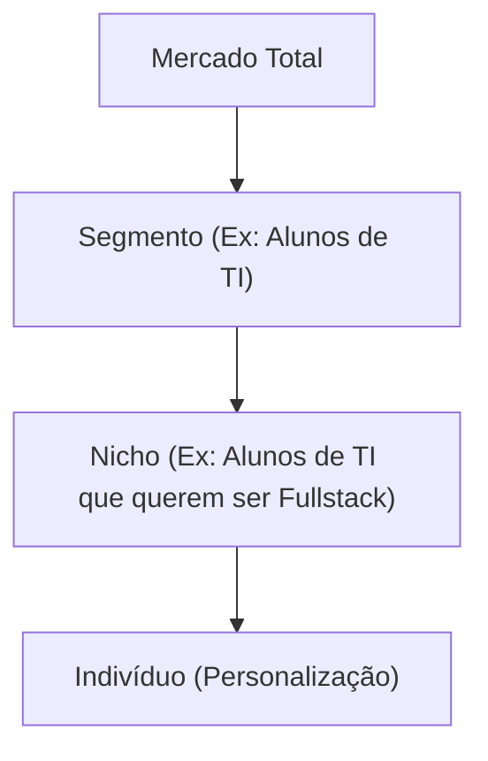
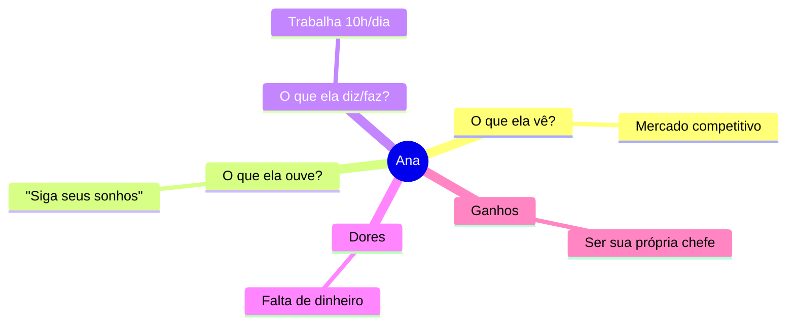

# Segmentação e Público-Alvo 🚢
## Aula 08 - Desenvolvimento de Modelos de Negócios

---

## Por que Segmentar? 🤔

"Quem quer vender para todo mundo, acaba não vendendo para ninguém."

<!-- .element: class="fragment" -->
Segmentar é dividir o mercado em grupos menores com necessidades e comportamentos similares.

---

## Níveis de Segmentação 📏

---

## Critérios de Segmentação 📝

1. **Geográfica:** País, cidade, clima, densidade.
2. **Demográfica:** Idade, gênero, renda, profissão.
3. **Psicográfica:** Estilo de vida, valores, personalidade.
4. **Comportamental:** Benefícios buscados, fidelidade, taxa de uso.

---

## Segmentação Geográfica 🌍

Onde seus clientes estão?
Ex: Uma loja de casacos de neve não faz sentido no Nordeste brasileiro.

---

## Segmentação Demográfica 👤

Fatos concretos sobre a pessoa.
Ex: Brinquedos focados em crianças de 3 a 5 anos.

---

## Segmentação Psicográfica 🧠

Desejos e medos profundos.
Ex: Consumidores que valorizam sustentabilidade e produtos orgânicos.

---

## Segmentação Comportamental 🛒

Como eles compram?
Ex: Clientes que compram apenas em promoções vs. clientes que compram lançamentos.

---

## O Público-Alvo (Target) 🎯

O grupo específico de pessoas para quem sua proposta de valor foi desenhada.

---

## Persona: O Cliente Ideal 👩‍🦰

Não é apenas "mulher, 30 anos".
É a "Ana, designer, 28 anos, odeia burocracia, adora gatos e quer abrir seu próprio estúdio."

---

## Criando uma Persona Útil 🎨

- Nome e foto (fictícios).
- Dados demográficos.
- Objetivos e Frustrações.
- Comportamento de compra.

---

## Mapa de Empatia revisited 🧠

---

## Mercado de Massa vs. Nicho 🥊

- **Massa:** Escala gigante, margem baixa. (Coca-cola)
- **Nicho:** Foco total, margem alta. (Ferrari)

---

## Plataformas Multilaterais (Multi-sided Platforms) 🤝

Negócios com dois ou mais segmentos que dependem um do outro.
Ex: Uber (Motoristas + Passageiros).

---

## Mercado Segmentado vs. Diversificado 🏷️

- **Segmentado:** Leve variação (Banco atendendo Varejo vs Private).
- **Diversificado:** Segmentos totalmente diferentes (Amazon vendendo livros vs AWS Cloud).

---

## O Vale da Morte da Segmentação 💀

Tentar atender dois segmentos com propostas de valor conflitantes ao mesmo tempo.

---

## Validando seu Segmento ✅

Use anúncios segmentados (Facebook/Google) para testar se aquele público realmente clica e compra sua ideia.

---

## Resumo da Aula 📝

- Importância da segmentação.
- Critérios Geográficos, Demográficos, Psicográficos e Comportamentais.
- Criação de Personas e nichos.

---

## Próximo Passo 👣

Na próxima aula, vamos falar sobre o **Value Proposition Canvas (VPC)** para conectar o produto ao cliente.

---

## Desafio: Crie sua Persona ✍️

Pense na sua ideia de negócio e descreva o "João" ou a "Maria" que seria seu primeiro cliente apaixonado.
O que ele faz? O que ele teme?