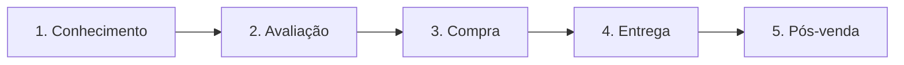
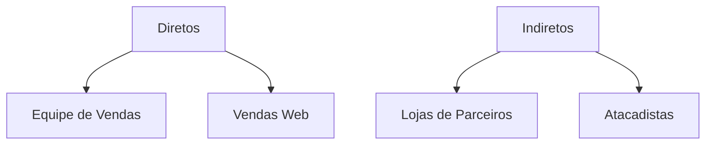

# Canais de Comunicação e Distribuição 📡
## Aula 10 - Desenvolvimento de Modelos de Negócios

---

## O que são Canais? 🗺️

São os pontos de contato entre a empresa e seus clientes.
Eles descrevem como a empresa comunica e alcança seus segmentos para entregar sua proposta de valor.

---

## As 5 Fases dos Canais 🚀

---

## 1. Conhecimento (Awareness) 📢

Como aumentamos a consciência sobre nossos produtos?
- Propaganda em redes sociais.
- Google Ads.
- Marketing de influência.

---

## 2. Avaliação (Evaluation) 🤔

Como ajudamos o cliente a avaliar nossa proposta?
- Review de usuários.
- Demonstrações grátis (Trials).
- Comparativos técnicos.

---

## 3. Compra (Purchase) 🛒

Como o cliente efetivamente compra?
- Site (E-commerce).
- Loja física.
- Call center / WhatsApp.

---

## 4. Entrega (Delivery) 📦

Como entregamos o valor?
- Download digital (Software).
- Logística e transporte (Produtos físicos).
- Prestação de serviço no local.

---

## 5. Pós-venda (After-sales) 🤝

Como damos suporte após a compra?
- Central de ajuda.
- Garantia estendida.
- Sucesso do cliente (Customer Success).

---

## Tipos de Canais: Próprios vs Parceiros 🥊

- **Próprios:** Loja própria, força de vendas interna, site. (Margem alta, custo de gestão alto).
- **Parceiros:** Atacado, varejistas, marketplaces. (Margem baixa, alcance gigante).

---

## Canais Diretos vs Indiretos 📈

---

## Omnichannel: A tendência atual 🌐

Integração de todos os canais de forma que o cliente não sinta a diferença entre comprar no site ou na loja física.

---

## Eficiência de Canais 💹

Não tente estar em todos os lugares.
Escolha os canais onde seu **Segmento de Cliente** realmente está e consome informação.

---

## Custo de Aquisição (CAC) e Canais 💰

Cada canal tem um custo. Um canal excelente é aquele que traz clientes qualificados com o menor custo possível.

---

## Marketing de Conteúdo como Canal ✍️

Blogs, vídeos e podcasts que educam o cliente antes de tentar vender algo. Gera autoridade e confiança.

---

## Redes Sociais: Vitrine ou Venda? 📸

- **Instagram:** Visual, desejo.
- **LinkedIn:** Profissional, B2B.
- **TikTok:** Engajamento, massa.

---

## O Papel da Logística 🚛

Em produtos físicos, o canal de entrega é vital. A experiência do "unboxing" faz parte da proposta de valor.

---

## Mobile First 📱

No mundo atual, seu principal canal de comunicação e venda deve funcionar perfeitamente em celulares.

---

## Testando Canais (A/B Test) 🧪

Teste dois canais diferentes com o mesmo investimento e veja qual traz mais retorno real (Vendas).

---

## Resumo da Aula 📝

- Definição de Canais.
- As 5 fases do contato com o cliente.
- Canais Próprios, Parceiros, Diretos e Indiretos.
- Omnichannel e eficiência.

---

## Próximo Passo 👣

Na próxima aula, vamos falar sobre como manter esses clientes engajados: **Relacionamento com o Cliente**.

---

## Desafio: Mapeie o iFood 🍔

Quais os canais de **Conhecimento**, **Compra** e **Entrega** do iFood para você como consumidor?
E para o restaurante?