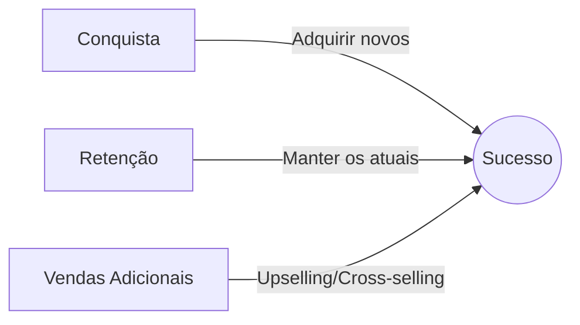

# Relacionamento com o Cliente 🤝
## Aula 11 - Desenvolvimento de Modelos de Negócios

---

## O que é Relacionamento no Canvas? 🤔

Descreve os tipos de relações que uma empresa estabelece com segmentos específicos de clientes.
O objetivo é conquistar, manter e crescer a base de clientes.

---

## Motivações para o Relacionamento 🚀

---

## Categorias de Relacionamento 📂

1. Assistência Pessoal
2. Assistência Pessoal Voltada (Key Accounts)
3. Self-service
4. Serviços Automatizados
5. Comunidades
6. Co-criação

---

## 1. Assistência Pessoal 🗣️

O cliente pode falar com um representante real durante o processo de venda ou suporte.
Ex: Loja física, Call Center.

---

## 2. Assistência Dedicada (Key Accounts) 🎖️

Um gerente específico para um cliente especial. Comum em bancos (Select/Personnalité) ou B2B de alto valor.

---

## 3. Self-service 🛒

A empresa não mantém relacionamento direto. Fornece todos os meios para o cliente se servir sozinho.
Ex: Caixas eletrônicos, Postos de gasolina.

---

## 4. Serviços Automatizados 🤖

Self-service aprimorado com inteligência. Reconhece o cliente e faz recomendações baseadas no perfil.
Ex: Amazon, Netflix.

---

## 5. Comunidades 🌐

Empresas usam comunidades para se envolver com clientes e facilitar a troca de conhecimento entre eles.
Ex: Fóruns de games, comunidades de software.

---

## 6. Co-criação ✍️

A empresa convida o cliente para criar o valor junto.
Ex: Reviews de produtos na Amazon, YouTube (os clientes criam o conteúdo), LEGO Ideas.

---

## Fidelização: O custo de manter vs. atrair 💰

É 5 a 7 vezes mais caro atrair um novo cliente do que manter um atual.
O relacionamento foca na **Satisfação** e **LTV (Lifetime Value)**.

---

## CRM: Customer Relationship Management 📊

Sistemas que guardam todo o histórico do cliente para personalizar o atendimento.
"Não trate todos os clientes da mesma forma."

---

## Net Promoter Score (NPS) 📏

"De 0 a 10, quanto você recomendaria nossa empresa para um amigo?"

<!-- .element: class="fragment" -->
- 9-10: Promotores
- 7-8: Neutros
- 0-6: Detratores

---

## Churn Rate: O perigo do cancelamento 📉

A taxa de clientes que param de comprar de você. Relacionamento forte reduz o Churn.

---

## Atendimento Humanizado em tempos de IA 🧠

Bots são bons, mas a empatia humana em problemas complexos ainda é um diferencial competitivo gigante.

---

## Upselling e Cross-selling 📈

- **Upselling:** Convencer o cliente a comprar uma versão superior.
- **Cross-selling:** Vender produtos complementares (ex: batata frita com o hambúrguer).

---

## Personificação e Tom de Voz 🗣️

Como sua marca fala? É séria, engraçada, jovem? Isso define como o cliente se sente em relação a você.

---

## Gestão de Crises no Relacionamento 🌪️

Como você responde a um post de reclamação no Reclame Aqui ou Twitter? Sua resposta pode salvar ou destruir a marca.

---

## Resumo da Aula 📝

- Definição de Relacionamento.
- As 6 categorias clássicas.
- Importância da retenção e ferramentas (NPS, CRM).
- Co-criação e comunidades.

---

## Próximo Passo 👣

Na próxima aula, vamos falar sobre o que a empresa faz para manter tudo isso funcionando: **Atividades-chave do Negócio**.

---

## Desafio: O Relacionamento da Netflix 📺

Qual a categoria de relacionamento da Netflix com você? É Assistência Pessoal ou Automatizada? Como eles tentam te manter fiel?