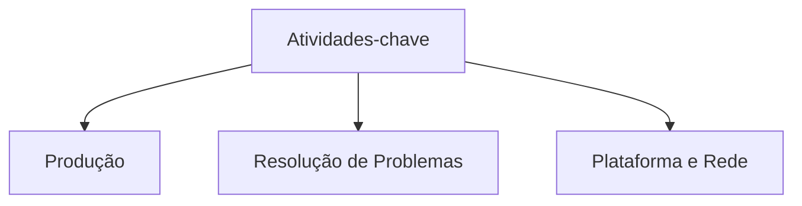
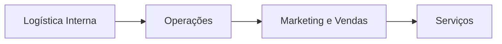

# Atividades-chave do Negócio 🛠️
## Aula 12 - Desenvolvimento de Modelos de Negócios

---

## O que são Atividades-chave? 🤔

São as ações mais importantes que uma empresa deve realizar para operar com sucesso.
Elas permitem criar e oferecer a Proposta de Valor, alcançar mercados e gerar receita.

---

## Categorias de Atividades 📂

---

## 1. Produção 🏭

Focadas no design, fabricação e entrega de um produto em quantidades substanciais ou qualidade superior.
Ex: Fábricas de carros, padarias, confecções.

---

## 2. Resolução de Problemas 🧠

Focadas em encontrar novas soluções para problemas de clientes individuais. Serviço intensivo em conhecimento.
Ex: Consultorias, hospitais, agências de publicidade.

---

## 3. Plataforma e Rede 🌐

Focadas na gestão, promoção e manutenção de uma plataforma que serve como ponto de encontro.
Ex: Visa (Rede), Airbnb (Plataforma), eBay (Marketplace).

---

## Atividade-chave vs. Atividade Comum 🥊

- **Comum:** Pagar a conta de luz, limpar o escritório.
- **Chave:** Desenvolver o algoritmo de recomendação (Netflix), gerenciar a logística (Amazon).

Se a atividade parar, o modelo de negócio morre.

---

## Terceirização (Outsourcing) 🤝

Empresas inteligentes focam no que é "Core" (Principal) e terceirizam o resto.
Ex: A Apple foca no Design e Software e terceiriza a fabricação física.

---

## Cadeia de Valor de Porter 💎

---

## Gestão da Qualidade 🏆

Garantir que os processos de produção sigam padrões para evitar desperdícios e devoluções.

---

## P&D (Pesquisa e Desenvolvimento) 🧪

Atividade-chave vital para empresas de tecnologia. Inovar é um processo contínuo de experimentação.

---

## Atividades de Marketing e Canais 📢

Em muitos negócios B2C, a principal atividade é contar uma história atraente e gerenciar canais de venda.

---

## A Importância do RH Estratégico 👥

Em empresas de serviço (Resolução de Problemas), a atividade-chave é atrair e treinar os melhores cérebros.

---

## Automação de Atividades 🤖

Como transformar uma atividade manual lenta em um processo digital escalável?
Uso de ERPs, CRMs e IA.

---

## Sustentabilidade Operacional 🌱

Atividades que visam reduzir o impacto ambiental e melhorar a eficiência energética são o novo diferencial competitivo.

---

## Gargalos de Atividades 🍾

Identificar qual passo do processo está atrasando todo o resto. Resolva o gargalo e você aumenta a capacidade total.

---

## Monitoramento de Performance 📊

Uso de Dashboards para ver o status das atividades em tempo real.
"O que os olhos não veem, o bolso não sente."

---

## Resumo da Aula 📝

- Definição de Atividades-chave.
- Categorias: Produção, Problemas, Plataforma.
- Diferença entre atividades Core e Suporte.
- Automação e Foco.

---

## Próximo Passo 👣

Na próxima aula, vamos falar sobre os recursos necessários para realizar essas atividades: **Recursos Essenciais e Ativos**.

---

## Desafio: A Atividade do Google 🔍

Qual a principal atividade-chave do Google?
É vender anúncios? É gerenciar servidores? É desenvolver algoritmos de busca?
(Spoiler: São todas, mas qual é a MAIS importante para o DNA deles?)