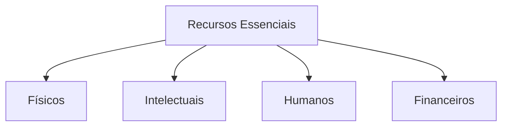

# Recursos Essenciais e Ativos 🧩
## Aula 13 - Desenvolvimento de Modelos de Negócios

---

## O que são Recursos Essenciais? 🤔

São os ativos mais importantes requeridos para fazer um modelo de negócio funcionar.
Eles permitem criar e oferecer a Proposta de Valor e alcançar mercados.

---

## Categorias de Recursos 📂

---

## 1. Recursos Físicos 🏗️

Ativos tangíveis necessários para a operação.
- Instalações fabris.
- Veículos.
- Pontos de venda.
- Máquinas e sistemas de TI.
Ex: Amazon tem armazéns gigantescos.

---

## 2. Recursos Intelectuais 🧠

Ativos intangíveis que podem ser protegidos.
- Marcas.
- Patentes e direitos autorais.
- Conhecimentos proprietários.
- Bancos de dados de clientes.
Ex: A fórmula da Coca-cola, a marca Nike.

---

## 3. Recursos Humanos 👥

Especialmente importantes em indústrias criativas, intensivas em conhecimento e de serviços.
- Especialistas técnicos.
- Designers.
- Cientistas.
Ex: Equipe de engenharia do Google.

---

## 4. Recursos Financeiros 💰

Garantias financeiras ou linhas de crédito necessárias.
- Dinheiro em caixa.
- Opções de ações (Stock options).
- Empréstimos bancários.
Ex: Startups de tecnologia precisam de capital intensivo inicial.

---

## Próprios vs Alugados 🏠

Uma empresa não precisa ser dona de todos os recursos.
- **Alugados:** Reduz investimetno inicial (CAPEX), aumenta flexibilidade.
- **Próprios:** Maior controle a longo prazo, ativo da empresa.

---

## Recursos como Vantagem Competitiva 🛡️

O recurso deve ser difícil de copiar pelos concorrentes para gerar uma vantagem real. (VRIO framework).

---

## A Importância do Branding 🏷️

A marca é um dos recursos intelectuais mais valiosos. Ela reduz o esforço de venda e aumenta a confiança do cliente.

---

## Dados como Recurso Moderno 📊

No mundo digital, o histórico de comportamento do cliente é o "novo petróleo". Permite prever vendas e personalizar ofertas.

---

## Gestão de Ativos Físicos 🛠️

Manutenção, depreciação e renovação de máquinas. Recursos físicos quebram e tornam-se obsoletos.

---

## Retenção de Talentos (Recurso Humano) 🤝

Como manter as mentes brilhantes na sua empresa? O recurso humano "vai para casa todo dia" e pode não voltar.

---

## Propriedade Intelectual (PI) 📜

A proteção legal de recursos intelectuais via patentes impede que a concorrência use sua inovação.

---

## O Papel do Capital de Giro 💸

Recurso financeiro vital para pagar as contas enquanto o dinheiro das vendas não entra.

---

## Recursos em Negócios Digitais 💻

Menos gasto com recursos físicos, mais investimento em recursos intelectuais (Código) e humanos (Devs).

---

## Escalabilidade e Recursos 📈

Um bom recurso permite que o negócio cresça sem que os custos subam de forma explosiva.

---

## Resumo da Aula 📝

- Definição de Recursos Essenciais.
- As 4 categorias: Físicos, Intelectuais, Humanos e Financeiros.
- Recursos próprios vs tercerizados.
- Vantagem estratégica.

---

## Próximo Passo 👣

Na próxima aula, vamos falar sobre quem nos ajuda a obter esses recursos: **Parceiros-chave e Alianças**.

---

## Desafio: O Recurso da Disney 🏰

Qual o recurso inteletual MAIS valioso da Disney?
É o parque físico? São os personagens e marcas (Mickey, Marvel)? Ou são os funcionários?
(Dica: O que acontece se destruírem o parque, mas eles mantiverem os direitos das marcas?)
