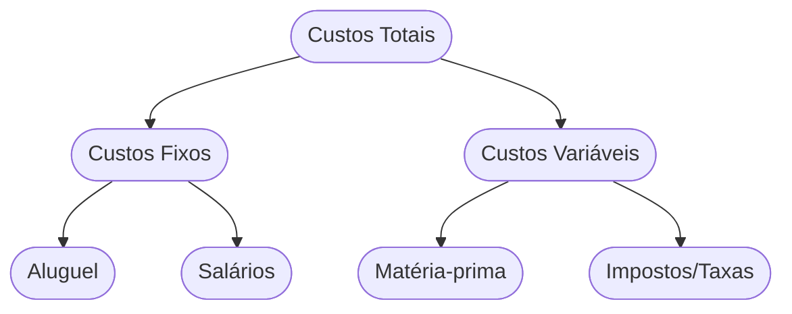

<!-- .slide: class="center" -->

# Aula 15 - Estrutura de Custos do Negócio 💰

### Desenvolvimento de Modelos de Negócios

[Pressione ESPAÇO para avançar]

---

## Avisos da Aula

- Desliguem os celulares <!-- .element: class="fragment" -->
- Foco na lógica <!-- .element: class="fragment" -->
- Participação ativa <!-- .element: class="fragment" -->

---

## 1. O que é Estrutura de Custos? 🏗️

A estrutura de custos descreve todos os custos incorridos para operar um modelo de negócio. Criar e entregar valor, manter relacionamentos e gerar receita, tudo gera custo.

---

---

## 2. Tipos de Estruturas de Custo 📂

Existem dois extremos na forma como os negócios lidam com custos:

1.  **Direcionado pelo Custo (Cost-driven)**: Focado em minimizar custos onde quer que seja possível (ex: companhias aéreas low-cost como a RyanAir).
2.  **Direcionado pelo Valor (Value-driven)**: Focado na criação de valor e personalização, com menos preocupação com o custo (ex: hotéis de luxo, marcas de grife).

---

## 2. Tipos de Estruturas de Custo 📂

---

---

## 3. Características dos Custos 📊

Para gerir seu financeiro, você deve entender estes quatro conceitos:

- <!-- .element: class="fragment" --> **Custos Fixos**: Permanecem os mesmos, independentemente do volume de produção (ex: aluguel, salários administrativos).
- <!-- .element: class="fragment" --> **Custos Variáveis**: Mudam proporcionalmente ao volume de bens ou serviços produzidos (ex: matéria-prima, comissões de venda).
- <!-- .element: class="fragment" --> **Economias de Escala**: Benefícios de custo que o negócio desfruta à medida que sua produção se expande (custo por unidade cai).
- <!-- .element: class="fragment" --> **Economias de Escopo**: Benefícios de custo que o negócio desfruta devido a uma maior variedade de operações (ex: usar a mesma logística para vários tipos de produtos).

---

## 3. Características dos Custos 📊

---

---

## 4. O Mapa de Custos (Mermaid) 📉



---

## 4. O Mapa de Custos (Mermaid) 📉

---

---

## 5. Simulador de Gastos (Termynal) 💻

Como está a saúde financeira da sua operação?

---

## 5. Simulador de Gastos (Termynal) 💻

```termynal
$ finance --audit-costs
> Analisando custos fixos... [ALTO]
> Verificando custos variáveis... [CONTROLADOS]
> Calculando Ponto de Equilíbrio... [1.500 unidades/mês]
> Resultado: Suas despesas fixas estão consumindo sua margem.
> Dica: Tente renegociar o aluguel ou otimizar a equipe administrativa!
```

---

## 5. Simulador de Gastos (Termynal) 💻

---

---

## 6. Aprofundamento: Economia de Escala vs. Escopo e Burn Rate 🔥

Dominar custos implica entender que o crescimento pode trazer a **Economia de Escala** (redução do custo unitário pelo volume) ou **Economia de Escopo** (usar a mesma infraestrutura para vender múltiplos produtos). Para startups, o **Burn Rate** (taxa mensal que a empresa gasta do seu capital investido até virar lucrativa) e a projeção de "Runway" (quantos meses a empresa dura até quebrar) são os indicadores cruciais de sobrevivência e necessidade de novas captações.

---

---

## 7. Mini-Projeto: Calculando o Básico 🚀

Imagine que você vende **Camisetas Estampadas**.
1.  O aluguel da sua sala é de R$ 1.000,00 (**Custo Fixo**).
2.  Cada camiseta custa R$ 20,00 para ser produzida (**Custo Variável**).
3.  Se você vender a camiseta por R$ 50,00, quantas você precisa vender por mês apenas para pagar o aluguel?
4.  Identifique uma forma de gerar **Economia de Escala** nesse negócio.

---

---

## 8. Exercício de Fixação 🧠

1.  Qual a diferença entre um negócio *Cost-driven* e um *Value-driven*?
2.  Explique o conceito de "Custos Variáveis" com um exemplo de uma empresa de serviços.
3.  O que são "Economias de Escopo" e como elas ajudam a reduzir custos?

---

---

## 8. Exercício de Fixação 🧠

!!! info "Dica"
    O segredo de um negócio lucrativo é manter os custos fixos baixos e os variáveis sob controle, enquanto se escala a Proposta de Valor.

---

---

## 8. Exercício de Fixação 🧠


---

---

## 📚 Material Complementar

- <!-- .element: class="fragment" --> **[📝 Exercícios da Aula 15](../../exercicios/exercicio-15.md)**: Pratique os conceitos com questões focadas.
- <!-- .element: class="fragment" --> **[🚀 Projeto da Aula 15](../../projetos/projeto-15.md)**: Aplique o conhecimento em um desafio prático de nível intermediário.

**Próxima Aula**: Como o dinheiro entra? [Fontes de Receita e Modelos de Ganho](../../aulas/aula-16.md) 🏆

---

## Discussão Aberta 1

- Como os conceitos vistos afetam nosso ambiente? <!-- .element: class="fragment" -->
- Quem tem um exemplo prático? <!-- .element: class="fragment" -->
- Pontos de ruptura? <!-- .element: class="fragment" -->

---

## Discussão Aberta 2

- Como os conceitos vistos afetam nosso ambiente? <!-- .element: class="fragment" -->
- Quem tem um exemplo prático? <!-- .element: class="fragment" -->
- Pontos de ruptura? <!-- .element: class="fragment" -->

---

<!-- .slide: class="center" -->

# FIM DA AULA 15

### Obrigado!