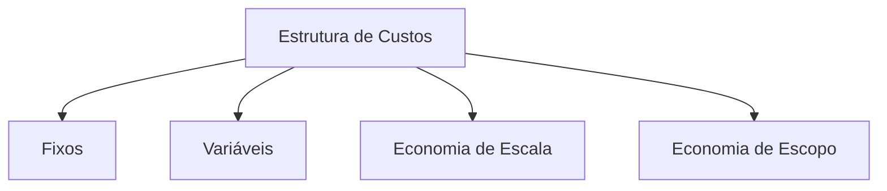
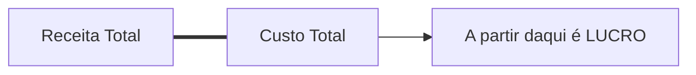

# Estrutura de Custos 💰
## Aula 15 - Desenvolvimento de Modelos de Negócios

---

## O que é a Estrutura de Custos? 🤔

Descreve todos os custos incorridos para operar um modelo de negócio.
Criar valor, manter relacionamentos e gerar receita, tudo gera custos.

---

## Classes de Custos 📂

---

## 1. Custos Fixos 🏢

Custos que permanecem os mesmos, independentemente do volume de bens ou serviços produzidos.
- Aluguel do escritório/fábrica.
- Salários fixos da equipe.
- Mensalidades de softwares (SaaS).
- Imposto Predial.

---

## 2. Custos Variáveis 📈

Custos que variam proporcionalmente ao volume de bens ou serviços produzidos.
- Matéria-prima.
- Comissões de vendas.
- Taxas de entrega / Logística.
- Consumo de energia na produção.

---

## 3. Economia de Escala 🏗️

Vantagem de custo que uma empresa obtém à medida que sua produção aumenta.
- Compras em grandes lotes reduzem o custo unitário.
- Diluição dos custos fixos em mais unidades vendidas.

---

## 4. Economia de Escopo 📂

Vantagem de custo que uma empresa obtém quando tem uma operação de maior escopo.
- Usar a mesma logística para entregar 10 tipos de produtos diferentes.
- Usar o mesmo canal de marketing para várias marcas.

---

## Focado no Custo vs. Focado no Valor 🥊

- **Cost-driven:** Baixo preço, automação máxima, outsourcing massivo. (Ex: Ryanair, GOL).
- **Value-driven:** Foco na criação de valor e propostas premium. (Ex: Hotéis 5 estrelas, Marcas de grife).

---

## O Perigo dos Custos Ocultos 🕵️‍♂️

Custos que não são óbvios no início, mas destroem o lucro.
- Retrabalho por falta de qualidade.
- Rotatividade alta de funcionários (Turnover).
- Manutenções de emergência.

---

## Ponto de Equilíbrio (Break-even Point) ⚖️

É o volume de vendas onde o lucro é zero (Empate).

---

## CAC (Custo de Aquisição de Cliente) 💰

Quanto você gasta em marketing e vendas para conseguir 1 novo cliente?
Se o CAC for maior que o que o cliente gasta (LTV), o negócio vai quebrar.

---

## LTV (Lifetime Value) 💎

O valor total que um cliente deixa na sua empresa durante todo o tempo de relacionamento. Objetivo: LTV >> CAC.

---

## Margem de Contribuição 💹

Preço de Venda - Custo Variável.
É o que sobra para pagar os custos fixos e gerar lucro.

---

## Custos em Negócios Digitais 💻

Baixo custo variável (copiar um software custa zero), mas alto custo fixo inicial (Desenvolvimento/P&D).

---

## Análise de Sensibilidade 📊

O que acontece com meu lucro se o dólar subir 10%?
O que acontece se eu der 5% de desconto em tudo?

---

## Sustentabilidade Financeira 🛡️

Uma empresa não quebra por falta de lucro, quebra por falta de **Caixa**. Saiba gerir seus vencimentos e recebimentos.

---

## Resumo da Aula 📝

- Definição de Estrutura de Custos.
- Custos Fixos, Variáveis e Economias.
- Negócios focados em Custo vs Valor.
- Break-even e Margens.

---

## Próximo Passo 👣

Na nossa última aula, vamos falar sobre como o dinheiro volta: **Fontes de Receita**.

---

## Desafio: Custo da Padaria 🥖

Liste **3 custos fixos** e **3 custos variáveis** de uma padaria de bairro.
Como eles poderiam obter uma "Economia de Escala"?
