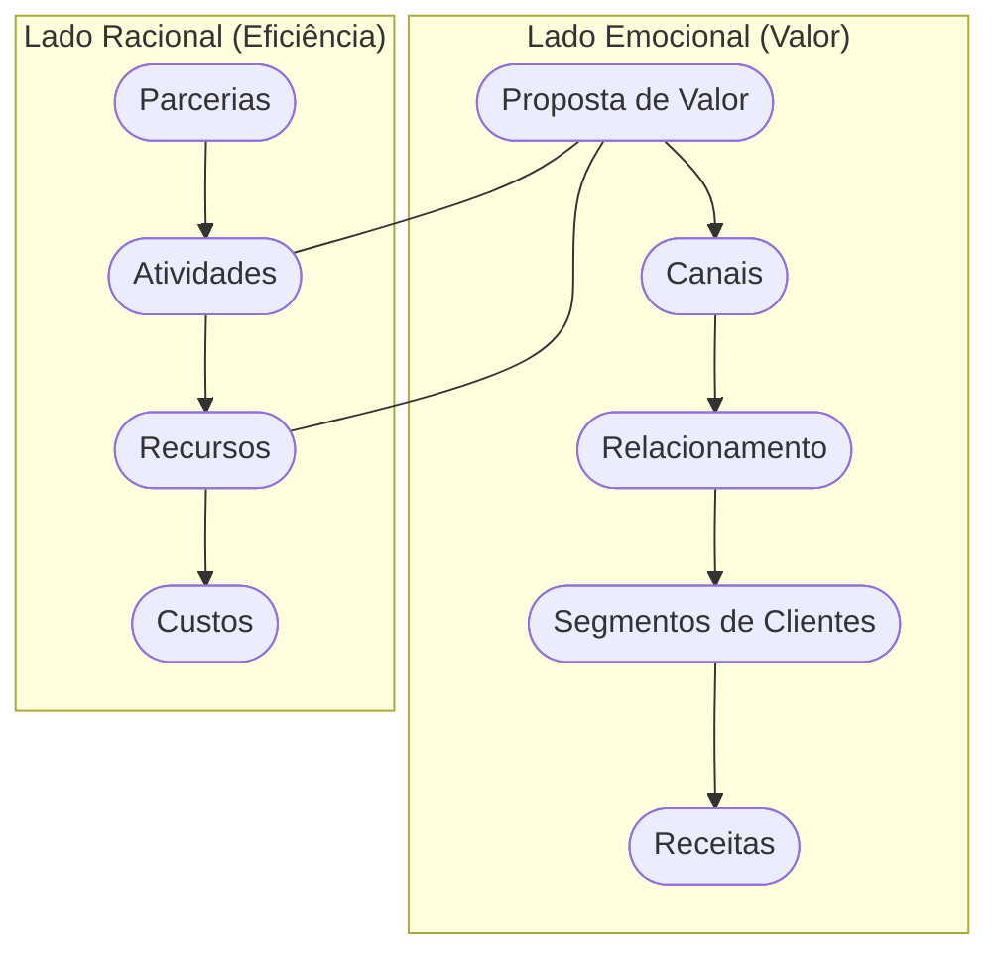

<!-- .slide: class="center" -->

# Aula 07 - Modelagem de Negócios: O Canvas 🧪

### Desenvolvimento de Modelos de Negócios

[Pressione ESPAÇO para avançar]

---

## Avisos da Aula

- Desliguem os celulares <!-- .element: class="fragment" -->
- Foco na lógica <!-- .element: class="fragment" -->
- Participação ativa <!-- .element: class="fragment" -->

---

## 1. O que é o Canvas? 🎨

O **Business Model Canvas** é um mapa visual que resume o modelo de negócio em 9 blocos fundamentais. Ele permite que você entenda como a empresa cria, entrega e captura valor em uma única página.

---

---

## 2. Os 9 Blocos do Canvas 🧱

Para modelar seu negócio, você deve preencher:

1.  **Segmento de Clientes**: Quem estamos atendendo?
2.  **Proposta de Valor**: Que problema resolvemos?
3.  **Canais**: Como chegamos ao cliente?
4.  **Relacionamento**: Como interagimos com cada segmento?
5.  **Fontes de Receita**: Como ganhamos dinheiro?
6.  **Recursos Principais**: O que é essencial para o negócio?
7.  **Atividades Principais**: O que fazemos no dia a dia?
8.  **Parcerias Principais**: Quem nos ajuda?
9.  **Estrutura de Custos**: O que gera gasto?

---

## 2. Os 9 Blocos do Canvas 🧱

---

---

## 3. A Lógica do Canvas (Mermaid) 🔗

O Canvas é dividido em dois lados: o lado **Direito** (valor e cliente) e o lado **Esquerdo** (eficiência e infraestrutura).

---

## 3. A Lógica do Canvas (Mermaid) 🔗



---

## 3. A Lógica do Canvas (Mermaid) 🔗

---

---

## 4. Canvas vs. Plano de Negócios 📊

- <!-- .element: class="fragment" --> **Canvas**: Ágil, visual, focado em testes de hipóteses e mudanças rápidas.
- <!-- .element: class="fragment" --> **Plano de Negócios**: Detalhado, linear, focado em execução e captação de recursos tradicionais.

> **Dica**: Use o Canvas para encontrar o modelo certo e o Plano de Negócios para detalhar como você vai executá-lo.

---

## 4. Canvas vs. Plano de Negócios 📊

---

---

## 5. Simulando um Modelo (Termynal) 📥

Vamos rodar uma verificação no seu Canvas:

---

## 5. Simulando um Modelo (Termynal) 📥

```termynal
$ canvas --check-balance
> Verificando equilíbrio entre lados... [OK]
> Checando Proposta de Valor vs Cliente... [CONECTADO]
> Analisando Receitas vs Custos... [ALERTA: Margem Pequena]
> Diagnóstico: Seu modelo é viável, mas os custos operacionais estão altos!
```

---

## 5. Simulando um Modelo (Termynal) 📥

---

---

## 6. Aprofundamento: Padrões de Modelos de Negócios (Business Model Patterns) 🧩

O Canvas não é apenas para preenchimento; ele serve para detectar padrões. Modelos **Long Tail** (venda de muitos itens de nicho em pequena quantidade), **Plataformas Multilaterais** (unir dois grupos de clientes distintos, como o Uber faz com motoristas e passageiros) e **Freemium** (base gratuita para converter uma minoria em premium) são estratégias intermediárias que mudam radicalmente o preenchimento de cada bloco do Canvas.

---

---

## 7. Mini-Projeto: Modelando uma Startup 🏗️

Imagine que você está criando o **Uber das Bicicletas**.
1.  Qual a sua principal **Proposta de Valor**?
2.  Quem são seus **Segmentos de Clientes**?
3.  Quais seriam seus dois principais **Recursos**?
4.  De onde viria sua **Fonte de Receita**?

---

---

## 8. Exercício de Fixação 🧠

1.  Quais são los 9 blocos do Business Model Canvas?
2.  O que o "lado direito" do Canvas representa?
3.  Por que o Canvas é considerado uma ferramenta de "metodologia ágil"?

---

---

## 8. Exercício de Fixação 🧠


---

---

## 📚 Material Complementar

- <!-- .element: class="fragment" --> **[📝 Exercícios da Aula 07](../exercicios/exercicio-07.md)**: Pratique os conceitos com questões focadas.
- <!-- .element: class="fragment" --> **[🚀 Projeto da Aula 07](../projetos/projeto-07.md)**: Aplique o conhecimento em um desafio prático de nível intermediário.

**Próxima Aula**: Como definir exatamente quem é seu cliente? [Segmentação de Clientes e Público-Alvo](../aulas/aula-08.md) 🚢

---

## Discussão Aberta 1

- Como os conceitos vistos afetam nosso ambiente? <!-- .element: class="fragment" -->
- Quem tem um exemplo prático? <!-- .element: class="fragment" -->
- Pontos de ruptura? <!-- .element: class="fragment" -->

---

## Discussão Aberta 2

- Como os conceitos vistos afetam nosso ambiente? <!-- .element: class="fragment" -->
- Quem tem um exemplo prático? <!-- .element: class="fragment" -->
- Pontos de ruptura? <!-- .element: class="fragment" -->

---

<!-- .slide: class="center" -->

# FIM DA AULA 07

### Obrigado!